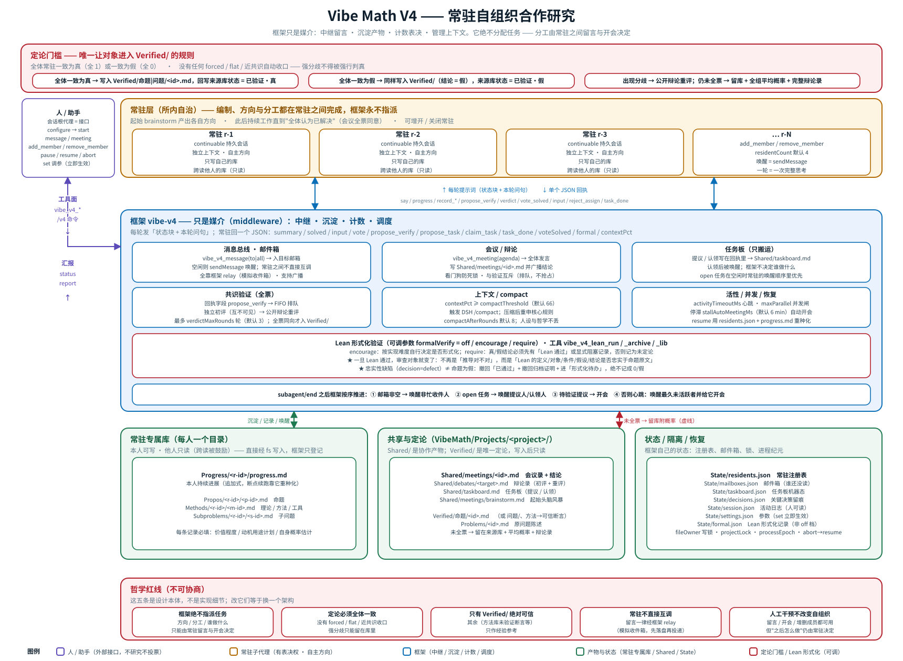
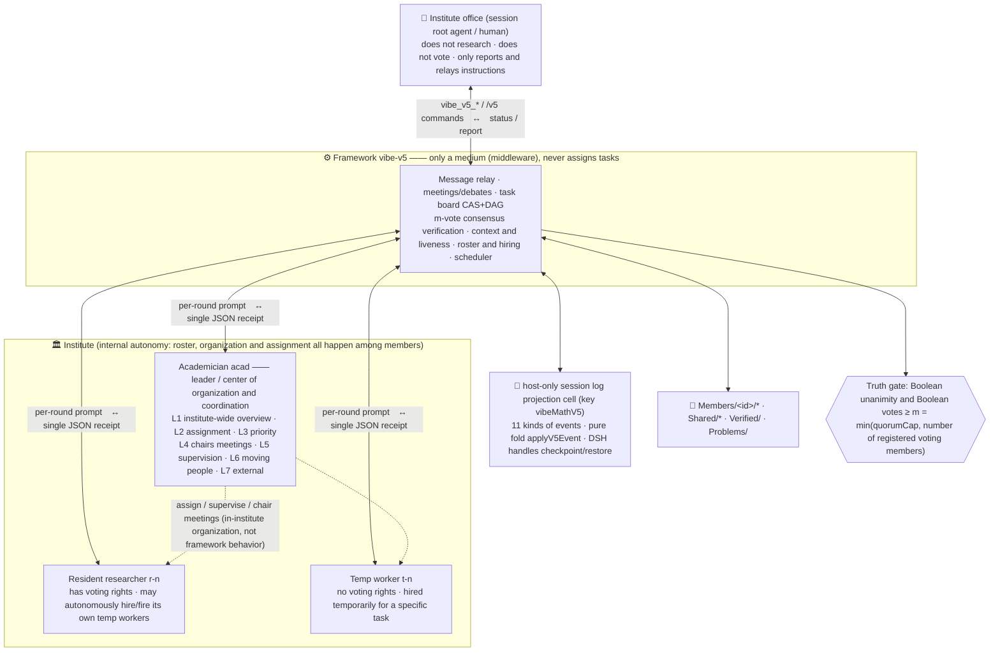

# Vibe Mathematics — Multi-Agent Mathematical Problem Solving and Verification Framework (Four Architectures)

English | [中文](README.md)

[](https://www.npmjs.com/package/dsh-vibe-math)
[](https://opensource.org/licenses/MIT)
[](https://github.com/ChongCyrus/Vibe-Mathematics)

> A set of **agent presets** running inside **DeepSeek Harness** (`vibe-math-v2` / `vibe-math-v3` / `vibe-math-v4` / `vibe-math-v5`),
> which use multi-agent collaboration to automatically solve mathematical problems and perform multi-agent cross-verification of the conclusions. All four presets share the foundational capabilities of "**checkpoint resume**,
> **mid-run manual intervention**, **progress reporting**, and **natural-language driving**", but adopt four generations of different solving architectures:
> **💡 `vibe-math-v2` and `vibe-math-v3` are recommended at the same level** — both are mature, usable, actively maintained recommended architectures; choose according to your actual needs (see "How to choose" below); `vibe-math-v4` is the "resident self-organizing collaborative research" architecture, and `vibe-math-v5` is the latest "institute system" (both are experimental).
>
> - **`vibe-math-v2` (probability-driven · JSON data layer) ✅ Recommended**: `qs.json` problem list + `Propos/` proposition library + probability-driven scheduling + code heuristic scheduling;
> - **`vibe-math-v3` (third generation · paper-style md + planner agent + method library) ✅ Recommended**: all knowledge is stored and extended in **Markdown paper/research-report form** (`Problems/` problem list + dependencies + source motivation, `Progress/` research log, `Propos/` proposition library, `Methods/` general theory invention library, `Verified/` absolutely trustworthy); before scheduling, the **planner agent** autonomously draws up a plan for the next N steps; theories/frameworks/tools/methods/ideas invented during solving are distilled by the **Method Keeper** into a reusable method system (as in inventing group theory or functional analysis).
> - **`vibe-math-v4` (fourth generation · resident self-organizing collaborative research) 🧪 Experimental**: a group of **persistent resident subagents** **leave messages for one another + hold meetings**, and autonomously decide all task arrangements (no central scheduler); each accumulates its own progress/proposition/method/subproblem libraries and consults the others; verification is written to `Verified/` **only when all residents agree (true or false)**, otherwise it remains in the library with a probability attached; when the context reaches a threshold it automatically `/compact`s; it stops only when all agree that the original problem has been solved.
> - **`vibe-math-v5` (fifth generation · institute system) 🧪 Experimental · Latest**: upgrades the residents into an **institute** — **academicians** (leaders / the organizing and coordinating center, responsible for decomposition and **assignment**, setting priorities, chairing meetings, and supervising progress) + **resident researchers** (with voting rights, able to autonomously hire/fire their own temp workers) + **temp workers** (no voting rights); it has a **public charter**, **group chat and meetings**, a **compare-and-set task board**, and **real firing**; a boolean agreement of **≥ m votes** is required to write to `Verified/` (opposing votes block, abstentions are not counted, and if the threshold is not met it remains in the library with an average probability attached); state is stored in **host-only projection units of the session log**, at zero token cost.

After installing this plugin package (or manually copying the presets), **four** agent presets appear in DSH's preset selector.

---

## 🧩 Architecture Diagrams (v2 + v3 + v4 + v5)

> Static architecture diagrams; for the complete process description see [docs/架构图.md](docs/架构图.md) (v2 in detail) and
> [vibe-math-v5/架构图.md](vibe-math-v5/架构图.md) (the full set of v5 detail diagrams);
> editable generation scripts: [v2](docs/generate_framework_diagram_v2.py) / [v3](docs/generate_framework_diagram_v3.py) (matplotlib → PNG),
> [v4](docs/generate_framework_diagram_v4.mjs) / [v5](docs/generate_framework_diagram_v5.mjs)
> (zero-dependency Node → **SVG**, `node docs/generate_framework_diagram_v4.mjs`).
> SVG is used from v4 onward: plain text, diff-friendly, crisp at any zoom; when PNG is needed, screenshot with a headless browser (the command is at the top of the generation script).

### Vibe Math V2 (probability-driven · JSON data layer) ✅ Recommended


**One-sentence pipeline**: `qs.json` takes problems by priority → Explorer splits out directions (if all are dead ends, re-derive) → one Solver per direction iterates over multiple rounds (lemmas go into `Propos/`, solutions go back to `qs.json`, all probabilities <1) → the scheduler picks r (proposition / proposition+proof·disproof / problem+solution) and dispatches ≥3 verifiers for independent review → debate → ruling → at probability=1 it automatically closes out (problem solved, proposition 1/0, priority set to `never`); state is written to disk throughout, `resume` continues from the checkpoint, and `reportMode` can report by file/push/both.

### Vibe Math V3 (paper-style md + planner agent + methods library) ✅ Recommended


**One-sentence pipeline**: all knowledge is stored and continued as **Markdown papers/research reports** (`Problems/` problem list including dependencies and the source motivation of follow-up problems, `Progress/` research log continued by direction and by round, `Propos/` proposition library, `Methods/` general theory invention library, `Verified/` absolutely trustworthy) → before scheduling, the scheduler builds a state brief and calls the **planner agent**; the planner agent lays out the next N steps in one go (spawn solver/verifier/explorer/method-keeper, interrupt, promote, wait), which are executed after code validation (actions exceeding the concurrency limit are queued and consumed across ticks; a planning failure automatically falls back to the v2-style heuristic) → verifiers review independently → debate → **near-consensus ruling** (if on the same side and the mean is ≥0.85/≤0.15, take the mean, fixing v2's flat misjudgment) → at probability=1 it closes out and generates a `Verified/` card → the solver's `methods_used`/`new_inventions` reports are distilled/refined into the methods library by the **Method Keeper** (which can form system hierarchies and be reused across projects).

### Vibe Math V4 (resident self-organizing collaborative research) 🧪 Experimental



> The SVG above is generated by a zero-dependency script: `node docs/generate_framework_diagram_v4.mjs` (pure Node, no Python/matplotlib dependency;
> generation estimates text width, and any line overflowing its container raises a warning and exits with code 1).

**One-sentence pipeline**: initially N **resident subagents** are created (continuable, persistent context) which first brainstorm on their own and produce initial insights/directions → after that **all task arrangements are decided autonomously by them leaving messages for each other + holding collective meetings** (the framework only provides the message bus/meetings/task board/artifact persistence, and **never assigns tasks**); each resident persists valuable artifacts into **its own** `Progress/<id>/`, `Propos/<id>/`, `Methods/<id>/`, `Subproblems/<id>/` libraries according to **degree of value / planned motivation and use / its own probability estimate**, and they **can read each other's**; verification is initiated by **their own deliberation**, and only when **all residents agree (true or false)** is it written to `Verified/`, otherwise it stays in the library with a probability attached; when a resident's context reaches a threshold (66% by default) it automatically `/compact`s; they stop **only when all of them agree that the original problem is solved**; residents can be manually intervened with/added/shut down at any time, and checkpoint resume is supported.

> Note: V4 removes v3's central planner and deterministic roles (explorer/solver/verifier/planner/method-keeper) and makes the "researcher" itself the subject. See `vibe-math-v4/实现方案.md` for details.
> Keep-alive mechanism (tiered keep-alive A+B + deadlock watchdog): a gang idle for longer than `activityTimeoutMs` receives a **self-driven** CHECKPOINT (suggesting it continue solving/send a message/propose a task, rather than "do you want to stop"), and it **fills in parallel** — branch A fills as much of the `maxParallel` concurrency budget as possible in one go (waking several idle residents at the same moment, rather than the serial "wake only r1, then r2 after it finishes"), and mailbox delivery also reaches several idle recipients in parallel; a failed wake automatically re-arms the heartbeat; if the team is idle and has **no new artifacts** for longer than `stallAutoMeetingMs` (6 minutes by default), the framework automatically convenes a synchronous meeting so the residents can decide the next step themselves; if a **meeting/verification hangs** (still no new speech/votes after more than 2×`activityTimeoutMs`), the framework automatically **abandons that meeting/verification** and returns to normal self-organization, so that one broken meeting does not permanently block the whole team; **meetings do not preempt verification** — meeting requests while verification is under way are held and convened afterwards (keeping the consensus-consistent "truth-seeking" step from being interrupted by coordination discussion) — the framework always only facilitates and never assigns tasks.

---

### Vibe Math V5 (institute system) 🧪 Experimental · Latest

**One-sentence positioning**: upgrade v4's "a group of residents messaging each other" into an **institute** — with three classes of staff: **academician** (leader), **resident researcher**, and **temp worker**; with the institute's **public charter**; with **group chat and meetings**; with **autonomous hiring/firing**; and where
**any conclusion must be given a Boolean probability of 1 or 0 unanimously by at least m voting members before it can be written to `Verified/`**.


> Image sources and all detail diagrams (member lifecycle, one-round sequence, consensus state machine, meeting flow, scheduling priority, state folding,
> prompt composition, task board, authority matrix): [`vibe-math-v5/架构图.md`](vibe-math-v5/架构图.md).
> The SVG above is generated by a zero-dependency script: `node docs/generate_framework_diagram_v5.mjs`.



#### Positions and Authority

| Position | Codename | Voting right | Authority |
|---|---|---|---|
| **Academician** (leader) | `acad` | ✅ one vote, **of equal weight with others** | **Center of organization and coordination**: build an institute-wide overview (`overview`), decompose the original problem into tasks and **assign** them (`assign`), set priorities (`prioritize`), convene and chair meetings (`convene`), supervise progress (`nudge`), move temp workers around, report outward. **Cannot unilaterally conclude**, and cannot expand the roster on its own. |
| **Resident researcher** | `r-<n>` | ✅ one vote | Digs deep in its own direction; **may autonomously hire/fire its own temp workers**; reports progress to the academician and accepts its organization and assignments (**has the right of reasoned objection**). |
| **Temp worker** | `t-<n>` | ❌ | Hired temporarily for a specific task: can read/think/speak/write its own output library/claim or be assigned tasks; fired by its **employer or the academician**. Codenames are never reused. |
| **Institute office** (main assistant) | —— | ❌ | **Does not take part in research and does not vote.** Only reports, translates the human's words into tool calls, and holds on the human's behalf the creation rights the platform requires (creating an institute / adding resident researchers). |

**Division of labor in one sentence**: **organization is the academician's responsibility, but judgment belongs to each person individually** —— what the academician assigns is **work**, not **conclusions**.

#### Truth Rules (the core of V5)

For an object to enter `Verified/` it must **simultaneously** satisfy:

1. At least **m = min(`quorumCap`, number of registered voting members)** voting members cast a **Boolean probability value**;
2. These votes are **all** `1` (absolutely true) or **all** `0` (absolutely false).

A vote is a numeric value in `[0,1]`: **strictly between 0 and 1 = abstention/doubt** (not counted toward m, but counted in the group's average probability).
**Any single opposing Boolean vote blocks a conclusion** —— the minority cannot push a conclusion through by having others abstain.
An object that falls short of the threshold **stays in its original library**, with the group's average probability and the complete debate record attached, and is **not forcibly ruled on**.

Voting has two stages: first [independent initial assessment] (mutually invisible), and if undecided, then [open debate] followed by a re-vote, with a round cap of `verdictMaxRounds`.
`quorumMode: "all-unanimous"` switches back to v4's "all-unanimous" standard.

#### Operating Mechanisms

- **Communication**: group chat (fanned out to every other member), direct message, votes cast only to members with voting rights; messages are **persisted per recipient**,
  written to disk before delivery, and group chat is batched into digests by `chatDigestMs` / `chatDigestMax` (direct messages/meetings/votes are not batched).
  All in-institute communication goes through the framework relay (DSH's adjacency restriction does not allow members to message each other directly), but **the signature is always the real sender**.
- **Meetings and verification are mutually exclusive** (in both directions): meeting requests while verification is under way are **held**; verification requested while a meeting is under way is **queued** ——
  the two consensus processes never run at the same time, avoiding mutual starvation of the watchdog clocks. Meetings collect opinions one by one in a **random speaking order**,
  and at closing they aggregate the votes and check whether everyone considers the problem solved.
- **Task board**: compare-and-set (the latest `expected_revision` must be read before a change) + dependency DAG (all dependencies must be complete before claiming;
  cycle detection rejects bad dependencies) + write-scope overlap warnings; when an owner is fired, its tasks are automatically reclaimed.
- **Hiring / firing**: both academicians and resident researchers can hire **their own** temp workers, with a dual quota per member (`maxTempPerMember`) and institute-wide
  (`maxTempTotal`); firing is **real** —— it cancels in-flight turns, releases the resident sub-session, reclaims tasks, and discards undelivered mail.
- **Liveness**: the main drive is a **one-shot activity wait** (`vibe_v5_wait`, no polling); the scheduler advances by priority
  (in-progress meetings/verification → queued verification → held meetings → active tasks → urgent mail → group chat digest → auto-meeting on stall → fallback heartbeat),
  and concurrency is gated by `maxParallel`; the task board's "nudge" is **throttled** by `activityTimeoutMs`.
- **Watchdog**: if a meeting/verification goes beyond 2×`activityTimeoutMs` with no new speech/new votes → abandon it and return to self-organization;
  the heartbeat is **re-armed after every wake**, so the scheduler never freezes permanently.
- **Context**: upon reaching `compactThreshold` (%) or accumulating `compactAfterRounds` rounds, members are asked to condense their working state into
  `Progress/`; **the charter lives in the persona**, remains in effect after compaction, and does not need to be restated every round.
- **Stopping**: the problem is concluded (**writing `Problems/conclusion.md`**) **only when all voting members consider the original problem solved**.

#### State and Persistence

Institute state lives in a **host-only projection cell of the session log** (key `vibeMathV5`): the framework's only side effect is appending 11 kinds of events to the
session log, from which `applyV5Event` purely folds out the state. Therefore

- **Zero token cost**: these events **do not enter the model context** and do not consume members' conversation budget;
- **Recovery takes the same code path**: both cross-process restarts and resume after an in-process abort are covered by DSH's checkpoint/restore;
- the whole class of problems caused by v4's direct writes to `State/*.json` — "corrupted silent overwrite / concurrent lost writes / stale cross-process snapshots" — is eliminated by construction.

If the host has no `sessionProjections` service, v5 automatically falls back to hardened JSON (`State/<研究所>.v5state.json`, the same fold,
serial writes, and a mandatory load before read), and the installer's startup self-check reports this degradation. Files outside the projection (member output libraries, group chat, meeting minutes,
debate records, roster mirror, task board mirror) are all **human-readable artifacts**, and breaking them by hand does not damage the institute.

#### How the Prompt Is Composed

A member's "persona" carries the **ten-section public charter** (roster and colleagues, general rules, knowledge base and progress format,
organization and coordination, voting rules, per-round rhythm, hiring and firing, task board, context discipline, stopping conditions), which is **frozen at onboarding** and persists with the session;
each round's prompt carries only a short **state block** (who I am / the round / m / the registered roster / my tasks / newly arrived messages), **this round's question**,
and the **receipt contract**. Every field in the receipt contract that the framework actually handles appears, trimmed by position
(temp workers have no `verdict`/`hire`/`fire`; non-academicians have no `assign`/`prioritize`/`nudge`/`convene_meeting`).

The framework treats "the text a member reads" as a product to be guaranteed: identity is **passed explicitly and never guessed**; a member is **written to the roster first, and only then** are its onboarding
prompts constructed; the charter snapshot is frozen at onboarding, and a session rebuild is framed as `【会话重建】` rather than "just onboarded"; no academician narrative appears when there is no academician;
message headers are labeled by **true origin** (institute office assignment ≠ academician assignment; supervision ≠ assignment); framework feedback has its own sender,
and **only one message is delivered per prompt**.

#### Directory Structure (Institute)

```
<会话工作区>/VibeMath/Projects/<项目>/Institutes/<研究所>/
├─ Institutes.md                 # roster mirror (human-readable snapshot, do not edit by hand)
├─ Problems/<id>.md              # original problem
├─ Problems/conclusion.md        # conclusion record
├─ Members/<代号>/
│   ├─ Progress/progress.md      # research log (the main basis for restoring state after compaction)
│   ├─ Propos/<id>.md            # proposition
│   ├─ Methods/<id>.md           # method / theory / tool
│   └─ Subproblems/<id>.md       # subproblem
├─ Shared/
│   ├─ Chat/<date>.md            # group chat log
│   ├─ Meetings/<mt-id>.md       # meeting minutes (including the voting section)
│   ├─ Debates/<object>.md       # debate record (each round's votes and reasons + average probability)
│   ├─ TaskBoard.md              # task board mirror
│   └─ State-of-institute.md     # snapshot of members' judgment on "whether it is solved"
├─ Verified/<type>/<id>.md       # conclusion (read-only; only this can be treated as established)
└─ State/README.md               # explains that "the authoritative state is in the session log projection, not here"
```

#### Tool Surface

| Who | Tools |
|---|---|
| **Institute office / human** | `vibe_v5_configure` (configure first) → `vibe_v5_start` (start work); `vibe_v5_resume` / `pause` / `stop`; `vibe_v5_set` (adjust parameters, effective immediately); `vibe_v5_status` / `report` / `members`; `vibe_v5_message` / `meeting`; `vibe_v5_hire` / `fire` / `add_researcher` / `remove_researcher`; slash command `/v5` |
| **All members** | `vibe_v5_say` (group chat/direct message/to all voters), `vibe_v5_wait` (poll-free wait), `vibe_v5_record_progress`, `vibe_v5_record_proposition` / `_method` / `_subproblem`, `vibe_v5_read_library` (cross-read others' libraries, read-only), `vibe_v5_propose_verify`, `vibe_v5_verdict`, `vibe_v5_task_create` / `_list` / `_get` / `_update`, `vibe_v5_meeting` (propose) |
| **Academician** (also has the `academicianLeads` switch) | `vibe_v5_overview` (institute-wide overview), `vibe_v5_assign` (assignment, must state the reason and acceptance criteria), `vibe_v5_prioritize`, `vibe_v5_nudge` |

#### Key Differences from v4

- **There is a leader**: v4 has no central scheduling and everything emerges from discussion; v5 has an academician responsible for organization and assignment **inside the institute**
  (**the framework still never assigns** —— the assigner is the academician, who is likewise bound by the m votes).
- **The truth gate changes from "all-unanimous" to "≥ m unanimous"** (switchable back to the v4 standard).
- **State is stored in the session log's host-only projection cell**, with DSH responsible for checkpoint/recovery (see above).
- **Three classes of positions + hireable temp workers**: the roster is mutable, and hiring/firing are real reversible operations.
- **No npm experimental package is introduced**: v5 is a single `.js` file within the preset, with zero dependencies.
- **Meetings and verification are strictly mutually exclusive** (queued in both directions).

See [`vibe-math-v5/实现方案.md`](vibe-math-v5/实现方案.md) (written specification) and
[`vibe-math-v5/架构图.md`](vibe-math-v5/架构图.md) (all detail diagrams).

---

## ✨ Features

- **Multi-agent automatic solving**: the main agent hands the problem to the scheduler, which dispatches explorer / solver / verifier (v2/v3) plus subagents such as **planner (planning agent, v3)** and **method-keeper (method organizing agent, v3)** to solve collaboratively; **you do not need to operate node by node by hand**.
- **Multi-agent cross-validation**: every conclusion goes to ≥3 "strict reviewers" for **independent review → debate (exchange group) → adjudication** (v3 defaults to **near-consensus adjudication**: if on the same side and the mean is ≥0.85/≤0.15, take the mean, so that "0.9 vs 1" is not misjudged as 0.5).
- **Paper-style Markdown knowledge base (v3)**: the problem list (including dependencies between problems, and the causes and plans of descendant problems), research log, propositions, and method library are all written and continued in md paper/research-report style (when a direction is re-derived, the logs of the old direction are automatically archived and kept); **only `Verified/` and the objects that a verifier judged true/false are absolutely trustworthy**, and all other md (including unverified assertions in the method library) serve only as empirical reference.
- **General theory invention library (v3)**: the theory systems/frameworks/tools/methods/ideas invented during solving (including empirical summaries) are reported via `methods_used`/`new_inventions`, and the **Method Keeper** consolidates them into `Methods/` method cards (which can form a hierarchy of systems and be reused across projects), forming a systematic method–theory system just like "inventing group theory while solving equations".
- **Planner-agent scheduling (v3)**: before scheduling, the planner agent is invoked to autonomously choose the optimal scheduling scheme according to the actual situation (problem dependencies / survival rate / verifiable objects / concurrency budget / results of the last plan), **arranging the tasks of each agent for the next N steps in one go**; if planning fails, it automatically falls back to heuristics.
- **Knowledge accumulation**: conclusions that pass verification are promoted into the `Verified/` trustworthy knowledge base (v2/v3 additionally have the `Propos/` proposition library) for reuse by later directions.
- **Checkpoint resume**: the scheduling state, task stack, agent registry, decision queue, verifier historical accuracy, etc. are all written to disk; after a restart, `resume` restores them (v2/v3 use a process epoch to distinguish "pause → resume within the same process" from "restart across processes"; v3's md is itself the narrative breakpoint).
- **Mid-run manual intervention (and continue)**: the `auto / manual` modes can be switched at any time; in manual mode, a decision is suspended at key nodes and waits for your approve/reject/override (v3 adds a **plan approval gate** and a **method promotion gate**); you can send a message to / interrupt any subagent.
- **Per-project isolation**: each mathematical problem is an independent project folder, with no interference between them, and you can switch at any time.
- **Multi-session parallel isolation**: a DSH agent preset is a standing mount (all sessions of the same preset share one plugin instance), and inside the plugin all running state is isolated by **root session id** — two sessions can each run a project at the same time, their respective subagents are correctly attached under their own session, and the scheduler / parameters / decision queue / current project do not interfere with each other (v3 additionally has a **project lock**, so the same project is scheduled by only one session at a time). The current project is persisted per session (`VibeMath/current.<session id>.json`).
- **Adjustable subagent permissions**: you can restrict the tools a subagent is allowed/forbidden to use and the per-round cap on external tool calls, and explicitly tell it that it may read `Verified/`, `Propos/`, `Methods/`, `Reliable/` and the progress log.
- **Configurable**: `vibe_math_setting.json` (with comments) for customizing default parameters; `/vibe setup` for interactive question-and-answer configuration.
- **Natural-language control**: the main agent acts as "assistant + reporter" — you state your needs in plain words, and it calls the tools, reports progress, and configures parameters on its own.

**Specific to v4 / v5**:

- **Persistent self-organization (v4)**: at the start, N **persistent resident subagents** are created, after which **all task arrangements are decided by those subagents themselves through leaving messages for each other + holding meetings** (the framework only provides the message bus/meetings/task board, and never assigns tasks).
- **Institute system (v5)**: on top of v4's self-organization, it introduces the **organizational form of a real research institute** — the **academician** (leader) is responsible for decomposition, **assignment**, prioritization, chairing meetings, and supervising progress; **resident researchers** have voting rights and can **autonomously hire/fire their own temp workers**; **temp workers** have no voting rights; all organizational actions are performed by **members of the institute**, and the framework still only acts as the medium. See the [Vibe Math V5](#vibe-math-v5-institute-system--experimental--latest) section above for details.
- **Adjustable quorum (v5)**: for an object to enter `Verified/`, **≥ m = min(`quorumCap`, number of enrolled voters)** voters must cast a **consistent boolean vote** (all `1` or all `0`); **an opposing vote blocks**, and **abstentions do not count as votes but do count toward the average probability**; if the threshold is not reached, the object is **kept in the library with the average probability and the complete debate record**, without forcing an adjudication.
- **Zero-token-cost state persistence (v5)**: the institute state is stored in a **host-only projection unit of the session log** and does not enter the model context; cross-process and same-process recovery go through the same code path.
- **Genuinely reversible roster (v5)**: hiring creates a resident child session; firing cancels in-flight turns, releases the child session, reclaims its tasks, and discards undelivered mail; a codename is never reused.
- **Human-readable mirror (v4/v5)**: the roster table, task board, meeting minutes, debate records, and closing records are all written to disk as Markdown and are readable by humans at any time; but **the authoritative state is not in these files** (in v5 it is in the projection unit), so manually corrupting them will not break the institute.

---

## 🧮 Lean formal verification (shared by the four architectures, adjustable switch)

**What it changes is not "being a bit stricter" but the object of review itself.** m agents agreeing that "this is right" is still **consensus** —
it cannot rule out shared misunderstanding; passing Lean is **machine checking**. The only remaining uncertainty is thus reduced to a question a single person can review effectively:

> **Are the definitions / objects / conditions / assumptions / conclusions in the Lean code fully consistent with the original text of the proposition?**

| | Original verification work | Verification work after formalization passes |
|---|---|---|
| Object of review | The proposition itself (whether the derivation is correct) | **Fidelity**: whether the Lean code ↔ the original text of the proposition are consistent |
| Strength of the conclusion | Consensus (may be jointly wrong) | Strict (already checked by the kernel), provided that fidelity holds |
| By-product | None | A reusable Lean definition / lemma library |

### Switch: `formalVerify` (same name in all four architectures, default `'off'`)

| Value | Meaning |
|---|---|
| **`'off'` (default)** | **No additional requirement whatsoever.** No Lean content appears in member prompts, no formalization state is written, and the verification flow and gates are completely unchanged (it is a **true no-op**, guarded by assertions and probes). The three tools are still registered and usable (calling them proactively works as usual); the main agent's persona **always** lists these three tools and four parameters — otherwise the switch would not be discoverable, and "off" could not be turned on |
| `'encourage'` | **Encouraged but not mandatory**: at verification time, first judge the **implementation difficulty** of the object, and if it can be formalized within an acceptable amount of work, do that first; once Lean passes, the focus of review shifts to **fidelity**. In ordinary work, it is also encouraged to formalize and archive commonly used / potentially reusable objects, assumptions, and new definitions along the way. **No gate** |
| `'require'` | **Mandatory**: a true/false conclusion must satisfy "**Lean has passed**" or "**the blocking reason has been explicitly recorded**", otherwise this adjudication **does not take effect** — it is recorded as undecided (reason `formal-required`), written into the "formalization TODO", announced in the group chat, and the object is kept in the library to be re-proposed after formalization |

> "Explicitly record the blocking reason" in `require` is exactly where **"decide not to do it based on implementation difficulty"** lands: **the decision is the agent's,
> but the decision must be spoken and auditable**, and silently skipping is not allowed. Related parameters also include `leanCommand` (default `lean`),
> `leanArgs` (used with `lake env lean`), and `leanTimeoutMs` (default 120s).

### ⚠️ A fidelity defect ≠ the proposition is false (important)

Passing Lean only guarantees that "this piece of code passed the kernel"; it **does not guarantee that it says what the proposition means to say**. So when a voter, checking item by item,
finds that the Lean code and the original text of the proposition are inconsistent (written too narrowly / too broadly / a different object / a missing condition):

- **Do not vote 0.** Voting 0 means "**the proposition is false**"; an incorrectly written formalization would make the framework record "the formalization does not qualify"
  as "the proposition was disproved", and under v5's all-0 consistency rule it would even write the proposition into `Verified/` marked **false** —
  a mechanism meant for truth-seeking would instead **fabricate a wrong negative conclusion**.
- The correct approach: give a value strictly between 0 and 1 (recorded as an abstention) + use the receipt
  `formal:{decision:'defect', note:'<specific deviation>'}` to record the deviation. The framework then **revokes the "passed" state of this proof**
  (downgraded to `attempted`; `Verified/Lean/<id>.lean` is **deleted**, and if the host cannot delete it, it is rewritten as a "withdrawn" note,
  never leaving a withdrawn proof in the place where everyone looks for proofs; and it is written into the "formalization TODO"), and under the `require` setting
  **this adjudication is not concluded** (the `encourage` setting has no gate, so you must not claim that the framework will force a shelving — there it relies on voters abstaining to prevent a conclusion);
  vote again only after fixing the formalization and getting it to run through.
- Vote 0 only when the voter, **independently of this Lean code**, can also determine that the proposition is false (and can give independent reasons).

> **Receipt channel** (members who do not call the Lean tools can also leave a judgment; it is mandatory under the `require` setting):
> `"formal": {"target":"<object id>", "decision":"used|blocked|defect", "file":"Formal/<object id>.lean", "note":"difficulty judgment/blocking reason/specific deviation"}`.
> When `decision='blocked'`/`'defect'`, **`note` is required** (if missing, the whole entry is rejected); `used` only records the object as `attempted`;
> under the `off` setting this channel **is disabled** (otherwise `off` would not be a true no-op).

> Three further hard requirements injected into the prompt (contract §6): tool names are always given in **full** (`<prefix>lean_archive`, not
> `lean_archive` — an abbreviation is not a registered name, and an agent copying it would call a nonexistent tool); before archiving a reusable definition/lemma, **run it through first** —
> if it does not run through, it must not enter the library; when the **toolchain is missing** (`LEAN_NOT_FOUND` cannot resolve the executable / `NO_SUBPROCESS` the host has no
> subprocess service), write the code down, archive it, and state "the host has no Lean toolchain" in `note` — this counts as an explicit blocking reason,
> and the gate lets it through on that basis, so it will not stall just because Lean cannot be installed.

### Archive: where formalized code goes

```
<VibeMath root>/
├─ Formal/                              # ★ cross-project reusable library (shared by the four architectures)
│   ├─ Lib/<name>.lean                  # reusable definitions / objects / assumptions (def / structure / notation)
│   ├─ Lib/Index.md                     # name → file → category → summary (check here before writing a new definition)
│   ├─ Proved/<name>.lean               # established Lean propositions / lemmas (already machine-checked)
│   └─ Proved/Index.md
└─ Projects/<project>/                  # (in v5, Projects/<project>/Institutes/<institute>/)
    ├─ Formal/
    │   ├─ <object id>.lean              # formalization working file for this object
    │   ├─ Index.md                      # object → status → file → archived proof → run result → difficulty judgment
    │   └─ TODO.md                       # the "formalization TODO" under require mode
    └─ Verified/
        ├─ <original conclusion card>
        └─ Lean/<object id>.lean            # ★ archived proof: the formalized code corresponding to this conclusion object
```

### Tools (three per architecture, prefix following each one's naming)

| Tool | Purpose |
|---|---|
| `<prefix>_lean_run` | Execute Lean on the host `subprocess` service, returning `{ok, exitCode, ms, stdout, stderr}`. **Never throws**: missing toolchain → `LEAN_NOT_FOUND`, timeout → `LEAN_TIMEOUT`, path escape → rejected |
| `<prefix>_lean_archive` | `kind='def'/'lemma'` → archive to the **cross-project** `Formal/Lib` or `Formal/Proved`; `kind='proof'` → write `Formal/<target>.lean`, and if it runs through, also write **`Verified/Lean/<target>.lean`** and mark the object as Lean-passed; `kind='blocked'` → record an explicit difficulty judgment/blocking reason (**reason required**) |
| `<prefix>_lean_lib` | Rebuild and return the three indexes and the per-object formalization status — **check for duplicates and reuse directly before writing a new definition** |

For example, v5 is `vibe_v5_lean_run` / `vibe_v5_lean_archive` / `vibe_v5_lean_lib`, v2/v3 are `vibe_math_lean_*`, and v4 is `vibe_v4_lean_*`.

**Boundaries (intentional)**: the framework **does not bundle Lean** (it does not install a toolchain or download dependencies; when the toolchain is missing it degrades gracefully and records this faithfully);
the framework **does not judge fidelity** (that is what agents/humans review and vote on; the framework is only responsible for **switching** the focus of review to fidelity);
**Lean passing ≠ the proposition is true** — it only means "this piece of formalized code passed the kernel check".

For the complete contract (parameters, paths, state transitions, prompt semantics, gate locations, index format, test requirements), see
[`docs/formal-verification.md`](docs/formal-verification.md).

> **The personas of all four presets (the prompt the main agent receives) fully list the three tools and four parameters above**,
> and the two blocks `prefix` and `text` are identical line by line (only line 0 may differ). This layer is guarded by
> [`audit-persona-surface.test.mjs`](tests/audit-persona-surface.test.mjs) and
> [`audit-persona-sensitivity.mjs`](tests/audit-persona-sensitivity.mjs) — when this feature was added, it was precisely
> in the four presets that the defect "the tools were registered but the persona never listed them" was found (the same batch also found that the persona listed two
> tools for adding/removing resident researchers too few, and that the `/v4`/`/v5` subcommand lists were inconsistent with the implementation; see the release notes shipped with the package).

---

## 🚀 Installation

Two installation methods, choose either one (they can also coexist):

### Method A: one-click install as a plugin package (recommended, installs all four presets at once)

```sh
dsh plugin --profile <your profile> add dsh-vibe-math
# Or install directly from GitHub:
dsh plugin --profile <your profile> add github:ChongCyrus/Vibe-Mathematics
```

During installation the plugin automatically writes the four presets into `~/.dsh/.agent-presets/`: `vibe-math-v2/`, `vibe-math-v3/`, `vibe-math-v4/` and `vibe-math-v5/`.
Then start a new session and pick **Vibe Math V3** (v3, **primary recommendation**), **Vibe Math V2** (v2, **primary recommendation**), **Vibe Math V4** (v4, resident self-organization) or **Vibe Math V5** (v5, institute system) in the preset picker — v2 and v3 are equally primary recommendations, choose according to your actual needs (see "How to choose").
**After upgrading the package version, restart DSH; the managed files in these four preset directories will be replaced wholesale with the new version's bytes — including files you edited by hand.**
This is intentional: a preset that is "half old version, half new version" will fail to mount or behave strangely, and you cannot tell from the outside. **The hand edits that get replaced are not lost**:
the original text is first backed up to `~/.dsh/.agent-presets/.vibe-math-backup/<old version>/<preset>/`, and the file names are listed in the log (see the installer notes at the end for details).
**If you want to customize a preset, do not edit these managed files** — make a copy (the copy action in the preset picker, or copy the directory yourself into a new id); that copy belongs to you and package updates will not touch it.

### Method B: manual install as an agent preset

1. Copy the files from the corresponding directory of this repository into the preset directory:

   ```
   C:\Users\<you>\.dsh\.agent-presets\vibe-math-v2\   ← copy agent.cordis.yml / preset.yml / vibe-math-v2.js from vibe-math-v2/
   C:\Users\<you>\.dsh\.agent-presets\vibe-math-v3\   ← copy agent.cordis.yml / preset.yml / vibe-math-v3.js from vibe-math-v3/
   C:\Users\<you>\.dsh\.agent-presets\vibe-math-v4\   ← copy agent.cordis.yml / preset.yml / vibe-math-v4.js from vibe-math-v4/
   C:\Users\<you>\.dsh\.agent-presets\vibe-math-v5\   ← copy agent.cordis.yml / preset.yml / vibe-math-v5.js from vibe-math-v5/
   ```

2. Start a new session and select **"Vibe Math V2"** / **"Vibe Math V3"** / **"Vibe Math V4"** / **"Vibe Math V5"** in the preset picker.
3. Once the session starts it is ready to use: v2/v3 tools are `vibe_math_*`, v4 is `vibe_v4_*`, v5 is `vibe_v5_*`; typing `/vibe`, `/v4`, `/v5` in the input box gives autocompletion.

> After modifying preset files you must **restart the DSH process** before starting a new session (a preset's standing mount is cached until the process exits).

### DSH version adaptation and dependencies

- **Form dependencies**: the four presets depend on DSH's standard **agent-preset mechanism** (`~/.dsh/.agent-presets/<id>/` + preset picker) and **bundle patch mechanism** (`cordis.patch.yml` injects the installer).
- **Host plugin rows**: `agent.cordis.yml` references the `@deepseek-ai/dsh-*` plugin rows provided by the host (persona, agent-instructions, tool-bash/pwsh, tool-fs/fs-search, tool-jobs, skill-filesystem, tool-skill, tool-goal, plan-mode, compaction, subagent/workflow, ask-user, todo, web, etc., about 21 unique package names). Missing rows on the host cause the preset mount to fail (an error is reported when the session starts).
- **Host service APIs**: the preset plugins consume `subagents` (startContinuable / **sendMessage** (continue/wake; `followup` is only a method of the `Agent` object, **not** a `subagents` service method) / interrupt / drainContinuableChildren (used by v5 for **real dismissal**)), `agents` (get/roots), `tools` (register/restrict), `commands` (register), `fs` (resolve/stat/readText/writeText/listDir), plus the **optional** `subprocess` / `sandboxPolicy` / `compaction` / `sessionProjections` / `sessions`. These API shapes evolve with DSH versions; this project **has checked and adapted to them item by item on `dsh-v0.1.5-rc.2`** (`dsh.testedVersion` in `package.json`). **Note: starting with DSH 0.1.2, `subagents.startContinuable`'s `agentOptions` / `toolFilter` require the host provider to declare the corresponding capability** (both the in-process spawn / fork providers support it; v4/v5's ability to specify member models/routes and tool permissions depends on this).
  > **2026 compatibility fix highlights** (see `docs/COMPAT-AUDIT-ROUND2.md` for details): ① `tools.restrict()` **throws on unregistered tool names**, and the filter is applied when a subagent is created, so the permission name table must contain only names actually registered in this deployment — v2/v3 previously hard-coded `web`/`fetch`/`bash` (of which `bash` is `disabled` on Windows), which caused "when you want to tighten permissions, the subagent can never start"; ② v4's real `/compact` previously looked up `agents.get()` in `subagent/end`, but that event fires only after the subagent **has already been removed from the registry**, making it dead code; it now captures the reference in `subagent/start`; ③ optional services are now read **lazily** instead of being snapshotted in `apply()` (otherwise mount order could leave `subprocess` permanently undefined and silently skip directory creation).
- **DSH STORE compatibility declaration**: `dsh.compatibility.dshReleases` in `package.json` declares `compatible` / `incompatible` / `unknown` item by item for each complete DSH version (currently 8 versions from `0.1.2-alpha.4` … `0.1.5-rc.2` are declared `compatible`, with `0.1.5-rc.2` as the tested target); `engines.node` is `^22.19.0 || >=24.0.0`.
- **Runtime self-check (capability + version dual check)**: on every start the installer (bundle plugin): **① makes a best-effort probe of the DSH version** (reads `@deepseek-ai/dsh/package.json` or the `DSH_VERSION` environment variable; DSH does not expose its version through a public service/context, so this is best effort and is skipped if the probe fails). If a version is detected and is not declared `compatible` in `dshReleases`, a clear notice is given; **② then runs a capability self-check against host services and key APIs** (this is the real mount gate): `subagents`/`agents`/`tools`/`commands`/`fs` are **required** (missing means a warning), while `subprocess`/`sandboxPolicy`/`compaction`/`sessionProjections`/`sessions` are **optional** (missing only prompts that "functionality will silently degrade" and does not affect mounting; when `sessionProjections` is missing, v5's institute state falls back to hardened JSON), and it also includes an `fs.resolve` return-shape check and a subagent `agentOptions`/`toolFilter` capability check. If a preset fails to mount, look first at the self-check warnings in the DSH log.
- **Upgrade path**: after upgrading DSH there is no need to reinstall this package; to upgrade this package use `dsh plugin --profile <your profile> add dsh-vibe-math@latest` (`dsh plugin`'s `--profile` is mandatory; use `add` rather than `update`, because a profile may pin the version to an exact value, in which case `update` will not cross over), and after restarting DSH the installer updates the managed files of the four presets wholly to the new version (modified files are likewise replaced, with the original text first going to `<presetRoot>/.vibe-math-backup/`; see the "Installation" notes above).

---

## 🧭 How to choose among the four presets

> **💡 `vibe-math-v2` and `vibe-math-v3` are equally primary recommendations; choose according to your actual needs:**
>
> - **Choose `vibe-math-v2` (probability-driven · JSON data layer)** if you:
>   - prefer **structured JSON data** (`qs.json` / `Propos/<category>_Propos.json` / `Verified/` cards), convenient for programmatic retrieval and further processing;
>   - want **mature and stable code-heuristic scheduling** (priority + probability, predictable behavior, not dependent on the planner agent's "improvisation");
>   - do not need method library accumulation / paper-style narration, and data being field-oriented is enough.
> - **Choose `vibe-math-v3` (paper-style md + planner agent + method library)** if you:
>   - prefer a **paper/research-report-style natural-language knowledge base** (the problem list includes dependencies and the source motivation of follow-up problems, the research log is continued by direction and by round, human-readable and freely extendable);
>   - want scheduling to be **planned autonomously by the planner agent** as an N-step plan based on the actual situation (more flexible, automatically falls back to heuristics on failure);
>   - want a **general theory invention library** — theories/frameworks/tools/methods/ideas invented during solving are accumulated by the Method Keeper into a reusable, systematizable, cross-project-extendable methodology (like "inventing group theory while solving equations");
>   - accept the trust layering of "only `Verified/` is absolutely trustworthy, the rest of the md is empirical reference".
>
> Both are mature and usable, continuously maintained, and both support checkpoint resume, manual/automatic intervention, progress reporting, multi-session isolation, proposition promotion, near-consensus/weighted adjudication and other core capabilities; the switching cost is low (the same set of `vibe_math_*` tools and `/vibe` commands, the same parameter system).
>
> - **Choose `vibe-math-v4` (resident self-organization)** if you want a group of **persistent resident subagents** that message each other and hold meetings, **fully self-organizing** (no leader, no central scheduling), and can accept a strict threshold of "a conclusion requires unanimity".
> - **Choose `vibe-math-v5` (institute system)** if you want:
>   - **organized self-organization** — like a real research institute, with a **leader (academician)** responsible for decomposition, assignment, prioritization, chairing meetings and supervising progress, but **judgment still belongs to each individual**;
>   - a **roster that can grow or shrink** — resident researchers + temp workers who can be **autonomously hired/dismissed** (temp workers have no voting rights, suitable for chores such as checking, trial computation and material organization);
>   - an **adjustable consistency threshold** — `m = min(quorumCap, number of voting members)` boolean-consistent votes settle the matter (easier to converge than "unanimity", while **opposing votes still block**, so a minority will not be drowned out by abstentions);
>   - **zero-token-cost state persistence** — the institute state is stored in a host-only projection unit of the session log and does not consume member context budget.
>
> **⚠️ `vibe-math-v2` and `vibe-math-v3` are mature primary architectures; `vibe-math-v4` and `vibe-math-v5` are experimental architectures,** all are selectable; the old `vibe-math-v1` has been removed (this package contains only v2/v3/v4/v5).

| | **v2 (probability-driven · primary)** | **v3 (paper-style md · primary)** | **v4 (resident self-organization · experimental)** | **v5 (institute system · experimental)** |
|---|---|---|---|---|
| Positioning | **Primary** (JSON data layer) | **Primary** (third generation) | **Experimental** (fourth generation) | **Experimental** (fifth generation) |
| Core idea | Probability-driven: `qs.json` problems + `Propos/` proposition library, scheduled by "correctness probability / value" | **Paper-style md knowledge base + planner agent scheduling + general theory invention library** | **Persistent resident subagents self-organizing**: message each other + meetings decide all tasks, no central scheduling | **Institute**: the academician organizes and assigns, members research on their own; a conclusion requires **≥ m boolean-consistent votes**; temp workers can be hired as needed |
| Data | `qs/qs.json` + `Propos/<category>_Propos.json` + `Reliable/` | `Problems/` + `Progress/` + `Propos/` + `Methods/` (all md, soft-spec anchors + free narration) + `Verified/` | `Problems/` + `Progress|Propos|Methods|Subproblems/<id>/` **owned by resident id** + `Shared/` (meetings/task board/debate) + `Verified/` | Same member-owned layout as v4, plus `Institutes.md` (roster mirror); **the authoritative state is in the session log projection**, and files are only mirrors and workspaces |
| Roles | explorer → per-direction solver → verifier | **planner (planner agent)** → explorer → per-direction solver → verifier → **method-keeper (method organization agent)** | **N resident researchers** (continuable), no fixed roles | **academician acad** (leader) + **resident researcher r-n** (with voting rights) + **temp worker t-n** (no voting rights, hireable and dismissible) + institute office (does not research and does not vote) |
| Scheduling | Code heuristics (priority + probability) | **The planner agent produces an N-step plan** (executed after validation, falls back to heuristics on failure) | **No central scheduling**: tasks arise from residents messaging each other / holding meetings (the framework is only a medium and does not assign) | **The framework still does not assign**; the **academician** decomposes/assigns/prioritizes/supervises, and members may object with reasons; the framework only relays, keeps the task board, holds meetings and counts |
| Closing rule | A solution/proof reaching probability `1` closes it; `never` is never scheduled | Same as v2 (near-consensus adjudication fixes flat misjudgment) | Writes to `Verified/` **only when all residents agree (true or false)**, otherwise leaves it in the library with a probability | Writes to `Verified/` **only when boolean votes ≥ m = min(`quorumCap`, number of voting members) and all are 1 or all are 0**; opposing votes block; abstentions do not count as votes but count toward the average; (can be switched back to the v4 criterion) |
| Stopping | All solved or stuck | All solved / no candidates | Stops **only when all residents unanimously agree the original problem is solved** | Same as v4: concluded **only when all voting members unanimously agree the original problem is solved** |
| Context | None | None | **Resident context automatically runs `/compact` on reaching the threshold** (adjustable) | Same as v4 (threshold/round count adjustable; after compaction the charter still takes effect in the persona) |
| Ad hoc capabilities | Automatic promotion of proposition "value/criticality" to the problem list; `reportMode file/push/both`; `priorityAdjust` | **Method library accumulation loop** (`methods_used`/`new_inventions` → Method Keeper); **plan approval gate/method promotion gate**; **project lock**; follow-up problem "source and motivation" as a first-class citizen | **Residents accumulate individually + read each other**; **unanimous verification**; **add/close residents at any time, intervene by message**; **checkpoint resume** | All v4 capabilities, plus: **real hiring/dismissal** (releases sub-sessions, reclaims tasks); **compare-and-set task board + dependency DAG**; **strict mutual exclusion between meetings and verification**; **roster mirror and conclusion records**; **zero-token-cost state** |

All four support: checkpoint resume (`vibe_math_resume` / `vibe_v4_resume` / `vibe_v5_resume`), manual intervention and pause/resume,
per-project isolation, subagent permission control, and natural-language driving. **v2 and v3 are both equally primary recommendations** — choose v2 if you prefer structured JSON data and deterministic scheduling,
choose v3 if you prefer paper-style md, the planner agent and the theory invention library; v4 is fully self-organizing resident collaborative research, and v5 is an institute system with "a leader + a roster that can grow or shrink + an adjustable threshold".

---

## 🧠 Architecture and Division of Labor (v3 · third generation) ✅ recommended

The framework = **one main agent (assistant) + one code scheduler + one planner agent + six kinds of subagents**.

| Role | Type | Responsibility |
|---|---|---|
| **Main agent** | LLM (the assistant in the session) | **Natural-language interface + reporter + assistant**. It **does not solve or schedule on its own**; it is only responsible for: translating your words into `vibe_math_*` tool calls, reporting progress, configuring parameters in Q&A form, and executing control commands. |
| **Scheduler** | Plugin code (not a model) | The sole master control: maintains the md knowledge base index, builds the state brief, **validates and executes the planner agent's plan**, writes files, and advances the state machine. **Hard constraints (concurrency / idempotency / already-verified is never scheduled again / write ownership) are enforced by code**. |
| **Planner (planner agent)** 🆕 | Subagent | Each time a dispatch is being prepared, it reads the state brief (problem + dependencies + survival rate, verifiable objects, active agents, concurrency budget, available methods, result of the last plan) and **autonomously chooses the optimal scheduling scheme, arranging the next N steps in one go** (spawn/continue/interrupt/promote/verify/method-keep/wait). It outputs a JSON plan, which the scheduler validates before executing; on failure it automatically falls back to heuristics. |
| **Explorer subagent** | Subagent | Metacognitive brainstorming: constraint decomposition, boundary testing, similar-problem mapping, splitting the problem into multiple "widely divergent" solution directions (if all are dead ends, re-derive). Before starting work it first checks the `Methods/` method library. |
| **Solver subagent** | Subagent | One dedicated solver per direction, **multiple iteration rounds within the same session**, producing lemmas (with proofs), sub-routes, survival probability, and a complete solution, and **reporting `methods_used` and `new_inventions`** (methods/tools/ideas newly invented in this round). |
| **Verifier subagent** | Subagent | Each verification object gets ≥3 independent "harsh reviewers": independent review → debate (chat group) → **near-consensus verdict** (if on the same side with mean ≥0.85/≤0.15, take the mean; otherwise flat/forced). |
| **Method Keeper (method-organizing agent)** 🆕 | Subagent | Periodically digests recent work and new-invention reports, **distills new method cards, merges fragments, improves the system structure (parent system/sub-methods), maintains trusted assertions**, and deposits the theories/frameworks/tools/methods/ideas invented during solving into the `Methods/` general theory invention library. |

> Division of labor in one sentence: **the main agent handles "talking to people", the planner agent handles "setting the plan", the scheduler handles "execution and boundary-keeping", subagents handle "thinking", and the Method Keeper handles "depositing inventions into theory".**

### Architecture and Division of Labor (v4 / v5)

| | **v4 (resident self-organization)** | **v5 (institute system)** |
|---|---|---|
| Principal | N resident subagents (continuable) | academicians + resident researchers + temp workers (all continuable subagents) |
| Who assigns tasks | **No one**: emerges on its own through mutual messages and meetings | **academicians** (institute members, equally bound by the voting rules); the framework still does not assign |
| Who judges | Each on its own; a conclusion is reached only when all agree | Each on its own; a conclusion is reached only on **≥ m voting members in boolean agreement** |
| Coordination mechanism | messages + meetings | messages + meetings (strictly mutually exclusive with verification) + **compare-and-set task board** |
| Roster | resident, can be spawned/closed | **can grow and shrink**: resident researchers are hired with the institute office's approval; temp workers are hired and fired autonomously by academicians/researchers |
| State | `State/*.json` written directly | **session-log host-only projection cells** (zero token cost, handled by DSH checkpoint/restore) |

For the complete v5 architecture (including member lifecycle, one-round timeline, consensus state machine, meeting flow, scheduling priority, state folding, prompt composition, task board, authority matrix), see [`vibe-math-v5/架构图.md`](vibe-math-v5/架构图.md); for the textual specification see
[`vibe-math-v5/实现方案.md`](vibe-math-v5/实现方案.md).

---


## 📁 Directory Structure

### v2 (probability-driven · recommended)

```
<session workspace>/VibeMath/
├─ current.json                        # current project
├─ vibe_math_setting.json             # (optional, global fallback) default parameters JSONC, with comments
└─ Projects/<project>/
   ├─ vibe_math_setting.json          # default parameters for this project
   ├─ qs/qs.json                       # problem list: overview/solved/solution list (complete solution · correctness probability)/priority/progress
   ├─ Propos/<category>_Propos.json        # proposition library: overview/boolean estimate/fine type/proof·disproof list/priority/value·criticality/progress
   ├─ Reliable/                        # trusted references (read-only, placed by the user)
   ├─ Verified/                        # concluded-fact index (propositions with boolean estimate = 0/1)
   ├─ Verification_logs/               # debate record of each verification round (for auditing)
   ├─ Progress_Logs/                   # periodic progress reports report.json
   └─ VibeMath_State/                  # scheduler-private persistent state (for checkpoint resume)
```

### v3 (paper-style md + planner agent + method library) ✅ recommended

```
<session workspace>/VibeMath/
├─ Methods/                            # [global] cross-project general theory invention library (v3, promoted from project level)
├─ current.<session id>.json               # current project per session (parallel sessions do not overwrite each other)
├─ vibe_math_setting.json             # (optional, global fallback) default parameters JSONC, with comments
└─ Projects/<project>/
   ├─ vibe_math_setting.json          # default parameters for this project
   ├─ Problems/<id>.md                 # problem list: one md per problem (soft-spec anchor: ID/type/status/priority/dependencies/dependents/source/plan
   │                                   #   + ## statement / ## source and motivation (later-born problems: generation flow/motivation/backfill plan) / ## solution candidates)
   ├─ Progress/<id>.md                 # aggregated research log index (per-direction summaries + lemma index + per-round records)
   ├─ Progress/<id>/<direction id>.md         # one independent file per direction (written directly by self-organizing agents, no cross-direction concurrency conflict)
   ├─ Propos/<category>/<id>.md            # proposition library: one md per proposition (statement/proof attempts/disproof attempts, soft-spec anchor + free narrative)
   ├─ Methods/<id>.md                  # [general theory invention library] method card: theoretical system/framework/tool/method/idea (with application records/improvement history/system hierarchy)
   ├─ Verified/命题/<id>.md            # absolutely trusted: scheduler-generated verified proposition cards (read-only)
   ├─ Verified/问题/<id>.md            # absolutely trusted: complete trusted solution cards for solved problems (read-only)
   ├─ Reliable/                        # trusted references (read-only, placed by the user)
   ├─ Notes/                           # free notes (not involved in scheduling)
   ├─ Logs/Verification/               # debate record of each verification round (for auditing)
   ├─ Logs/Plans/                      # each scheduling plan + execution result (planner learning loop)
   ├─ Logs/报告.md                     # paper-style human-readable progress report
   └─ State/                           # scheduler-private persistent state (agents/tasks/plans/verifier_accuracy/index/project lock/process epoch)
```

**Iron rule (v2 general)**: the scheduler is the **sole file writer** (subagents only return structured JSON and never write files).
**v3 iron rule**: only `Verified/` and objects judged true/false by the verifier are **absolutely trusted**; all other md (unconcluded propositions, research logs, unverified assertions in the method library) serve only as experiential reference; the scheduler parses only soft-spec anchor lines and entry title lines, and never parses body prose. **v3 allows agents to write md directly** (self-organizing agents locate their own files, e.g. a solver writes `Progress/<id>/<direction id>.md`, a new lemma is written to `Propos/<category>/<id>.md`, and the method-organizing agent writes `Methods/<id>.md`); concurrency safety relies on **write locks** — before writing any file call `vibe_math_claim_write`, after writing call `vibe_math_release_write` (only one agent may write a given file at a time); the content stays in the md, and lightweight metadata is reported to the scheduler via `vibe_math_sync_meta`.

### v5 (institute system · experimental)

```
<session workspace>/VibeMath/Projects/<project>/Institutes/<institute>/
├─ Institutes.md                 # roster mirror (human-readable snapshot: codename/position/status/employer/direction/round/context%)
├─ Problems/<id>.md              # original problem
├─ Problems/conclusion.md        # conclusion record (generated when all those with voting rights agree it is solved)
├─ Members/<codename>/
│   ├─ Progress/progress.md      # research log (narrative, appendable; the main basis for restoring state after compaction)
│   ├─ Propos/<id>.md            # proposition (with proof attempts/disproof attempts)
│   ├─ Methods/<id>.md           # method / theory / tool (with definition notation/application records/improvement history)
│   └─ Subproblems/<id>.md       # subproblem
├─ Shared/
│   ├─ Chat/<date>.md            # group chat record (including institute founding/hiring/firing/meetings/votes/conclusion announcements)
│   ├─ Meetings/<mt-id>.md       # meeting minutes (each member's speech + vote subsection)
│   ├─ Debates/<object>.md         # debate record (each round's votes and reasons + whole-group mean probability)
│   ├─ TaskBoard.md              # task board mirror
│   └─ State-of-institute.md     # snapshot of members' judgment on "whether it is solved"
├─ Verified/<type>/<id>.md       # conclusions (read-only; only these may be treated as established)
└─ State/
    ├─ README.md                 # explains "the authoritative state is in the session-log projection, not here"
    └─ <institute>.v5state.json      # fallback authoritative source only when the host lacks sessionProjections
```

> Enabling Lean formal verification adds two more directories: this institute's `Formal/` (working files + index + formalization todos) and `Verified/Lean/`
> (**archived proofs**), plus the **cross-project** `<VibeMath root>/Formal/{Lib,Proved}/` (reusable definitions and already-proved lemmas) — see
> the "Lean formal verification" section above.

**v5 iron rules**: ① the authoritative state lives in the **session log's host-only projection cells** (key `vibeMathV5`); in the table above, everything except
`State/<institute>.v5state.json` (degraded fallback) is merely a **mirror/workspace**, and breaking it by hand-editing will not destroy the institute;
② members **write only their own library** (`Members/<own codename>/`), but may read anyone's library;
③ only `Verified/` and cards marked "verified·true/false" are **absolutely trusted**; everything else (including unverified assertions in `Methods/`) is merely experiential reference,
and citations must be marked "unverified"; ④ entry into the library must state all three of **degree of value / motivation-purpose plan / own probability estimate**, none may be omitted.

---

## ⚡ Quick Start

### Method A: Direct conversation (recommended, the least effort)

Because the main agent has built-in usage instructions, you **can simply speak in plain language**:

```
帮我用 Vibe Math 证明 √2 是无理数。
```

The main agent will automatically: `vibe_math_add_problem` to add the problem → `vibe_math_start` to start it → after that you can ask it for progress at any time.

```
现在进展怎么样了？
```

The main agent will automatically call `vibe_math_status` / `vibe_math_report` and report the results back to you in plain language.

### Method B: Commands / tools (precise control)

Call the tools directly in the conversation (arguments are JSON):

| Tool | Purpose |
|---|---|
| `vibe_math_add_problem` | Add a problem (id/description/priority/dependencies?; v3 generates `Problems/<id>.md`) |
| `vibe_math_add_proposition` / `vibe_math_list_propositions` (v2/v3) | Add / list the proposition library (id/overview/boolean estimate/fine type/value·criticality; v3 generates `Propos/<分类>/<id>.md`) |
| `vibe_math_start` / `vibe_math_resume` | Start / checkpoint-resume the scheduler |
| `vibe_math_pause` / `vibe_math_abort` | Pause / abort (interrupts all subagents) |
| `vibe_math_status` / `vibe_math_report` | View status / full progress report |
| `vibe_math_set_mode` | Switch `auto` / `manual` |
| `vibe_math_set_params` | Adjust parameters at runtime |
| `vibe_math_setup` | Return the parameter schema (for interactive configuration) |
| `vibe_math_save_settings` | Save the current parameters as the new defaults |
| `vibe_math_template` | Generate the default parameter template file |
| `vibe_math_new_project` / `vibe_math_set_project` / `vibe_math_list_projects` | Project management |
| `vibe_math_list_decisions` / `decide` | View / decide manual decisions (v3: `node=plan` plan approval / `node=method-promote` method promotion) |
| `vibe_math_list_agents` / `vibe_math_message_agent` / `vibe_math_interrupt_agent` | View / message / interrupt subagents |
| `vibe_math_plan` (v3) | View the pending plan / the last plan, or `force:true` to force one planning run |
| `vibe_math_index` (v3) | Rebuild the machine index from the md knowledge base (`State/index.json`) |
| `vibe_math_method_add` / `vibe_math_method_list` (v3) | Manually add / list method cards (project + global) |
| `vibe_math_lock_status` (v3) | View project lock occupancy |
| `vibe_math_claim_write` / `vibe_math_release_write` (v3) | Claim / release the **write lock** on an md file (call before an agent writes a file directly; only one agent may write the same file at a time, preventing concurrent conflicts) |
| `vibe_math_sync_meta` (v3) | After an agent writes content into md, report **lightweight metadata** (direction status/survival rate/lemma id/method card id/new invention) so the scheduler can sync the index — content stays in md, not in JSON |

Slash commands (equivalent to the tools): `/vibe start|resume|pause|abort|status|report|mode <auto|manual>|setup|save|template [global|project]|add <id> <desc>|add-proposition <id> <概述>|list-propositions|project [list|new <name>|<name>]|decisions|agents` (v3 additionally has `methods|index|plan|lock`)

---

## 🎓 Tutorial: Let the Main Agent Do the Work for You

### 1. Natural-language driven (no need to memorize commands)

The main agent's role is to be your "translator". You only need to describe the **goal**, and it will choose and call the tools itself:

| What you say | What the main agent does |
|---|---|
| “求解 / 证明 XXX” | `add_problem` + `start`, then report |
| “现在进度怎么样 / 有哪些代理在跑” | `status` / `report` / `list_agents` and summarize |
| “暂停 / 终止求解” | `pause` / `abort` |
| “切到人工模式，我要逐步把关” | `set_mode manual`, then remind you with `list_decisions` whenever there is a decision |
| “给 q1 的某个求解方向换个思路（比如改成构造性证明）” | `list_agents` to find the childId → `message_agent` to inject new instructions |
| “中断某个卡住的子代理” | `interrupt_agent` |

### 2. Q&A-style parameter configuration (/vibe setup)

You do not even need to remember parameter names. Say:

```
帮我配置一下参数。
```

The main agent will call `vibe_math_setup` to get the full parameter schema (each item includes a **description / options / suggestion / current value**),
then use `ask_user_question` to **ask you item by item** (the options come with explanations and suggestions), apply your choices with `vibe_math_set_params`,
and finally ask whether to save them as defaults with `vibe_math_save_settings`.

You can also just run the command: `/vibe setup` (view the schema) → tell the main agent which ones you want to change → `/vibe save` (save as defaults).

### 3. Configuration file (vibe_math_setting.json)

- **Generate a template**: `/vibe template` (generated into the workspace) or `/vibe template project` (generated into the current project) —
  it produces a JSON template **with `//` comments and an item-by-item Chinese description**; after you edit it by hand, restart/resume to take effect.
- **Save current values**: `/vibe save` writes the currently effective parameters back to that file.
- **The only persistent source**: that file is the **only persistence layer** for parameters (project level takes precedence → when missing, fall back to the global `<工作区>/VibeMath/vibe_math_setting.json` → built-in defaults).
  `vibe_math_set_params` / `set_mode` **write back immediately** to the project-level file and persist, so no manual save is needed.

---

## 🌱 Beginner example walkthrough (using “prove √2 is irrational” as the example)

**Step 1 — Start with one sentence**

```
帮我用 Vibe Math 证明：√2 是无理数。
```

The main agent runs `vibe_math_add_problem {"id":"q1","description":"证明：√2 是无理数。","priority":0}`
then runs `vibe_math_start`, and then tells you “started”.

**Step 2 — Ask about progress**

```
进展如何？
```

The main agent runs `vibe_math_status` and reports in plain language: the number of currently active subagents, the units being verified, whether there are pending decisions, and so on.

**Step 3 — Tune parameters by conversation (optional)**

```
我想让它用加权投票，并发数设成 6。
```

The main agent `vibe_math_set_params {"verdictMode":"weighted-vote","maxParallelThreshold":6}`,
and asks you whether to `vibe_math_save_settings` to save them.

**Step 4 — Intervene midway (optional)**

```
切到人工模式，我要在每个关键节点把关。
```

The main agent `vibe_math_set_mode {"mode":"manual"}`. Afterwards, at every key node it runs `vibe_math_list_decisions`
to get the decisions, explains them to you, and waits for you to `vibe_math_decide {"id":"...","action":"approve"}` (or `reject` / `override`).

**Step 5 — Wrap up**

```
结束了吗？结论是什么？
```

The main agent `vibe_math_status`: in `qs.csv`, `q1` has been written back as `solved`, and the solution file is in `Verified/` and named
`q1-的解法_<唯一标识>.csv`.

> The corresponding wrap-up in v2 is: `q1.已解决 = true` in `qs.json`, its solution `正确概率 = 1`, and the related proposition enters `Verified/`.

---

## 🖼️ Real usage example (long screenshot)

> The screenshot is very long, so it is **collapsed** by default here: the full long image is loaded only after you click “Expand” below, so that it does not fill the page and block the surrounding text.

<details>
<summary>📸 Expand to view the real usage example long screenshot</summary>


</details>

---

## ⚙️ Parameter quick reference

### v2 (probability-driven · main recommendation) defaults

| Parameter | Default | Description |
|---|---|---|
| `mode` | `auto` | `auto` / `manual` |
| `maxParallelThreshold` | 4 | Global maximum number of concurrent subagent rounds (before a new dispatch, active must be < threshold) |
| `solverMaxRounds` | 3 | Maximum number of iteration rounds per solving direction (agent_self_iteration cap) |
| `directionsPerSolver` | 1 | Total number of directions visible to each solver prompt (1 = only its own direction, no mutual interference; N>1 = its own plus summaries of up to N-1 other active directions) |
| `verifierCount` | 3 | Number of independent verifiers per verification target |
| `debateMaxRounds` | 5 | Maximum number of rounds of verification debate (chat group) |
| `verdictMode` | `flat` | `flat` = balanced mechanism (inconsistency judged 0.5) / `forced` = forced verdict (historical accuracy + rigor weighting) |
| `reportMode` | `file` | `file` = write a report file / `push` = push a report to the main agent / `both` |
| `promoteValueThreshold` | 0.7 | A proposition in Propos with "value/criticality" ≥ this value and undecided (0,1) is automatically added to qs.json |
| `priorityAdjust` | `none` | `none` / `deadend-deprioritize` (deprioritize all dead ends) / `survival-map` (recompute by survival rate) |
| `proposPriorityAdjust` | `none` | Dynamic adjustment of proposition priority: `none` / `progress-graded` (recompute by proximity to a conclusion + amount of proof/disproof material; the closer to a conclusion, the higher the priority for verification) |
| `provider` / `model` | empty | Subagent model (empty = inherit the root agent) |
| `solverPersona` / `verifierPersona` / `explorerPersona` | empty | Persona/requirements injected at the start of the solver/verifier/explorer prompt |
| `knowledgeContext` | empty | Shared knowledge/data model description (empty = built-in full version: object/attribute definitions, probability semantics, folder purposes, output completeness requirements; non-empty = overrides and is injected into all subagent prompts) |
| `solverToolAllow` / `solverToolDeny` | `[]` | Tools allowed/denied for the solver |
| `verifierToolAllow` / `verifierToolDeny` | `[]` | Tools allowed/denied for the verifier |
| `solverAllowNetwork` / `verifierAllowNetwork` | empty | Network tool switch (web_search/web/fetch): empty = inherit everything; `true` = add to the existing allow list when one is present; `false` = deny |
| `solverAllowScripts` / `verifierAllowScripts` | empty | Script tool switch (bash/pwsh): same as above |
| `solverMaxToolCalls` / `verifierMaxToolCalls` | 0 | Maximum external tool calls per round (0 = unlimited) |
| `reportIntervalMs` | 0 | 0 = event-driven only (write/push only when there is a state update); >0 = timed automatic reporting (milliseconds) |
| `tickIntervalMs` | 2000 | Scheduler heartbeat interval (milliseconds) |
| `activityLogCap` | 100 | Number of activity log entries retained (the report displays at most 30) |
| `maxExplorerRetries` | 3 | Upper limit on re-dispatching after an explorer fails to split directions |
| `formalVerify` | `'off'` | **Lean formal verification switch**: `'off'` no additional requirement (default)｜`'encourage'` encouraged (during verification, decide for yourself whether to formalize based on implementation difficulty)｜`'require'` mandatory (a true/false conclusion must first have a "Lean passed" or an explicit blocking record, otherwise it is recorded as undecided and enters the formalization todo list). Any illegal value falls back to `'off'` |
| `leanCommand` | `'lean'` | The Lean executable to run (e.g. `'lake'`) |
| `leanArgs` | `[]` | Additional arguments inserted before the file name (e.g. `['env','lean']` together with `leanCommand='lake'`) |
| `leanTimeoutMs` | `120000` | Upper limit for a single Lean run (milliseconds) |

### v3 (paper-style md + planner agent + method library) defaults

Added/adjusted on top of all v2 parameters:

| Parameter | Default | Description |
|---|---|---|
| `verdictMode` | `forced` | v3 first makes a **near-consensus determination** (all results on the same side with a mean ≥0.85/≤0.15 takes the mean), otherwise `forced` = weighted by historical accuracy + rigor / `flat` = balanced (0.5). Fixes the v2 flat problem of misjudging "0.9 vs 1" as 0.5 |
| `planningHorizon` | 3 | Maximum number of actions in one plan by the planner agent ("the next n times") |
| `plannerEnabled` | true | false = fully use the built-in heuristic scheduling (planner agent disabled) |
| `plannerProvider` / `plannerModel` | empty | Planner agent model route (empty = inherit the root agent) |
| `plannerPersona` | empty | Persona/requirements injected at the start of the planner agent prompt |
| `planMinIntervalMs` | 30000 | Minimum interval between two planning calls (milliseconds); ignored when the system is idle and there is work |
| `plannerMaxFails` | 3 | The planner agent reaching this number of consecutive failures → automatic degradation to heuristics |
| `methodKeepIntervalMs` | 0 | Method Keeper periodic consolidation interval (0 = event-driven) |
| `methodKeepEvery` | 5 | Trigger one consolidation every N accumulated inventions/new propositions awaiting sedimentation |
| `methodAutoPromote` | false | Automatically promote project-level methods to the global library (false = manual gate) |
| `indexAutoRebuild` | true | Automatically rebuild `State/index.json` after each disk write (false = manual `vibe_math_index`) |
| `projectLockTimeoutMs` | 60000 | Project lock wait timeout (only one session may schedule a given project at any one time) |
| `methodKeeperPersona` | empty | Persona/requirements injected at the start of the method consolidation agent prompt |
| `formalVerify` | `'off'` | **Lean formal verification switch**: `'off'` no additional requirement (default)｜`'encourage'` encouraged (during verification, decide for yourself whether to formalize based on implementation difficulty)｜`'require'` mandatory (a true/false conclusion must first have a "Lean passed" or an explicit blocking record, otherwise it is recorded as undecided and enters the formalization todo list). Any illegal value falls back to `'off'` |
| `leanCommand` | `'lean'` | The Lean executable to run (e.g. `'lake'`) |
| `leanArgs` | `[]` | Additional arguments inserted before the file name (e.g. `['env','lean']` together with `leanCommand='lake'`) |
| `leanTimeoutMs` | `120000` | Upper limit for a single Lean run (milliseconds) |

### v4 (resident self-organization · experimental) defaults

Adjustable via `vibe_v4_set` (persisted to `State/settings.json`):

| Parameter | Default | Description |
|---|---|---|
| `residentCount` | 4 | Resident count (can be increased/decreased via `vibe_v4_add_member`) |
| `compactThreshold` | 66 | Reaching this resident context share triggers soft compaction (self-report instruction) |
| `compactAfterRounds` | 8 | Trigger one soft compaction every N accumulated rounds per resident (uncompacted) |
| `meetingKeepEvery` | 5 | Automatically trigger one sync meeting every N accumulated new artifacts |
| `maxParallel` | 3 | Upper limit on simultaneously awakened residents (framework-side concurrency gate, not an assignment) |
| `activityTimeoutMs` | 120000 | Idle heartbeat interval (only on timeout is a **self-driven** CHECKPOINT wakeup triggered, pushing residents to keep making progress; a failed wakeup automatically re-arms the heartbeat, ensuring the group never permanently stalls) |
| `stallAutoMeetingMs` | 360000 | **Stall auto sync meeting threshold** (tiered keep-alive B): when the team is idle with no new artifacts for longer than this duration, the framework automatically convenes a sync meeting so the residents decide the next route/division of labor themselves (the framework only facilitates, it does not assign) |
| `verdictMaxRounds` | 3 | Maximum number of rounds of debate after independent initial assessment in verification |
| `provider` / `model` | empty | **Resident LLM route** (empty = residents inherit the main agent's provider/model; previously declared but unused, actually wired up in v1.4.1) |
| `residentPersona` | empty | Persona/requirements injected at the start of each resident prompt |
| `toolAllow` / `toolDeny` | `[]` | **Resident tool permissions** (scoped `tools.restrict()` via `startContinuable`'s `toolFilter`; empty = inherit all tools; ⚠️ an empty `allow:[]` rejects all tools) |
| `formalVerify` | `'off'` | **Lean formal verification switch**: `'off'` no additional requirement (default)｜`'encourage'` encouraged (during verification, decide for yourself whether to formalize based on implementation difficulty)｜`'require'` mandatory (a true/false conclusion must first have a "Lean passed" or an explicit blocking record, otherwise it is recorded as undecided and enters the formalization todo list). Any illegal value falls back to `'off'` |
| `leanCommand` | `'lean'` | The Lean executable to run (e.g. `'lake'`) |
| `leanArgs` | `[]` | Additional arguments inserted before the file name (e.g. `['env','lean']` together with `leanCommand='lake'`) |
| `leanTimeoutMs` | `120000` | Upper limit for a single Lean run (milliseconds) |

### v5 (institute system · experimental) defaults

Adjustable via `vibe_v5_set` (persisted in the session log projection):

| Parameter | Default | Description |
|---|---|---|
| `academician` | `true` | Whether to appoint an academician (1 person) |
| `academicianLeads` | `true` | Whether to enable the academician's organizing/dispatching authority (turning it off degrades to v4-style pure self-organization, with only the institute office able to coordinate) |
| `memberMayRejectAssign` | `true` | Whether a member may **reasoned-object** to the academician's assignment (an objection does not block execution, but the reason is broadcast to the academician and the whole institute) |
| `researcherCount` | 3 | Number of resident researchers (at institute founding) |
| `quorumCap` | 3 | Upper limit of m; actually **m = min(quorumCap, number of enrolled voting members)** |
| `quorumMode` | `'m-unanimous'` | v5 calibration; switching to `'all-unanimous'` returns to v4's "all unanimous" |
| `verdictMaxRounds` | 3 | Maximum number of rounds of public debate after independent initial assessment |
| `maxTempPerMember` | 3 | Upper limit on temp workers **simultaneously** enrolled per academician/researcher (counted by enrollment, not cumulative — so swapping people is not restricted) |
| `maxTempTotal` | 12 | Upper limit on temp workers simultaneously enrolled across the whole institute |
| `compactThreshold` | 66 | Reaching this member context share (0–100) triggers compaction |
| `compactAfterRounds` | 8 | Or trigger one soft compaction every N accumulated rounds |
| `maxParallel` | 3 | Upper limit on simultaneously awakened members (framework-side concurrency gate) |
| `activityTimeoutMs` | 120000 | Idle fallback heartbeat interval (the main driver is a one-shot activity wait, not polling) |
| `stallAutoMeetingMs` | 360000 | Threshold for automatically convening a sync meeting on stall |
| `chatDigestMs` / `chatDigestMax` | 45000 / 12 | Time window and entry cap for batching group chat digests (direct messages/meetings/votes are not batched) |
| `meetingKeepEvery` | 5 | Automatically initiate one sync meeting every N accumulated new artifacts |
| `provider` / `model` | empty | Member LLM route (empty = inherit the institute office/main agent route) |
| `toolAllow` / `toolDeny` | `[]` | Resident staff tool permissions (⚠️ an empty `allow:[]` rejects all tools) |
| `tempToolAllow` / `tempToolDeny` | `[]` | Temp worker tool permissions (narrower than residents) |
| `staffPersona` | empty | Persona/requirements appended before each member charter |
| `formalVerify` | `'off'` | **Lean formal verification switch**: `'off'` no additional requirement (default)｜`'encourage'` encouraged (during verification, decide for yourself whether to formalize based on implementation difficulty)｜`'require'` mandatory (a true/false conclusion must first have a "Lean passed" or an explicit blocking record, otherwise it is recorded as undecided and enters the formalization todo list). Any illegal value falls back to `'off'` |
| `leanCommand` | `'lean'` | The Lean executable to run (e.g. `'lake'`) |
| `leanArgs` | `[]` | Additional arguments inserted before the file name (e.g. `['env','lean']` together with `leanCommand='lake'`) |
| `leanTimeoutMs` | `120000` | Upper limit for a single Lean run (milliseconds) |

Common controls: `vibe_v5_configure` (configure first) → `vibe_v5_start` (start work) → `vibe_v5_report` / `vibe_v5_status`; `vibe_v5_message` / `vibe_v5_meeting` / `vibe_v5_members` / `vibe_v5_hire` / `vibe_v5_fire` (temp worker) / `vibe_v5_add_researcher` / `vibe_v5_remove_researcher` (add/remove residents, institute office only) / `vibe_v5_pause` / `vibe_v5_resume` / `vibe_v5_stop`; slash command `/v5`.

---

## 📝 Checkpoint resume & manual intervention (two hard requirements)

- **Checkpoint resume**: all state is persisted to disk (v2: `VibeMath_State/*.json`; v3: `State/*.json`; **v5: the host-only projection units of the session logs**), and every subagent is a DSH **continuable persistent session** (the conversation is saved automatically by DSH). After a restart, open a new session → `vibe_math_resume` / `vibe_v4_resume` / `vibe_v5_resume` resumes the run. v2/v3 additionally use a **process epoch** to distinguish "same-process pause → resume" (keeping live subagents running) from "cross-process restart" (cleaning up stale tasks). **v3's md knowledge base is itself a narrative breakpoint** — on resume the agent continues writing from the tail of the research log / problem card / proposition card; **in v5 this role is taken by the projection units** — cross-process and same-process recovery go through the same code path, and when member sessions are rebuilt they are re-seeded by "reading back your own Progress/" (rather than making them start over).
- **Intervening mid-run**: `manual` mode suspends decisions at key points (v2: explorer/solver dispatch, verification verdicts; v3: the **plan approval gate** (after the planning agent produces a plan, it waits for your approve/reject), the verification verdict gate, and the **method promotion gate** (project methods → global library)); you can switch back to automatic at any time with `set_mode auto` (which automatically clears all pending decisions); you can `message_agent` / `interrupt_agent` any subagent. **v4/v5 are intervenable by nature**: leave a message for a member at any time (`vibe_v5_message`), convene a meeting, pause the whole institute, add or remove positions — members will see it on their next round.
- **Progress reporting**: **event-driven** by default — reports are written only when an event such as an agent status update occurs (v2: `Progress_Logs/report.json`; v3: `Progress_Logs/report.json` + `Logs/报告.md`, a paper-style human-readable summary; `reportMode` can be `file`/`push`/`both`, and `push` wakes up resident agents to report proactively via `subagents.sendMessage(root agent, resident subagent, …)` — `followup` is **not** a method of the `subagents` service, it is only a method of the `Agent` object); scheduled automatic reporting (interval in milliseconds) starts only when `reportIntervalMs` is set to >0. **v4/v5 progress reporting is "self-reporting within the institute"**: members write their progress into their own `Progress/`, and state key conclusions in the group chat (in v5 there are also readers of the mirrors `Institutes.md` / `Shared/TaskBoard.md`, the meeting minutes, the debate records, and `Problems/conclusion.md`).

---

## 📚 Specification documents

- **v2 (probability-driven)**: [`vibe-math-v2/实现方案.md`](vibe-math-v2/实现方案.md)
- **v3 (paper-style md + planning agent + method library)**: [`vibe-math-v3/实现方案.md`](vibe-math-v3/实现方案.md)
- **v4 (resident self-organization)**: [`vibe-math-v4/实现方案.md`](vibe-math-v4/实现方案.md)
- **v5 (institute system)**: [`vibe-math-v5/实现方案.md`](vibe-math-v5/实现方案.md) (text specification) · [`vibe-math-v5/架构图.md`](vibe-math-v5/架构图.md) (the full set of architecture diagrams)
- **v5 prompts and interaction corpus**: [`prompt-corpus-v5/prompt-corpus-v5.md`](prompt-corpus-v5/prompt-corpus-v5.md) (the verbatim text of every prompt the framework actually emits, so you can manually review whether identity/positions/interaction signatures are correct)
- **Four sets of Lean prompt corpora**: [`prompt-corpus-v2/formal-verify-v2.md`](prompt-corpus-v2/formal-verify-v2.md) · [`prompt-corpus-v3/formal-verify-v3.md`](prompt-corpus-v3/formal-verify-v3.md) · [`prompt-corpus-v4/formal-verify-v4.md`](prompt-corpus-v4/formal-verify-v4.md) (each covering off / encourage / **require** / fidelity branches / work rounds / receipt contract; the workspace is normalized to `<WS>` and the VibeMath root to `<VIBEMATH>`)
- **The persona source text of the four presets**: [`prompt-corpus-persona/persona-corpus.md`](prompt-corpus-persona/persona-corpus.md) (the prompts the main agent actually receives: which tools, which parameters, which slash subcommands; generated by `audit-persona-surface.test.mjs` and shipped with the package)
- **Lean formal verification (a contract shared by the four architectures)**: [`docs/formal-verification.md`](docs/formal-verification.md)
- **Test timing baseline and parallel run recipes**: [`docs/test-timing.md`](docs/test-timing.md) (`node tests/run-tests.mjs` runs all suites in parallel in ≈1.9 min; the probe scripts ≈2.6 min; every runner prints its elapsed time/speedup for choosing a strategy next time)
- **Static prompt-surface consistency (persona ↔ tool registry ↔ slash command hint/usage)**: [`audit-persona-surface.test.mjs`](tests/audit-persona-surface.test.mjs) (197 assertions, and generates [`prompt-corpus-persona/persona-corpus.md`](prompt-corpus-persona/persona-corpus.md) for manual review) + [`audit-persona-sensitivity.mjs`](tests/audit-persona-sensitivity.mjs) (11 sensitivity probes) — guarding "every registered tool must appear in the persona / every name in the persona must really be registered / the `prefix` and `text` blocks must match line by line / hint, usage, and the actual branch must agree in all three places"
- **Mandatory checklist for a full review**: [`AUDIT-CHECKLIST.md`](docs/AUDIT-CHECKLIST.md) (this repository's mandatory audit process; §1.9 specifically checks "whether the tool parameter schema can accommodate them")
- **Prompt/interaction invariants (all four sets together, re-checkable in one command)**: [`audit-prompt-invariants.mjs`](tests/audit-prompt-invariants.mjs) (157 assertions) — encoding, one by one, "the classes of prompt/tool-surface defects that have really occurred historically" as static invariants (abbreviated tool names, projecting a fidelity defect as 0, `defect` written only in the prompt but not implemented, a receipt contract missing `defect`, passing without a note, wrong field names, the `off` tier still being able to write state in its receipt, uncertain corpora, missing probes, **a tool's closed schema that cannot accommodate the parameters in its own documentation**, **keys that the schema declares at the parameter level but silently drops**). Adding `--self-probe` injects these defect shapes in memory and requires the corresponding invariants to **turn red** while the unmutated control run **stays green** (5/5); the script itself additionally carries six self-checks X5–X8b (the comment scanner must recognize regex literals — including regexes **after a keyword** such as `return /…/` — `//` inside strings must be preserved, stripping comments must not change line structure, and the parse-level criterion that "the four sets of source, with comments stripped, must still parse under `node --check`")
- **Specification ↔ code traceability (all four sets together)**: [`audit-spec-traceability.mjs`](tests/audit-spec-traceability.mjs) (94 assertions) — tools promised in `实现方案.md`/README must really be registered; the four Lean parameters must be accepted by both the documentation and the code
- **v5 static integrity**: [`audit-v5-integrity.mjs`](tests/audit-v5-integrity.mjs) (≈0.5 s) — functions called but never defined, reads of undeclared `params.*`, methods that do not exist on the session API, documented error codes that are never thrown, leftover development markers, plus a **parse-level self-check of the scanner** (it strips comments/strings/regexes before scanning, and the self-check guarantees that "the stripped source still parses under `node --check`" — 2.3.5 fixed exactly this blind spot where the scanner misread 30 lines); accompanied by [`audit-v5-sensitivity.mjs`](tests/audit-v5-sensitivity.mjs) (39 probes, and it passes only if they all turn red)

---

## ⚠️ Known limitations (deliberate simplifications)

**v2**:
- The installer has **versioned auto-update**: on every DSH start it compares the package version against the record in `<presetRoot>/.vibe-math-installed.json` — **as soon as the version changes (or on the first run of an older installation with no record) it replaces the managed files wholesale, regardless of whether they were modified**; replaced hand-edited originals are first backed up to `<presetRoot>/.vibe-math-backup/<old version>/<preset>/` and listed in the log. Within the same version it **rewrites no files at all** (restarting DSH will not rewrite the presets, nor disturb the generation index it records by mtime), and missing files are restored at any time. To force a full reinstall: delete the `~/.dsh/.agent-presets/vibe-math-v2`, `vibe-math-v3`, `vibe-math-v4` and `vibe-math-v5` directories and restart DSH.
- **These four directories are owned by the installer**: deleting any file in them or the whole directory only leads to it being restored on the next DSH start (which is exactly why the "force a full reinstall" above works). To get rid of them entirely, uninstall this package (`dsh plugin --profile <your profile> remove dsh-vibe-math`).
- A `flat` verdict directly rules `0.5` when the debate is inconsistent (high-confidence disagreement such as 0.9 vs 1 is also misjudged as 0.5 — **v3 has fixed this with the near-consensus rule**); `forced` weights by historical accuracy + confidence.
- Problems/propositions with `never` priority are **never scheduled**, and do not block strict termination (they count as voluntarily abstaining).
- The four preset files are mutually independent and can coexist; only one preset can be selected in a given session at a time.

**v3**:
- **Soft specification rather than zero specification**: the md knowledge base only enforces the 4–7 anchor lines at the head of an object (`- ID/类型/状态/概率/优先级/依赖/...`) and the entry title line (`### 解法/证明/证伪 N｜标题｜概率X｜状态Y`), so that the scheduler can index reliably; the body is entirely free paper-style prose, and the scheduler never parses the body. Manually editing the anchors may cause index drift (the scheduler keeps the last valid index and warns).
- **The planning agent is an enhancement, not a requirement**: when `plannerEnabled=false` or the planning agent fails repeatedly (`plannerMaxFails`), it automatically falls back to v2-style heuristic scheduling; the `planMinIntervalMs` cooldown takes effect while subagents are in flight (when the system is idle and there is work, it plans immediately).
- **Trust tiers in the method library**: a method card's `可信断言` may only link IDs that have entered `Verified/`; all other content of a method entry (including unverified strategies/intuitions/heuristics) is treated as **empirical reference** and must not be cited as a theorem.
- **Project lock**: only one session may schedule a given project at a time (starting a second session reports "occupied by session X"); the lock is released automatically on pause/termination/when everything is resolved.
- **Near-consensus verdicts**: when all verifier results fall on the same side and the mean is ≥0.85/≤0.15, the mean is taken (e.g. 0.9 vs 1 → 0.95); otherwise `forced` weighting / `flat` rules 0.5 — this fixes the problem in v2 where conclusions that were "mathematically correct but formally flawed" were misjudged as uncertain.

**v5**:
- **The framework never assigns tasks**: this is a hard design boundary, not a feature that has yet to be implemented. The creation and allocation of tasks belong to **institute self-governance**
  (academicians decompose and assign, members claim on their own); the framework only provides the **coordination tools** — task board, messages, and meetings.
- **`≥ m` agreement ≠ mathematically proved**: the quorum only guarantees that "a consistent judgment has been reached within the institute", not that the conclusion is really correct.
  The depth of truth-seeking rests on the members' own derivations and the paper trail in the debate records; objects that do not reach quorum are **kept in the library with their average probability attached** and are not forcibly ruled true or false.
- **The consistency quorum is not "majority rule"**: any single opposing boolean vote blocks a conclusion, and abstention helps neither truth nor falsehood.
  To converge more easily, lower `quorumCap` or reduce the number of members with voting rights; for stricter behavior, switch to `quorumMode: "all-unanimous"`.
- **A member whose round never ends will not be forcibly released** (the same boundary as v4): the heartbeat re-arms it every time,
  so the scheduler will not freeze permanently; when manual intervention is needed, use `vibe_v5_fire` (temp worker) or have the institute office add or remove positions.
- **Meetings and verification are strictly mutually exclusive**: while one is in progress, the other queues/is held. Therefore "concluding an object on the spot in a meeting" first queues,
  and only after the meeting closes does it go through the full voting procedure.
- **After `resume`, the round counter restarts from 1** (in-memory state, used only for throttling and compaction hints); the authoritative progress lives in the members' own `Progress/`.
- **A member's charter is an onboarding snapshot**: upgrading this package will not rewrite the charters of members in an institute that is already running (they keep the version frozen at onboarding).
  If you need a new charter, open a new institute in a new session; the projection state and file tree need no migration.
- **Installer behavior is the same as v2** (versioned auto-update; as soon as the version changes it replaces the managed files wholesale, backing up the originals first, and the `vibe-math-v5` directory is likewise managed).
- **Lean formalization requires a Lean toolchain on the host**: the framework neither bundles nor downloads one; without a toolchain the three Lean tools truthfully return
  `LEAN_NOT_FOUND`, and formalization code can still be written down and archived, but verification cannot be executed.
- **The gate in `require` mode is "shelving" rather than "deadlock"**: true/false conclusions that lack formalization are recorded as undecided + entered into the formalization to-do,
  and the institute keeps moving forward (the same trade-off as "kept in the library with average probability when quorum is not reached"), so it will not be stuck forever on one object.

---

## 📄 License

MIT
