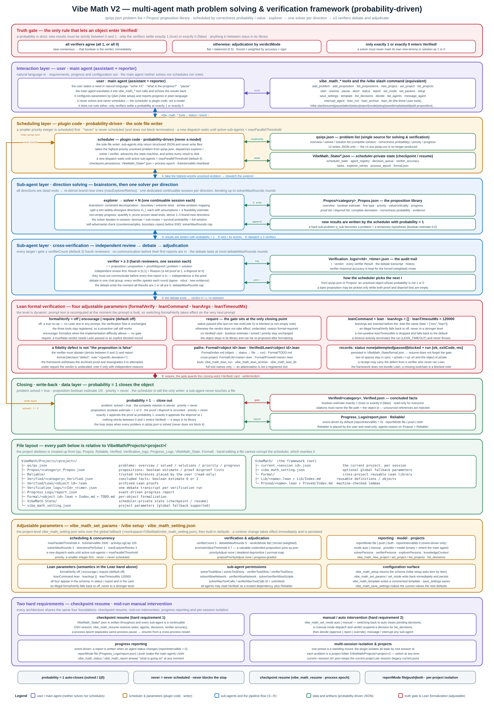
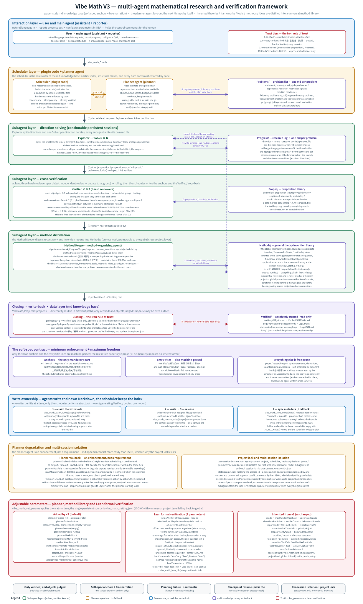
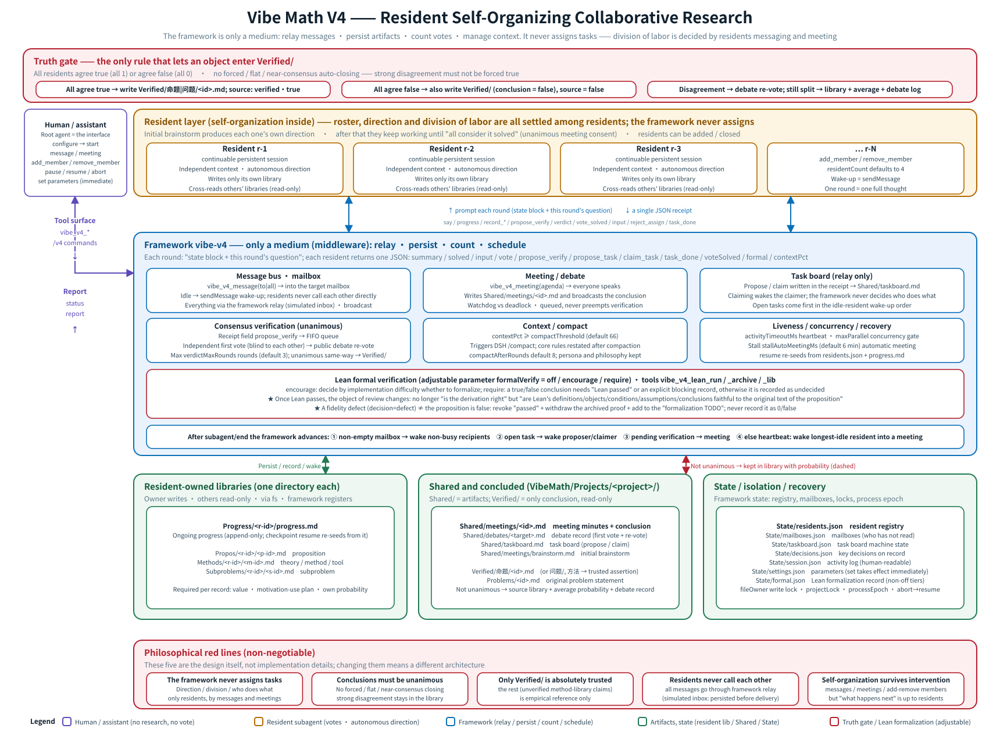
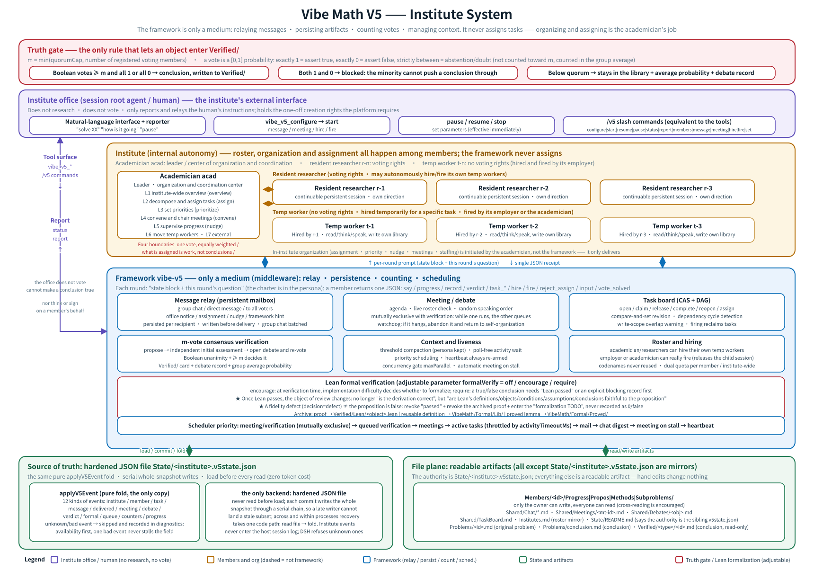
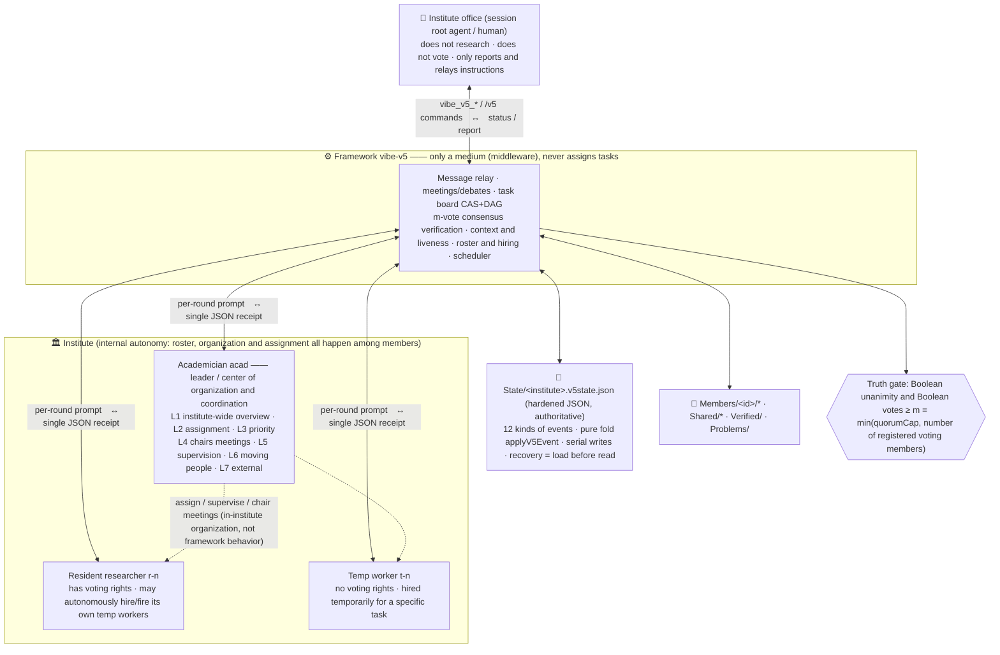

# Vibe Mathematics — Multi-Agent Mathematical Problem Solving and Verification Framework (Four Architectures)

English | [中文](README.md)

[](https://www.npmjs.com/package/dsh-vibe-math)
[](https://opensource.org/licenses/MIT)
[](https://github.com/ChongCyrus/Vibe-Mathematics)

> A set of **agent presets** running inside **DeepSeek Harness** (`vibe-math-v2` / `vibe-math-v3` / `vibe-math-v4` / `vibe-math-v5`),
> which use multi-agent collaboration to automatically solve mathematical problems and perform multi-agent cross-verification of the conclusions. All four presets share the foundational capabilities of "**checkpoint resume**,
> **mid-run manual intervention**, **progress reporting**, and **natural-language driving**", but adopt four generations of different solving architectures:
> **💡 v4/v5 first** — `vibe-math-v4` (the "resident self-organizing collaborative research" architecture) and `vibe-math-v5` (the latest "institute system") are the **current focus of maintenance**; `vibe-math-v2` and `vibe-math-v3` are the **classic / early** architectures, now **architecturally frozen** and receiving **compatibility-only** maintenance (new capabilities land in v4/v5). All four still install and work; see [`docs/maintenance-policy.md`](docs/maintenance-policy.md). Choose according to your actual needs (see "How to choose" below).
>
> - **`vibe-math-v2` (probability-driven · JSON data layer) · classic**: `qs.json` problem list + `Propos/` proposition library + probability-driven scheduling + code heuristic scheduling;
> - **`vibe-math-v3` (third generation · paper-style md + planner agent + method library) · classic**: all knowledge is stored and extended in **Markdown paper/research-report form** (`Problems/` problem list + dependencies + source motivation, `Progress/` research log, `Propos/` proposition library, `Methods/` general theory invention library, `Verified/` absolutely trustworthy); before scheduling, the **planner agent** autonomously draws up a plan for the next N steps; theories/frameworks/tools/methods/ideas invented during solving are distilled by the **Method Keeper** into a reusable method system (as in inventing group theory or functional analysis).
> - **`vibe-math-v4` (fourth generation · resident self-organizing collaborative research) 🧪 Experimental**: a group of **persistent resident subagents** **leave messages for one another + hold meetings**, and autonomously decide all task arrangements (no central scheduler); each accumulates its own progress/proposition/method/subproblem libraries and consults the others; verification is written to `Verified/` **only when all residents agree (true or false)**, otherwise it remains in the library with a probability attached; when the context reaches a threshold it automatically `/compact`s; it stops only when all agree that the original problem has been solved.
> - **`vibe-math-v5` (fifth generation · institute system) 🧪 Experimental · Latest**: upgrades the residents into an **institute** — **academicians** (leaders / the organizing and coordinating center, responsible for decomposition and **assignment**, setting priorities, chairing meetings, and supervising progress) + **resident researchers** (with voting rights, able to autonomously hire/fire their own temp workers) + **temp workers** (no voting rights); it has a **public charter**, **group chat and meetings**, a **compare-and-set task board**, and **real firing**; a boolean agreement of **≥ m votes** is required to write to `Verified/` (opposing votes block, abstentions are not counted, and if the threshold is not met it remains in the library with an average probability attached); state is written to the **hardened JSON file** `State/<institute>.v5state.json` under the institute directory (serial writes, a mandatory load before read) — **never into the host session log** — at zero token cost.

After installing this plugin package (or manually copying the presets), **four** agent presets appear in DSH's preset selector.

---

## 🧭 Navigation: I want to … → start here

- **Get started (first run)** → [Start in five minutes](#-start-in-five-minutes)
- **Which of the four presets to pick** → [How to choose among the four presets](#-how-to-choose-among-the-four-presets)
- **Positioning, flow and division of labour of the four** → [Architecture Diagrams](#-architecture-diagrams-v2--v3--v4--v5) · [Architecture and division of labour](#-architecture-and-division-of-labour-all-four-in-parallel)
- **New: the final paper (produced at closure)** → [Features](#-features) · [full contract](docs/final-paper.md)
- **Lean formal verification** → [Lean formal verification](#-lean-formal-verification-shared-by-the-four-architectures-adjustable-switch) · [full contract](docs/formal-verification.md)
- **Observability (`status()` / `report()` fields and their scopes)** → [complete field table](docs/status-report-fields.md)
- **What is in the directories** → [Directory structure](#-directory-structure)
- **Tuning parameters** → [Parameter quick reference](#-parameter-quick-reference)
- **Checkpoint resume / mid-run intervention** → [Checkpoint resume & manual intervention](#-checkpoint-resume--manual-intervention-two-hard-requirements)
- **Known limitations** → [Known limitations](#-known-limitations-deliberate-simplifications)

---

## 🧩 Architecture Diagrams (v2 + v3 + v4 + v5)

> Static architecture diagrams; for the complete process description see [the v1-era architecture notes](docs/架构图.md) (historical: the layout changed from v2 on) and
> [the v5 detail diagrams](vibe-math-v5/架构图.md) (the full set of v5 detail diagrams);
> editable generation scripts: the Chinese v2/v3 posters come from the matplotlib scripts
> [v2](docs/generate_framework_diagram_v2.py) / [v3](docs/generate_framework_diagram_v3.py) (matplotlib → PNG); the English v2/v3 diagrams come from the
> zero-dependency Node scripts [v2-en](docs/generate_framework_diagram_v2_en.mjs) / [v3-en](docs/generate_framework_diagram_v3_en.mjs) (→ **SVG**);
> [v4](docs/generate_framework_diagram_v4.mjs) / [v5](docs/generate_framework_diagram_v5.mjs)
> (zero-dependency Node → **SVG**, `node docs/generate_framework_diagram_v4.mjs`; add `--lang=en` for `示例图/框架图-v4-en.svg`).
> SVG is used from v4 onward: plain text, diff-friendly, crisp at any zoom; when PNG is needed, screenshot with a headless browser (the command is at the top of the generation script).

### Vibe Math V2 (probability-driven · JSON data layer) · classic



**One-sentence pipeline**: `qs.json` takes problems by priority → Explorer splits out directions (if all are dead ends, re-derive) → one Solver per direction iterates over multiple rounds (lemmas go into `Propos/`, solutions go back to `qs.json`, all probabilities <1) → the scheduler picks r (proposition / proposition+proof·disproof / problem+solution) and dispatches ≥3 verifiers for independent review → debate → ruling → at probability=1 it automatically closes out (problem solved, proposition 1/0, priority set to `never`); state is written to disk throughout, `resume` continues from the checkpoint, and `reportMode` can report by file/push/both.

### Vibe Math V3 (paper-style md + planner agent + methods library) · classic



**One-sentence pipeline**: all knowledge is stored and continued as **Markdown papers/research reports** (`Problems/` problem list including dependencies and the source motivation of follow-up problems, `Progress/` research log continued by direction and by round, `Propos/` proposition library, `Methods/` general theory invention library, `Verified/` absolutely trustworthy) → before scheduling, the scheduler builds a state brief and calls the **planner agent**; the planner agent lays out the next N steps in one go (spawn solver/verifier/explorer/method-keeper, interrupt, promote, wait), which are executed after code validation (actions exceeding the concurrency limit are queued and consumed across ticks; a planning failure automatically falls back to the v2-style heuristic) → verifiers review independently → debate → **near-consensus ruling** (if on the same side and the mean is ≥0.85/≤0.15, take the mean, fixing v2's flat misjudgment) → at probability=1 it closes out and generates a `Verified/` card → the solver's `methods_used`/`new_inventions` reports are distilled/refined into the methods library by the **Method Keeper** (which can form system hierarchies and be reused across projects).

### Vibe Math V4 (resident self-organizing collaborative research) 🧪 Experimental



> The SVG above is generated by a zero-dependency script: `node docs/generate_framework_diagram_v4.mjs --lang=en` (pure Node, no Python/matplotlib dependency;
> generation estimates text width, and any line overflowing its container raises a warning and exits with code 1).

**One-sentence pipeline**: initially N **resident subagents** are created (continuable, persistent context) which first brainstorm on their own and produce initial insights/directions → after that **all task arrangements are decided autonomously by them leaving messages for each other + holding collective meetings** (the framework only provides the message bus/meetings/task board/artifact persistence, and **never assigns tasks**); each resident persists valuable artifacts into **its own** `Progress/<id>/`, `Propos/<id>/`, `Methods/<id>/`, `Subproblems/<id>/` libraries according to **degree of value / planned motivation and use / its own probability estimate**, and they **can read each other's**; verification is initiated by **their own deliberation**, and only when **all residents agree (true or false)** is it written to `Verified/`, otherwise it stays in the library with a probability attached; when a resident's context reaches a threshold (66% by default) it automatically `/compact`s; they stop **only when all of them agree that the original problem is solved**; residents can be manually intervened with/added/shut down at any time, and checkpoint resume is supported.

> Note: V4 removes v3's central planner and deterministic roles (explorer/solver/verifier/planner/method-keeper) and makes the "researcher" itself the subject. See `vibe-math-v4/实现方案.md` for details.
> Keep-alive mechanism (tiered keep-alive A+B + deadlock watchdog): a gang idle for longer than `activityTimeoutMs` receives a **self-driven** CHECKPOINT (suggesting it continue solving/send a message/propose a task, rather than "do you want to stop"), and it **fills in parallel** — branch A fills as much of the `maxParallel` concurrency budget as possible in one go (waking several idle residents at the same moment, rather than the serial "wake only r1, then r2 after it finishes"), and mailbox delivery also reaches several idle recipients in parallel; a failed wake automatically re-arms the heartbeat; if the team is idle and has **no new artifacts** for longer than `stallAutoMeetingMs` (6 minutes by default), the framework automatically convenes a synchronous meeting so the residents can decide the next step themselves; if a **meeting/verification hangs** (still no new speech/votes after more than 2×`activityTimeoutMs`), the framework automatically **abandons that meeting/verification** and returns to normal self-organization, so that one broken meeting does not permanently block the whole team; **meetings do not preempt verification** — meeting requests while verification is under way are held and convened afterwards (keeping the consensus-consistent "truth-seeking" step from being interrupted by coordination discussion) — the framework always only facilitates and never assigns tasks.

---

### Vibe Math V5 (institute system) 🧪 Experimental · Latest

**One-sentence positioning**: upgrade v4's "a group of residents messaging each other" into an **institute** — with three classes of staff: **academician** (leader), **resident researcher**, and **temp worker**; with the institute's **public charter**; with **group chat and meetings**; with **autonomous hiring/firing**; and where
**any conclusion must be given a Boolean probability of 1 or 0 unanimously by at least m voting members before it can be written to `Verified/`**.



> Image sources and all detail diagrams (member lifecycle, one-round sequence, consensus state machine, meeting flow, scheduling priority, state folding,
> prompt composition, task board, authority matrix): [the v5 detail diagrams](vibe-math-v5/架构图.md).
> The SVG above is generated by a zero-dependency script: `node docs/generate_framework_diagram_v5.mjs --lang=en`.


```mermaid
flowchart TB
    OFF["👤 Institute office (session root agent / human)<br/>does not research · does not vote · only reports and relays instructions"]
    subgraph INST["🏛️ Institute (internal autonomy: roster, organization and assignment all happen among members)"]
        ACAD["Academician acad —— leader / center of organization and coordination<br/>L1 institute-wide overview · L2 assignment · L3 priority<br/>L4 chairs meetings · L5 supervision · L6 moving people · L7 external"]
        RES["Resident researcher r-n<br/>has voting rights · may autonomously hire/fire its own temp workers"]
        TMP["Temp worker t-n<br/>no voting rights · hired temporarily for a specific task"]
    end
    subgraph FW["⚙️ Framework vibe-v5 —— only a medium (middleware), never assigns tasks"]
        M["Message relay · meetings/debates · task board CAS+DAG<br/>m-vote consensus verification · context and liveness · roster and hiring · scheduler"]
    end
    PROJ["💾 State/&lt;institute&gt;.v5state.json (hardened JSON, authoritative)<br/>12 kinds of events · pure fold applyV5Event · serial writes · recovery = load before read"]
    FS["📁 Members/&lt;id&gt;/* · Shared/* · Verified/ · Problems/"]
    RULE{{"Truth gate: Boolean unanimity and Boolean votes ≥ m = min(quorumCap, number of registered voting members)"}}
    OFF <-->|"vibe_v5_* / /v5 commands　↔　status / report"| M
    M <-->|"per-round prompt　↔　single JSON receipt"| ACAD
    M <-->|"per-round prompt　↔　single JSON receipt"| RES
    M <-->|"per-round prompt　↔　single JSON receipt"| TMP
    ACAD -.->|"assign / supervise / chair meetings (in-institute organization, not framework behavior)"| RES
    ACAD -.-> TMP
    M <--> PROJ
    M <--> FS
    M --> RULE
```

**One-sentence pipeline**: the institute office (session root / human) `configure → start`s the institute → the **academician** (center of organization and coordination) decomposes the original problem, **assigns** tasks, sets priorities, chairs meetings and supervises progress; **resident researchers** research on their own and hold the vote, and **temp workers** can be hired as needed (no vote, genuinely dismissible). **The framework is only a medium and never assigns tasks**; every conclusion needs **≥ m = min(`quorumCap`, number of registered voting members) Boolean votes, all on the same side**, before it is written to `Verified/` (an opposing vote blocks; abstentions do not count as votes but count toward the average; below the threshold the object stays in its library with its average probability); meetings and verification are **mutually exclusive in both directions**; state lives in the hardened JSON `State/<institute>.v5state.json` under the institute directory (zero token cost, serial writes, a mandatory load before read); the problem is concluded **only when all voting members consider it solved**.

> Positions and authority, the detailed truth rules, operating mechanisms, state and persistence, prompt composition, the institute directory, the tool surface, and the differences from v4: see [the v5 detail diagrams](vibe-math-v5/架构图.md) §13 "v5 notes moved from the README" (text preserved); parameters are in the [parameter quick reference](#-parameter-quick-reference), and the final paper in [`docs/final-paper.md`](docs/final-paper.md).

---

## ✨ Features

- **Final paper (on by default in all four presets)**: at closure the run writes a complete paper that **only organises evidence it already has**, and the paper phase runs **before** the run is marked complete; the artifacts are `Paper/<id>/{paper.md,paper.tex,paper.pdf,paper.meta.json,paper.log.md}` (v2/v3 additionally write `paper.lock.json`). Parameters: `finalPaper` (default `true`) / `paperFormat` (default `both`) / `paperLanguage` (default `zh`) / `paperCompilePdf` (default `true`) (plus `paperEditor` on v4/v5); the manual trigger is `/vN paper [lang=] [format=] [editor=] [force]`. A PDF needs a LaTeX engine on the host (`xelatex` preferred for Chinese); without one the tex+md are still delivered. Full contract and usage: [`docs/final-paper.md`](docs/final-paper.md).
- **Multi-agent automatic solving**: the main agent hands the problem to the scheduler, which dispatches explorer / solver / verifier (v2/v3) plus subagents such as **planner (planning agent, v3)** and **method-keeper (method organizing agent, v3)** to solve collaboratively; **you do not need to operate node by node by hand**.
- **Multi-agent cross-validation**: every conclusion goes to ≥3 "strict reviewers" for **independent review → debate (exchange group) → adjudication** (v3 defaults to **near-consensus adjudication**: if on the same side and the mean is ≥0.85/≤0.15, take the mean, so that "0.9 vs 1" is not misjudged as 0.5).
- **Paper-style Markdown knowledge base (v3)**: the problem list (including dependencies between problems, and the causes and plans of descendant problems), research log, propositions, and method library are all written and continued in md paper/research-report style (when a direction is re-derived, the logs of the old direction are automatically archived and kept); **only `Verified/` and the objects that a verifier judged true/false are absolutely trustworthy**, and all other md (including unverified assertions in the method library) serve only as empirical reference.
- **General theory invention library (v3)**: the theory systems/frameworks/tools/methods/ideas invented during solving (including empirical summaries) are reported via `methods_used`/`new_inventions`, and the **Method Keeper** consolidates them into `Methods/` method cards (which can form a hierarchy of systems and be reused across projects), forming a systematic method–theory system just like "inventing group theory while solving equations".
- **Planner-agent scheduling (v3)**: before scheduling, the planner agent is invoked to autonomously choose the optimal scheduling scheme according to the actual situation (problem dependencies / survival rate / verifiable objects / concurrency budget / results of the last plan), **arranging the tasks of each agent for the next N steps in one go**; if planning fails, it automatically falls back to heuristics.
- **Knowledge accumulation**: conclusions that pass verification are promoted into the `Verified/` trustworthy knowledge base (v2/v3 additionally have the `Propos/` proposition library) for reuse by later directions.
- **Checkpoint resume**: the scheduling state, task stack, agent registry, decision queue, verifier historical accuracy, etc. are all written to disk; after a restart, `resume` restores them (v2/v3 use a process epoch to distinguish "pause → resume within the same process" from "restart across processes"; v3's md is itself the narrative breakpoint).
- **Mid-run manual intervention (and continue)**: the `auto / manual` modes can be switched at any time; in manual mode, a decision is suspended at key nodes and waits for your approve/reject/override (v3 adds a **plan approval gate** and a **method promotion gate**); you can send a message to / interrupt any subagent.
- **Per-project isolation**: each mathematical problem is an independent project folder, with no interference between them, and you can switch at any time.
- **Multi-session parallel isolation**: a DSH agent preset is a standing mount (all sessions of the same preset share one plugin instance), and inside the plugin all running state is isolated by **root session id** — two sessions can each run a project at the same time, their respective subagents are correctly attached under their own session, and the scheduler / parameters / decision queue / current project do not interfere with each other (v3 additionally has a **project lock**, so the same project is scheduled by only one session at a time). The current project is persisted per session (`VibeMath/current.<session id>.json`).
- **Adjustable subagent permissions**: you can restrict the tools a subagent is allowed/forbidden to use and the per-round cap on external tool calls, and explicitly tell it that it may read `Verified/`, `Propos/`, `Methods/`, `Reliable/` and the progress log.
- **Configurable**: `vibe_math_setting.json` (with comments) for customizing default parameters; `/vibe setup` for interactive question-and-answer configuration.
- **Natural-language control**: the main agent acts as "assistant + reporter" — you state your needs in plain words, and it calls the tools, reports progress, and configures parameters on its own.

**Specific to v4 / v5**:

- **Persistent self-organization (v4)**: at the start, N **persistent resident subagents** are created, after which **all task arrangements are decided by those subagents themselves through leaving messages for each other + holding meetings** (the framework only provides the message bus/meetings/task board, and never assigns tasks).
- **Institute system (v5)**: on top of v4's self-organization, it introduces the **organizational form of a real research institute** — the **academician** (leader) is responsible for decomposition, **assignment**, prioritization, chairing meetings, and supervising progress; **resident researchers** have voting rights and can **autonomously hire/fire their own temp workers**; **temp workers** have no voting rights; all organizational actions are performed by **members of the institute**, and the framework still only acts as the medium. See the [Vibe Math V5](#vibe-math-v5-institute-system--experimental--latest) section above for details.
- **Adjustable quorum (v5)**: for an object to enter `Verified/`, **≥ m = min(`quorumCap`, number of enrolled voters)** voters must cast a **consistent boolean vote** (all `1` or all `0`); **an opposing vote blocks**, and **abstentions do not count as votes but do count toward the average probability**; if the threshold is not reached, the object is **kept in the library with the average probability and the complete debate record**, without forcing an adjudication.
- **Zero-token-cost state persistence (v5)**: the institute state is written to the **hardened JSON file under the institute directory** (`State/<institute>.v5state.json`) and does not enter the model context; cross-process and same-process recovery go through the same code path (a mandatory load before read).
- **Genuinely reversible roster (v5)**: hiring creates a resident child session; firing cancels in-flight turns, releases the child session, reclaims its tasks, and discards undelivered mail; a codename is never reused.
- **Human-readable mirror (v4/v5)**: the roster table, task board, meeting minutes, debate records, and closing records are all written to disk as Markdown and are readable by humans at any time; but **the authoritative state is not in these files** (in v5 it is `State/<institute>.v5state.json`), so manually corrupting them will not break the institute.

---

## 🧮 Lean formal verification (shared by the four architectures, adjustable switch)

**What it changes is not "being a bit stricter" but the object of review itself.** m agents agreeing that "this is right" is still **consensus** —
it cannot rule out shared misunderstanding; passing Lean is **machine checking**. The only remaining uncertainty is thus reduced to a question a single person can review effectively:
**are the definitions / objects / conditions / assumptions / conclusions in the Lean code fully consistent with the original text of the proposition (fidelity)?**

- **Switch `formalVerify` (same name in all four architectures, default `'off'`)**: `'off'` is a **true no-op** (no Lean content appears in the prompts, no formalization state is written, and the verification flow and gates are completely unchanged; the five tools stay registered and usable and the persona always lists them, otherwise the switch would be undiscoverable and could not be turned on); `'encourage'` is **encouraged but not mandatory** (decide by implementation difficulty whether to formalize; once Lean passes, the focus of review shifts to fidelity; **no gate**); `'require'` is **mandatory** — a true/false conclusion must satisfy "**Lean has passed**" or "**the blocking reason was explicitly recorded**", otherwise the adjudication does not take effect (recorded as undecided, reason `formal-required`, written into the "formalization TODO"). Related parameters: `leanCommand` (default `lean`), `leanArgs` (used with `lake env lean`), `leanTimeoutMs` (default 120s).

- **⚠️ A fidelity defect ≠ the proposition is false (important)**: passing Lean only guarantees that "this piece of code passed the kernel"; it **does not guarantee that it says what the proposition means to say**. When a voter finds the Lean code and the original proposition inconsistent (too narrow / too broad / a different object / a missing condition): **do not vote 0** (0 means "the proposition is false" — that would record "the formalization does not qualify" as "the proposition was disproved", and under v5's all-0 consistency rule it would even write the proposition into `Verified/` marked **false**, so a mechanism meant for truth-seeking would fabricate a wrong negative conclusion); instead vote a value strictly between 0 and 1 (an abstention) and record the deviation with the receipt `formal:{decision:'defect', note:'<specific deviation>'}`. The framework then **revokes the "passed" state of this proof** (downgraded to `attempted`, `Verified/Lean/<id>.lean` deleted or rewritten as a "withdrawn" note if the host cannot delete it, and written into the "formalization TODO"), and under `require` this adjudication is not concluded (the `encourage` setting has no gate, so you must not claim the framework will force a shelving). Vote 0 only when the voter, **independently of this Lean code**, can also determine that the proposition is false (and can give independent reasons).
- **The receipt channel and three further hard requirements** (members who do not call the Lean tools can also leave a judgment; mandatory under `require`): the receipt field is `"formal": {"target":"<object id>", "decision":"used|blocked|defect", "file":"Formal/<object id>.lean", "note":"difficulty judgment/blocking reason/specific deviation"}`; when `decision='blocked'`/`'defect'`, **`note` is required** (if missing the whole entry is rejected), `used` only records the object as `attempted`, and under `off` this channel **is disabled** (otherwise `off` would not be a true no-op). Three more: tool names in the injected text are always given in **full** (`<prefix>_lean_archive`, not `lean_archive` — an abbreviation is not a registered name); before archiving a reusable definition/lemma **run it through first**, and if it does not run through it must not enter the library; when the **toolchain is missing** (`LEAN_NOT_FOUND` cannot resolve the executable / the host has no `subprocess` service), write the code down, archive it, and state "the host has no Lean toolchain" in `note` — this counts as an explicit blocking reason and the gate lets it through.

- **Where the artifacts go**: `<VibeMath root>/Formal/Lib|Proved/` are the **cross-project** reusable definitions and already-proved lemmas (each with an `Index.md`, to be checked before writing a new definition); inside a project, `Formal/<object id>.lean` is the object's working file (next to an `Index.md` and, under `require`, a `TODO.md`), and `Verified/Lean/<object id>.lean` is the **archived proof** (in v5 these live under `Projects/<project>/Institutes/<institute>/`).

- **The five tools (one set per architecture, prefix following each one's naming)**: `<prefix>_lean_run` executes Lean on the host `subprocess` service (with `leanAsync=true` it enqueues and returns `{async:{jobId,state}}`; otherwise it returns `{ok, exitCode, ms, stdout, stderr}` synchronously) and **never throws** (missing toolchain → `LEAN_NOT_FOUND`, timeout → `LEAN_TIMEOUT`, path escape → rejected); `<prefix>_lean_archive`: `kind='def'/'lemma'` archives into the **cross-project** `Formal/Lib|Proved` (identical content is deduplicated), `kind='proof'` writes `Formal/<target>.lean` and **only a `settled(ok)` job** writes `Verified/Lean/<target>.lean` and marks the object Lean-passed, `kind='blocked'` records an explicit difficulty judgment/blocking reason (**reason required**); `<prefix>_lean_lib` rebuilds and returns the three indexes, the per-object status and the background jobs — **check for duplicates and reuse before writing a new definition**; `<prefix>_lean_read` reads one archived file back verbatim (only `Formal/Lib|Proved`, 64KB cap); `<prefix>_lean_job` inspects or waits for a background compile (read-only). For example, v5 is `vibe_v5_lean_*`, v2/v3 are `vibe_math_lean_*`, and v4 is `vibe_v4_lean_*` (each with run / archive / lib / read / job).
- **Boundaries (intentional)**: the framework **does not bundle Lean** (no toolchain installation, no dependency downloads; when the toolchain is missing it degrades gracefully and records this faithfully); it **does not judge fidelity** (that is what agents/humans review and vote on; the framework is only responsible for **switching** the focus of review to fidelity); **Lean passing ≠ the proposition is true** — it only means "this piece of formalized code passed the kernel check".

For the complete contract (parameters, paths, state transitions, prompt semantics, gate locations, index format, test requirements), see [`docs/formal-verification.md`](docs/formal-verification.md). The personas (the prompt the main agent receives) of all four presets fully list these five tools and eight parameters, and the `prefix` and `text` blocks are identical line by line (only line 0 may differ); this layer is guarded by [`audit-persona-surface.test.mjs`](tests/audit-persona-surface.test.mjs) and [`audit-persona-sensitivity.mjs`](tests/audit-persona-sensitivity.mjs) — when this feature was added, it was precisely in the four presets that the defect "the tools were registered but the persona never listed them" was found (see the release notes shipped with the package).

---

## 🚀 Installation

Two installation methods, choose either one (they can also coexist):

### Method A: one-click install as a plugin package (recommended, installs all four presets at once)

On the desktop app, install `dsh-vibe-math` from **Settings → Plugins**; on the command line, use a profile (**always pin a version**):

```sh
# Prerequisite: DSH forwards plugin installs to pnpm (it does not bundle pnpm) - check it first:
pnpm --version

# Install this package (with an explicit version; without one you may stay on an OLD version, see below):
dsh plugin --profile <your profile> add dsh-vibe-math@<version>
# Or install directly from GitHub:
dsh plugin --profile <your profile> add github:ChongCyrus/Vibe-Mathematics
```

> **Prerequisite**: `dsh plugin …` needs a working **`pnpm`** (DSH **forwards** installs to pnpm and does **not** bundle it). When it is missing the command ends with **`exit 1`**, while the **plugin market may show no reason** ⇒ attach `~/.dsh/profiles/<profile>/hub.log` (DSH's install log) so the failure can be located.
>
> **Why every example pins `@<version>`**: pnpm resolves a bare package name through the profile's `package.json` and `pnpm-lock.yaml` first, so **without a version you may stay on an OLD version**. Measured locally: `@latest`, `@^2`, `pnpm update --latest` and `pnpm add …@latest` **all four failed to move the install**; **only an explicit version** (e.g. `@2.8.5`) actually upgrades. Install and upgrade both use `add dsh-vibe-math@<version>` (use `add`, not `update`).

Then start a new session and pick **Vibe Math V2** (v2, classic), **Vibe Math V3** (v3, classic), **Vibe Math V4** (v4, resident self-organization) or **Vibe Math V5** (v5, institute system) in the preset picker — the four architectures are peers, choose according to your actual needs (see "How to choose").
**The two DSH generations land in different places, and this package adapts to both**:

- **DSH ≥ 0.1.7 (current)**: agent presets are declared as composition rows. This package declares all four presets in `cordis.patch.yml` (each row hands that preset's full plugin list to the host's `agentPresets` service), and **writes nothing into `~/.dsh/.agent-presets/`** — that directory has not been read since 0.1.7.
- **DSH ≤ 0.1.6**: presets are still directories, and the installer writes the four presets into `~/.dsh/.agent-presets/` (`vibe-math-v2/` … `vibe-math-v5/`); the declaration rows in the same `cordis.patch.yml` register nothing on those versions, so older hosts **do not error** at boot.

**After upgrading the package version, restart DSH: the managed content is replaced wholesale with the new version's bytes — including files you edited by hand.** This is intentional: a preset that is "half old version, half new version" will fail to mount or behave strangely, and you cannot tell from the outside. **The hand edits that get replaced are not lost**: in the directory form the original text is first backed up to `~/.dsh/.agent-presets/.vibe-math-backup/<old version>/<preset>/`, and the file names are listed in the log.
**If you want to customize a preset, do not edit managed content** — make a copy (the copy action in the preset picker, or declare it under a new id in your own bundle). Note: on current DSH, if you save your own declaration for the **same id**, this package skips registration and logs one line saying so — your declaration wins.

### Method B: manual declaration (customization / secondary development)

- **DSH ≥ 0.1.7**: put the whole of `vibe-math-vN/agent.cordis.yml` into a declaration row as its `plugins` — either copy the `dsh-vibe-math/preset-declaration` row from this package's `cordis.patch.yml`, or use the host's own `@deepseek-ai/dsh-agent-preset` row; install this bundle into your profile. Full rules: the DSH skill `editing-cordis-compositions`.
- **DSH ≤ 0.1.6**: copy `agent.cordis.yml` / `preset.yml` / `vibe-math-vN.js` from `vibe-math-vN/` into `~/.dsh/.agent-presets/vibe-math-vN/`.

Then start a new session and select **"Vibe Math V2"** / **"Vibe Math V3"** / **"Vibe Math V4"** / **"Vibe Math V5"** in the preset picker; once the session starts it is ready to use: v2/v3 tools are `vibe_math_*`, v4 is `vibe_v4_*`, v5 is `vibe_v5_*`; typing `/vibe`, `/v4`, `/v5` in the input box gives autocompletion.

> After changing a preset definition you must **restart the DSH process** before starting a new session (a preset's standing mount is cached until the process exits).

### DSH version adaptation and dependencies

- **Supported range**: `0.1.2-alpha.4` … `0.2.0-rc.2` (11 versions declared `compatible`, tested target `0.2.0-rc.2`; `engines.node` is `^22.19.0 || >=24.0.0`) — per-version declarations, the `engines.dsh` range and `peerDependencies` live in `package.json` (`dsh.compatibility.dshReleases`).
- **Delivery form**: DSH ≥ 0.1.7 uses **composition-row declarations** (the `agentPresets` service); DSH ≤ 0.1.6 uses the `~/.dsh/.agent-presets/<id>/` directory + preset picker — one bundle covers both lines.
- **Hard constraint**: v5 keeps its institute state **only** in `State/<institute>.v5state.json` and **never** in the host session log — on an unknown event type DSH **refuses to load the whole session**, so it will not open on the next resume.
- **Everything else** (host rows and required services, the startup self-check and capability gate, the live-resident cap, the three 2026 fixes, the `dsh.bundle.patch` constraint, the upgrade path and `peerDependencies`): see `docs/COMPAT-AUDIT-ROUND2.md` (install/upgrade: its §9); to upgrade this package use `dsh plugin --profile <your profile> add dsh-vibe-math@<new version>` (**pin the version**; use `add`, not `update` — measured locally: `@latest` does not upgrade).

### Install/upgrade troubleshooting (pnpm and versions)

- **Cannot install (`exit 1`)**: first check that `pnpm --version` runs — DSH's installer **forwards** installs to pnpm and does **not** bundle it; when it is missing the plugin market often shows only `exit 1` and no reason. Install pnpm, retry `add`, and attach `~/.dsh/profiles/<profile>/hub.log`.
- **Installed, but an OLD version**: measured locally, **`@latest` does not upgrade either** (all four spellings failed), because the profile's `package.json` / `pnpm-lock.yaml` win over the `latest` tag. Use an **explicit version**: `dsh plugin --profile <your profile> add dsh-vibe-math@<new version>`; or set the profile dependency to `latest` and `install`.
- **Check which version you actually have**: look at the profile's `package.json` (or run `pnpm list --depth 0` in that profile) instead of only checking that a preset appeared.
- **After upgrading**: **restart DSH** (see above for when the managed content is replaced).

---

## 🧭 How to choose among the four presets

> **💡 All four architectures are peers; choose according to your actual needs:**
>
> - **Choose `vibe-math-v2` (probability-driven · JSON data layer)** if you:
>   - prefer **structured JSON data** (`qs.json` / `Propos/<category>_Propos.json` / `Verified/` cards), convenient for programmatic retrieval and further processing;
>   - want **mature and stable code-heuristic scheduling** (priority + probability, predictable behavior, not dependent on the planner agent's "improvisation");
>   - do not need method library accumulation / paper-style narration, and data being field-oriented is enough.
> - **Choose `vibe-math-v3` (paper-style md + planner agent + method library)** if you:
>   - prefer a **paper/research-report-style natural-language knowledge base** (the problem list includes dependencies and the source motivation of follow-up problems, the research log is continued by direction and by round, human-readable and freely extendable);
>   - want scheduling to be **planned autonomously by the planner agent** as an N-step plan based on the actual situation (more flexible, automatically falls back to heuristics on failure);
>   - want a **general theory invention library** — theories/frameworks/tools/methods/ideas invented during solving are accumulated by the Method Keeper into a reusable, systematizable, cross-project-extendable methodology (like "inventing group theory while solving equations");
>   - accept the trust layering of "only `Verified/` is absolutely trustworthy, the rest of the md is empirical reference".
>
> Both are mature and usable, continuously maintained, and both support checkpoint resume, manual/automatic intervention, progress reporting, multi-session isolation, proposition promotion, near-consensus/weighted adjudication and other core capabilities; the switching cost is low (the same set of `vibe_math_*` tools and `/vibe` commands, the same parameter system).
>
> - **Choose `vibe-math-v4` (resident self-organization)** if you want a group of **persistent resident subagents** that message each other and hold meetings, **fully self-organizing** (no leader, no central scheduling), and can accept a strict threshold of "a conclusion requires unanimity".
> - **Choose `vibe-math-v5` (institute system)** if you want:
>   - **organized self-organization** — like a real research institute, with a **leader (academician)** responsible for decomposition, assignment, prioritization, chairing meetings and supervising progress, but **judgment still belongs to each individual**;
>   - a **roster that can grow or shrink** — resident researchers + temp workers who can be **autonomously hired/dismissed** (temp workers have no voting rights, suitable for chores such as checking, trial computation and material organization);
>   - an **adjustable consistency threshold** — `m = min(quorumCap, number of voting members)` boolean-consistent votes settle the matter (because an opposing vote blocks, the effective threshold is still "every Boolean vote points the same way"; it differs only when fewer than `m` members cast a Boolean vote);
>   - **zero-token-cost state persistence** — the institute state is written to a hardened JSON file under the institute directory and does not consume member context budget.
>
> **⚠️ `vibe-math-v2` and `vibe-math-v3` are the classic architectures; `vibe-math-v4` and `vibe-math-v5` are experimental architectures,** all four are peers and all are selectable; the old `vibe-math-v1` has been removed (this package contains only v2/v3/v4/v5).

| | **v2 (probability-driven · classic)** | **v3 (paper-style md · classic)** | **v4 (resident self-organization · experimental)** | **v5 (institute system · experimental)** |
|---|---|---|---|---|
| Positioning | **Classic** (JSON data layer) | **Classic** (third generation) | **Experimental** (fourth generation) | **Experimental** (fifth generation) |
| Core idea | Probability-driven: `qs.json` problems + `Propos/` proposition library, scheduled by "correctness probability / value" | **Paper-style md knowledge base + planner agent scheduling + general theory invention library** | **Persistent resident subagents self-organizing**: message each other + meetings decide all tasks, no central scheduling | **Institute**: the academician organizes and assigns, members research on their own; a conclusion requires **≥ m boolean-consistent votes**; temp workers can be hired as needed |
| Data | `qs/qs.json` + `Propos/<category>_Propos.json` + `Reliable/` | `Problems/` + `Progress/` + `Propos/` + `Methods/` (all md, soft-spec anchors + free narration) + `Verified/` | `Problems/` + `Progress|Propos|Methods|Subproblems/<id>/` **owned by resident id** + `Shared/` (meetings/task board/debate) + `Verified/` | Same member-owned layout as v4, plus `Institutes.md` (roster mirror); **the authoritative state is `State/<institute>.v5state.json`**, and the other files are only mirrors and workspaces |
| Roles | explorer → per-direction solver → verifier | **planner (planner agent)** → explorer → per-direction solver → verifier → **method-keeper (method organization agent)** | **N resident researchers** (continuable), no fixed roles | **academician acad** (leader) + **resident researcher r-n** (with voting rights) + **temp worker t-n** (no voting rights, hireable and dismissible) + institute office (does not research and does not vote) |
| Scheduling | Code heuristics (priority + probability) | **The planner agent produces an N-step plan** (executed after validation, falls back to heuristics on failure) | **No central scheduling**: tasks arise from residents messaging each other / holding meetings (the framework is only a medium and does not assign) | **The framework still does not assign**; the **academician** decomposes/assigns/prioritizes/supervises, and members may object with reasons; the framework only relays, keeps the task board, holds meetings and counts |
| Closing rule | A solution/proof reaching probability `1` closes it; `never` is never scheduled | Same as v2 (near-consensus adjudication fixes flat misjudgment) | Writes to `Verified/` **only when all residents agree (true or false)**, otherwise leaves it in the library with a probability | Writes to `Verified/` **only when boolean votes ≥ m = min(`quorumCap`, number of voting members) and all are 1 or all are 0**; opposing votes block; abstentions do not count as votes but count toward the average; (can be switched back to the v4 criterion) |
| Stopping | All solved or stuck | All solved / no candidates | Stops **only when all residents unanimously agree the original problem is solved** | Same as v4: concluded **only when all voting members unanimously agree the original problem is solved** |
| Context | None | None | **Resident context automatically runs `/compact` on reaching the threshold** (adjustable) | Same as v4 (threshold/round count adjustable; after compaction the charter still takes effect in the persona) |
| Ad hoc capabilities | Automatic promotion of proposition "value/criticality" to the problem list; `reportMode file/push/both`; `priorityAdjust` | **Method library accumulation loop** (`methods_used`/`new_inventions` → Method Keeper); **plan approval gate/method promotion gate**; **project lock**; follow-up problem "source and motivation" as a first-class citizen | **Residents accumulate individually + read each other**; **unanimous verification**; **add/close residents at any time, intervene by message**; **checkpoint resume** | All v4 capabilities, plus: **real hiring/dismissal** (releases sub-sessions, reclaims tasks); **compare-and-set task board + dependency DAG**; **strict mutual exclusion between meetings and verification**; **roster mirror and conclusion records**; **zero-token-cost state** |

All four support: checkpoint resume (`vibe_math_resume` / `vibe_v4_resume` / `vibe_v5_resume`), manual intervention and pause/resume,
per-project isolation, subagent permission control, and natural-language driving. **All four architectures are peers** — choose v2 if you prefer structured JSON data and deterministic scheduling,
choose v3 if you prefer paper-style md, the planner agent and the theory invention library; v4 is fully self-organizing resident collaborative research, and v5 is an institute system with "a leader + a roster that can grow or shrink + an adjustable threshold".

---

## 🧠 Architecture and division of labour (all four in parallel)

### V2 (probability-driven · classic)

The framework = **main agent + code scheduler + explorer / solver / verifier subagents**. The scheduler is the sole master control and the sole file writer (subagents only return structured JSON and never write files); it decides the next step by **code heuristics** over "correctness probability + value/criticality + priority"; each verification object goes to ≥3 independent "harsh reviewers" for review → debate → adjudication (a solution/proof reaching probability `1` closes it; `never` is never scheduled). **Pick it** if you prefer structured JSON (`qs.json` / `Propos/`) and predictable, deterministic scheduling that does not depend on a planner agent.

> Division of labour in one sentence: **the main agent handles "talking to people", the scheduler handles "execution and boundary-keeping", and the subagents handle "thinking".**

### V3 (paper-style md + planner agent + method library) · classic

The framework = **main agent + code scheduler + planner agent + explorer / solver / verifier / method-keeper subagents**. Each time a dispatch is prepared, the **planner agent** reads the state brief (problem dependencies, survival rate, verifiable objects, concurrency budget, result of the last plan) and **autonomously draws up an N-step plan**, which the scheduler validates before executing (falling back to heuristics on failure); theories/frameworks/tools/methods/ideas invented during solving are reported via `methods_used`/`new_inventions` and distilled by the **Method Keeper** into new method cards in the `Methods/` general theory invention library. **Pick it** if you prefer a paper-style md knowledge base, want more flexible scheduling, and want a systematizable, cross-project method library.

> Division of labour in one sentence: **the main agent handles "talking to people", the planner agent handles "setting the plan", the scheduler handles "execution and boundary-keeping", the subagents handle "thinking", and the Method Keeper handles "depositing inventions into theory".**

### V4 (resident self-organization · experimental)

The principal is **N persistent resident subagents** (continuable): **there is no central scheduling and no leader** — task arrangements emerge from residents **messaging each other + holding meetings** (the framework only provides the message bus/meetings/task board and never assigns); each accumulates its own `Progress/Propos/Methods/Subproblems` library **owned by resident id** and may read the others'; verification is written to `Verified/` **only when all residents agree (true or false)**, otherwise it stays in the library with a probability; when the context reaches a threshold it automatically `/compact`s; it stops **only when all agree that the original problem is solved** (`vibe_v4_resume` resumes from a checkpoint). **Pick it** if you want fully self-organizing research and can accept the strict "unanimity before a conclusion" threshold.

### V5 (institute system · experimental · latest)

It upgrades v4's residents into an **institute**: **academician** (leader / organizing and coordinating centre: decomposition, **assignment**, prioritization, chairing meetings, supervising progress) + **resident researchers** (voting rights, may autonomously hire/fire their own temp workers) + **temp workers** (no voting rights); **the framework still only relays, keeps the task board, holds meetings and counts — it never assigns tasks**. The conclusion threshold is **≥ m = min(`quorumCap`, number of enrolled voting members) boolean-consistent votes** (opposing votes block; abstentions do not count as votes but count toward the average; below the threshold the object stays in the library with its average probability); state lives in `State/<institute>.v5state.json` (zero token cost); meetings and verification are strictly mutually exclusive. **Pick it** if you want "organized self-organization", a roster that can grow or shrink, and an adjustable threshold.

For the complete v5 architecture (member lifecycle, one-round timeline, consensus state machine, meeting flow, scheduling priority, state folding, prompt composition, task board, authority matrix), see [the v5 detail diagrams](vibe-math-v5/架构图.md); for the textual specification see [the v5 specification](vibe-math-v5/实现方案.md).

---


## 📁 Directory Structure

> Only the **top-level and high-value paths** are listed; for the full meaning of every file see each preset's `实现方案.md` ([v2](vibe-math-v2/实现方案.md) · [v3](vibe-math-v3/实现方案.md) · [v4](vibe-math-v4/实现方案.md) · [v5](vibe-math-v5/实现方案.md)) and [the v5 detail diagrams](vibe-math-v5/架构图.md).

### v2 (probability-driven · classic)

```
<VibeMath>/Projects/<project>/
├─ qs/qs.json                   # problem list (overview/solved/solutions + correctness probability/priority)
├─ Propos/<category>_Propos.json # proposition library (boolean estimate/proof·disproof/value·criticality)
├─ Verified/                    # concluded-fact index
├─ Reliable/                    # trusted references (read-only, placed by the user)
└─ VibeMath_State/              # scheduler-private persistent state (for checkpoint resume)
```

### v3 (paper-style md + planner agent + method library) · classic

```
<VibeMath>/
├─ Methods/                     # [global] cross-project general theory invention library (promoted from project level)
├─ Formal/{Lib,Proved}/         # cross-project reusable definitions / proved lemmas (Lean)
└─ Projects/<project>/
   ├─ Problems/ Progress/ Propos/ Methods/     # paper-style md knowledge base (soft-spec anchors + free narration)
   ├─ Verified/{命题,问题}/                      # absolutely trusted (read-only)
   ├─ Logs/{Verification,Plans}/  Logs/报告.md   # debate records / scheduling plans / paper-style progress report
   └─ State/                                     # index, project lock, process epoch
```

### v4 / v5 (resident self-organization / institute system · experimental)

```
<VibeMath>/Projects/<project>/
├─ Progress|Propos|Methods|Subproblems/<resident id>/   # v4: owned by resident id
└─ Institutes/<institute>/                               # v5
   ├─ Members/<codename>/{Progress,Propos,Methods,Subproblems}/
   ├─ Shared/{Chat,Meetings,Debates}/  Shared/TaskBoard.md  Institutes.md
   ├─ Verified/<type>/<id>.md                      # conclusions (read-only)
   └─ State/<institute>.v5state.json               # ★ authoritative state (hardened JSON, serial writes, mandatory load before read)
```

**Iron rules (all four)**: the v2/v3 scheduler is the **sole file writer** (v3 also lets agents write md directly, with `vibe_math_claim_write`/`vibe_math_release_write` guaranteeing that only one writer touches a file at a time); only `Verified/` and cards marked "verified·true/false" are **absolutely trusted**, and all other md (including unverified assertions in `Methods/`) is merely experiential reference; in v5 the authoritative state is written only to `State/<institute>.v5state.json`, every other file above is only a **mirror/workspace** (hand-editing it will not break the institute), members **write only their own library**, and an entry must state **degree of value / motivation-purpose plan / own probability estimate**. With Lean enabled there are additionally the institute's `Formal/` (working files + index + formalization TODO) and `Verified/Lean/` (archived proofs), plus the **cross-project** `<VibeMath root>/Formal/{Lib,Proved}/` — see the "Lean formal verification" section above.

---

## ⚡ Start in five minutes

> One main line: **start in plain language → ask about progress at any time → (optionally) tune parameters / intervene → wrap up**. At closure all four presets **produce a final paper by default** (`Paper/<id>/`, see "Features" above and [`docs/final-paper.md`](docs/final-paper.md)). Pick whichever of the three usages below you like; you do not need to read them all.

### Method A: Direct conversation (recommended, the least effort)

Because the main agent has built-in usage instructions, you **can simply speak in plain language**:

```
Use Vibe Math to prove that √2 is irrational.
```

The main agent will automatically: `vibe_math_add_problem` to add the problem → `vibe_math_start` to start it → after that you can ask it for progress at any time.

```
How is it going so far?
```

The main agent will automatically call `vibe_math_status` / `vibe_math_report` and report the results back to you in plain language.

### Method B: Commands / tools (precise control)

Call the tools directly in the conversation (arguments are JSON):

| Tool | Purpose |
|---|---|
| `vibe_math_add_problem` | Add a problem (id/description/priority/dependencies?; v3 generates `Problems/<id>.md`) |
| `vibe_math_add_proposition` / `vibe_math_list_propositions` (v2/v3) | Add / list the proposition library (id/overview/boolean estimate/fine type/value·criticality; v3 generates `Propos/<分类>/<id>.md`) |
| `vibe_math_start` / `vibe_math_resume` | Start / checkpoint-resume the scheduler |
| `vibe_math_pause` / `vibe_math_abort` | Pause / abort (interrupts all subagents) |
| `vibe_math_status` / `vibe_math_report` | View status / full progress report |
| `vibe_math_set_mode` | Switch `auto` / `manual` |
| `vibe_math_set_params` | Adjust parameters at runtime |
| `vibe_math_setup` | Return the parameter schema (for interactive configuration) |
| `vibe_math_save_settings` | Save the current parameters as the new defaults |
| `vibe_math_template` | Generate the default parameter template file |
| `vibe_math_new_project` / `vibe_math_set_project` / `vibe_math_list_projects` | Project management |
| `vibe_math_list_decisions` / `decide` | View / decide manual decisions (v3: `node=plan` plan approval / `node=method-promote` method promotion) |
| `vibe_math_list_agents` / `vibe_math_message_agent` / `vibe_math_interrupt_agent` | View / message / interrupt subagents |
| `vibe_math_plan` (v3) | View the pending plan / the last plan, or `force:true` to force one planning run |
| `vibe_math_index` (v3) | Rebuild the machine index from the md knowledge base (`State/index.json`) |
| `vibe_math_method_add` / `vibe_math_method_list` (v3) | Manually add / list method cards (project + global) |
| `vibe_math_lock_status` (v3) | View project lock occupancy |
| `vibe_math_claim_write` / `vibe_math_release_write` (v3) | Claim / release the **write lock** on an md file (call before an agent writes a file directly; only one agent may write the same file at a time, preventing concurrent conflicts) |
| `vibe_math_sync_meta` (v3) | After an agent writes content into md, report **lightweight metadata** (direction status/survival rate/lemma id/method card id/new invention) so the scheduler can sync the index — content stays in md, not in JSON |

Slash commands (equivalent to the tools): `/vibe start|resume|pause|abort|status|report|mode <auto|manual>|setup|save|template [global|project]|add <id> <desc>|add-proposition <id> <概述>|list-propositions|project [list|new <name>|<name>]|decisions|agents` (v3 additionally has `methods|index|plan|lock`)

### 🎓 Let the main agent do the work for you (no need to memorize commands)

#### 1. Natural-language driven (no need to memorize commands)

The main agent's role is to be your "translator". You only need to describe the **goal**, and it will choose and call the tools itself:

| What you say | What the main agent does |
|---|---|
| “Solve / prove XXX” | `add_problem` + `start`, then report |
| “What is the progress now / which agents are running?” | `status` / `report` / `list_agents` and summarize |
| “Pause / abort the proof” | `pause` / `abort` |
| “Switch to manual mode; I want to review each step” | `set_mode manual`, then remind you with `list_decisions` whenever there is a decision |
| “Give one of q1's directions a new angle (e.g. turn it into a constructive proof)” | `list_agents` to find the childId → `message_agent` to inject new instructions |
| “Interrupt a stuck subagent” | `interrupt_agent` |

#### 2. Q&A-style parameter configuration (/vibe setup)

You do not even need to remember parameter names. Say:

```
Help me configure the parameters.
```

The main agent will call `vibe_math_setup` to get the full parameter schema (each item includes a **description / options / suggestion / current value**),
then use `ask_user_question` to **ask you item by item** (the options come with explanations and suggestions), apply your choices with `vibe_math_set_params`,
and finally ask whether to save them as defaults with `vibe_math_save_settings`.

You can also just run the command: `/vibe setup` (view the schema) → tell the main agent which ones you want to change → `/vibe save` (save as defaults).

#### 3. Configuration file (vibe_math_setting.json)

- **Generate a template**: `/vibe template` (generated into the workspace) or `/vibe template project` (generated into the current project) —
  it produces a JSON template **with `//` comments and an item-by-item Chinese description**; after you edit it by hand, restart/resume to take effect.
- **Save current values**: `/vibe save` writes the currently effective parameters back to that file.
- **The only persistent source**: that file is the **only persistence layer** for parameters (project level takes precedence → when missing, fall back to the global `<workspace>/VibeMath/vibe_math_setting.json` → built-in defaults).
  `vibe_math_set_params` / `set_mode` **write back immediately** to the project-level file and persist, so no manual save is needed.

### 🌱 Complete example: prove √2 is irrational

**Step 1 — Start with one sentence**

```
Use Vibe Math to prove: √2 is irrational.
```

The main agent runs `vibe_math_add_problem {"id":"q1","description":"Prove that √2 is irrational.","priority":0}`
then runs `vibe_math_start`, and then tells you “started”.

**Step 2 — Ask about progress**

```
How is the progress?
```

The main agent runs `vibe_math_status` and reports in plain language: the number of currently active subagents, the units being verified, whether there are pending decisions, and so on.

**Step 3 — Tune parameters by conversation (optional)**

```
I want it to use forced verdict mode, with the concurrency limit set to 6.
```

The main agent `vibe_math_set_params {"verdictMode":"forced","maxParallelThreshold":6}`,
and asks you whether to `vibe_math_save_settings` to save them. (`verdictMode` accepts only `flat|forced`; any other value is **not an error** — it is silently reverted to that architecture's default, `flat` in v2 and `forced` in v3.)

**Step 4 — Intervene midway (optional)**

```
Switch to manual mode; I want to check every key step.
```

The main agent `vibe_math_set_mode {"mode":"manual"}`. Afterwards, at every key node it runs `vibe_math_list_decisions`
to get the decisions, explains them to you, and waits for you to `vibe_math_decide {"id":"...","action":"approve"}` (or `reject` / `override`).

**Step 5 — Wrap up**

```
Is it finished? What is the conclusion?
```

The main agent `vibe_math_status`: in `qs/qs.json`, `q1` has been written back with `已解决 = true` (`已解决` = solved) and its solution carries `正确概率 = 1` (`正确概率` = correctness probability); the resolved fact is indexed in
`Verified/<category>_Verified.json`.

> v2 writes no CSV at all: solved problems live in `qs/qs.json`, and `Verified/<category>_Verified.json` is the resolved-fact index (a solution with `正确概率 = 1` closes its problem; a proof or disproof with `正确概率 = 1` sets the proposition estimate to `1`/`0`).

**Step 6 — the final paper is produced automatically at closure (on by default)**

All four presets default to `finalPaper=true`: once the respective closure signal fires, the paper phase starts **before the run is marked complete** (in v2/v3 a dedicated "paper writer" subagent organises the existing evidence; in v4/v5 the team co-authors, cross-reviews, and the editor finalises on unanimous agreement). The artifacts are `Paper/<id>/{paper.md,paper.tex,paper.pdf,paper.meta.json,paper.log.md}` (v2/v3 additionally write `paper.lock.json`): `paper.tex` / `paper.pdf` are produced only when `paperFormat` includes tex and the host detects a LaTeX engine (`xelatex` preferred for Chinese; with no engine only md/tex are delivered, and the wrap-up is never blocked). Trigger it manually with `/vibe paper` (v2/v3), `/v4 paper` or `/v5 paper`, optionally with `lang=` / `format=` / `editor=` / `force`; the full contract is in [`docs/final-paper.md`](docs/final-paper.md).

### 🖼️ Real usage example (long screenshot)

> The screenshot is very long, so it is **collapsed** by default here: the full long image is loaded only after you click “Expand” below, so that it does not fill the page and block the surrounding text.

<details>
<summary>📸 Expand to view the real usage example long screenshot</summary>


</details>

---

## ⚙️ Parameter quick reference

### Shared parameters (accepted by ≥2 presets)

> Each preset's **complete parameter set = every row of this table whose "Applies to" column names that preset ∪ that preset's own preset-specific table** (v2 has no preset-specific parameters).
> For parameter details and gate locations see [`docs/formal-verification.md`](docs/formal-verification.md) and [`docs/final-paper.md`](docs/final-paper.md).

| Parameter | Default | Applies to | Description (including per-preset differences) |
|---|---|---|---|
| `mode` | `auto` | v2·v3 | `auto` / `manual` (manual suspends decisions at key nodes and waits for your approve/reject/override) |
| `maxParallelThreshold` | 4 | v2·v3 | Global maximum number of concurrent subagent rounds (before a new dispatch, active must be < threshold) |
| `solverMaxRounds` | 3 | v2·v3 | Maximum number of iteration rounds per solving direction (agent_self_iteration cap) |
| `directionsPerSolver` | 1 | v2·v3 | Total number of directions visible to each solver prompt (1 = only its own direction, no mutual interference; N>1 = its own plus summaries of up to N-1 other active directions) |
| `verifierCount` | 3 | v2·v3 | Number of independent verifiers per verification target |
| `debateMaxRounds` | 5 | v2·v3 | Maximum number of rounds of verification debate (chat group) |
| `verdictMode` | v2 `flat`; v3 `forced` | v2·v3 | **The default differs per preset.** v2 `flat` = the **equal-weight mean** of the probabilities the verifiers report (an inconsistency is no longer judged 0.5); v2 `forced` = forced verdict (weighted by historical accuracy + rigor; accuracy is tracked per model and scored only when the object later receives a boolean verdict). v3 `forced` = first a **near-consensus determination** (all results on the same side with a mean ≥0.85/≤0.15 takes the mean — this runs BEFORE the mode, so 0.9 vs 1 yields ≈0.95 in either mode), otherwise the **equal-weight mean** of the reported probabilities (no accuracy weighting; strict 1/0 still act as absolute votes), while `flat` rules `0.5` (a disagreement is undecided) |
| `reportMode` | `file` | v2·v3 | `file` = write a report file / `push` = push a report to the main agent / `both` |
| `promoteValueThreshold` | 0.7 | v2·v3 | A proposition in Propos with "value/criticality" ≥ this value and undecided (0,1) is automatically added to qs.json |
| `priorityAdjust` | `none` | v2·v3 | `none` / `deadend-deprioritize` (deprioritize all dead ends) / `survival-map` (recompute by survival rate) |
| `proposPriorityAdjust` | `none` | v2·v3 | Dynamic adjustment of proposition priority: `none` / `progress-graded` (recompute by proximity to a conclusion + amount of proof/disproof material; the closer to a conclusion, the higher the priority for verification) |
| `provider` / `model` | empty | all four | Model route (empty = inherit the root agent). **Per preset**: v2/v3 = subagent model (v3's planner agent has its own `plannerProvider`/`plannerModel` in the preset-specific table); v4 = **resident LLM route** (previously declared but unused, actually wired up in v1.4.1); v5 = member LLM route (empty = inherit the institute office/main agent route) |
| `solverPersona` / `verifierPersona` / `explorerPersona` | empty | v2·v3 | Persona/requirements injected at the start of the solver/verifier/explorer prompt |
| `knowledgeContext` | empty | v2·v3 | Shared knowledge/data model description (empty = built-in full version: object/attribute definitions, probability semantics, folder purposes, output completeness requirements; non-empty = overrides and is injected into all subagent prompts) |
| `solverToolAllow` / `solverToolDeny` | `[]` | v2·v3 | Tools allowed/denied for the solver |
| `verifierToolAllow` / `verifierToolDeny` | `[]` | v2·v3 | Tools allowed/denied for the verifier |
| `solverAllowNetwork` / `verifierAllowNetwork` | empty | v2·v3 | Network tool switch (web_search/web/fetch): empty = inherit everything; `true` = add to the existing allow list when one is present; `false` = deny |
| `solverAllowScripts` / `verifierAllowScripts` | empty | v2·v3 | Script tool switch (bash/pwsh): same as above |
| `solverMaxToolCalls` / `verifierMaxToolCalls` | 0 | v2·v3 | Maximum external tool calls per round (0 = unlimited) |
| `reportIntervalMs` | 0 | v2·v3 | 0 = event-driven only (write/push only when there is a state update); >0 = timed automatic reporting (milliseconds) |
| `mathComputation` | `auto` | all four | Math-computation tier: `off` (a true no-op: no probing, no execution, nothing injected into prompts) / `auto` (works once an engine is detected) / `on`. See [`docs/math-computation.md`](docs/math-computation.md) |
| `mathMode` | `typed+shell` | all four | **Prompt policy only** (the plugin cannot enforce it): `typed+shell` lets the prompt fall back to the host shell when the tool cannot run, but such conclusions must be marked "not tool-archived" and only tool-routed runs count as reproducible supporting material; `typed` never mentions the shell and also disables `engine:'cli'` |
| `mathEngines` | `[python, r, octave, julia, matlab, maple, wolfram, cli]` | all four | Allowed engines and detection order. The three commercial ones (matlab/maple/wolfram) are detected and licence-checked only and are **never installed**; removing `cli` closes the generic escape hatch |
| `mathTimeoutMs` | `60000` | all four | Per-run budget in milliseconds (minimum 1000); on timeout the process is terminated |
| `mathPackages` | `[]` | all four | Packages/toolboxes required by default; a missing one is reported with an install plan - it is **never installed automatically** |
| `mathInstallScope` | `user` | all four | Install scope; `system` must be given **explicitly on every call and is never remembered** (most managers have no system template, in which case the request is refused) |
| `tickIntervalMs` | 2000 | v2·v3 | Scheduler heartbeat interval (milliseconds) |
| `activityLogCap` | 100 | v2·v3 | Number of activity log entries retained (the report displays at most 30) |
| `maxExplorerRetries` | 3 | v2·v3 | Upper limit on re-dispatching after an explorer fails to split directions |
| `maxParallel` | 3 | v4·v5 | Upper limit on simultaneously awakened residents (v4) / members (v5) (framework-side concurrency gate, not an assignment) |
| `activityTimeoutMs` | 120000 | v4·v5 | v4: idle heartbeat interval (only on timeout is a **self-driven** CHECKPOINT wakeup triggered, pushing residents to keep making progress; a failed wakeup automatically re-arms the heartbeat, ensuring the group never permanently stalls); v5: idle fallback heartbeat interval (the main driver is a one-shot activity wait, not polling; the task board's "nudge" is also throttled by it) |
| `stallAutoMeetingMs` | 360000 | v4·v5 | **Stall auto sync meeting threshold** (tiered keep-alive B): when the team is idle with no new artifacts for longer than this duration, the framework automatically convenes a sync meeting so the members decide the next route/division of labor themselves (the framework only facilitates, it does not assign) |
| `verdictMaxRounds` | 3 | v4·v5 | Maximum number of rounds of debate (v4) / public debate (v5) after independent initial assessment in verification |
| `compactThreshold` | 66 | v4·v5 | Context share (0–100) that triggers soft compaction: v4 = resident context share reaching this value triggers soft compaction (self-report instruction); v5 = a member reaching this value triggers compaction (condensing the working state into `Progress/`) |
| `compactAfterRounds` | 8 | v4·v5 | Trigger one soft compaction every N accumulated rounds (uncompacted) |
| `meetingKeepEvery` | 5 | v4·v5 | Automatically trigger one sync meeting every N accumulated new artifacts |
| `toolAllow` / `toolDeny` | `[]` | v4·v5 | **Resident / resident-staff tool permissions** (scoped `tools.restrict()` via `startContinuable`'s `toolFilter`; empty = inherit all tools; ⚠️ an empty `allow:[]` rejects all tools); v5's temp workers have their own `tempToolAllow`/`tempToolDeny` |
| `formalVerify` | `'off'` | all four | **Lean formal verification switch**: `'off'` no additional requirement (default)｜`'encourage'` encouraged (during verification, decide for yourself whether to formalize based on implementation difficulty)｜`'require'` mandatory (a true/false conclusion must first have a "Lean passed" or an explicit blocking record, otherwise it is recorded as undecided and enters the formalization todo list). Any illegal value falls back to `'off'` |
| `leanCommand` | `'lean'` | all four | The Lean executable to run (e.g. `'lake'`) |
| `leanArgs` | `[]` | all four | Additional arguments inserted before the file name (e.g. `['env','lean']` together with `leanCommand='lake'`) |
| `leanTimeoutMs` | `120000` | all four | Upper limit for a single Lean run (milliseconds); the async queue reuses it as the per-compile budget |
| `leanAsync` | `true` | all four | Lean compile mode: `true` (default) = background queue — `lean_run` / `lean_archive{run:true}` enqueue and return `async.jobId` immediately without blocking the member; `false` = synchronous await (the previous semantics, verbatim) |
| `leanJobsMaxParallel` | `1` | all four | Background-compile concurrency cap (default 1 = serial; raise it to compile in parallel) |
| `leanInitiative` | `'normal'` | all four | **Daily formalization eagerness**: `off` / `normal` (default, formalize along the way) / `eager` (more proactive). A **separate knob** from `formalVerify` (which only says how strong verification must be) |
| `leanSearchPaths` | `[]` | all four | Extra Lean search roots (injected first; the automatic `<VibeMath root>` is added after them; nothing is injected when `leanArgs` already sets `-R`/`--root`) |
| `finalPaper` | `true` | all four | **Final paper**: written automatically at closure (`false` disables only the automatic trigger; the manual command still works). Full contract: `docs/final-paper.md` |
| `paperFormat` | `both` | all four | Which text versions to produce: `both` (md+tex) / `md` (skips compilation and must not warn about a missing tex) / `tex` |
| `paperLanguage` | `zh` | all four | Paper language: `zh` (ctexart, engine prefers xelatex) / `en` (article, pdflatex first) |
| `paperCompilePdf` | `true` | all four | Compile `paper.pdf` when a LaTeX engine is detected; with no engine or a failed compile, tex+md are still delivered and a warning is logged |
| `paperLatexCommand` | `''` | all four | Force one LaTeX engine executable (empty = auto-detect per language: xelatex→latexmk→pdflatex→lualatex→tectonic) |
| `paperEditor` | v4 `office`; v5 `academician` | v4·v5 | Who finalises. v4: `office` (the session root / human side, default) or `resident:<id>` (if that resident has left, it degrades to office and the meta/log say so); v5: `academician` (default, the only editor an unattended run can reach) or `office` (manual `/v5 paper editor=office` only, and only after consulting the whole institute) |

> **Archive = evidence**: every run writes `Computation/<id>/` (receipt carries `scriptPath` + `scriptHash`); after editing a script you MUST re-run it with `mode:'file'` for a NEW receipt (`scriptChanged` / `scriptChangedDuringRun` warn; an old receipt does not represent edited code); archives are append-only. See [`docs/math-computation.md`](docs/math-computation.md) §4.1.

> **Declare substitutions**: when an alternative changes exactness or conclusion strength, the conclusion MUST say so and must not read as the original result; if no exact result is available, say so plainly (rule line `MATH_SUBSTITUTION_RULE_LINE`).

- **Install and versions**: `op:'install'` dispatches to conda/mamba, uv, or the pip fallback; R/Octave/Julia default to user scope (`system` => `MATH_REFUSED`); version solving is delegated to the package manager — existence only by base name, `pkg==1.2` passed through verbatim, unsafe/unknown syntax => `unsupported-version-syntax`; engine discovery and `engine:'cli'` details are in [`docs/math-computation.md`](docs/math-computation.md) §5.1-5.4.
- **Lean async**: `leanAsync=true` (default) queues compiles so `lean_run`/`lean_archive{run:true}` return immediately; **only** a `settled` job with exit 0 and an unchanged content hash and build context sets `passed` and writes `Verified/Lean/<id>.lean` — everything else stays `attempted`.

### v2 (probability-driven · classic) preset-specific parameters

v2 has **no preset-specific parameters**: its complete parameter set is every row of the table above whose "Applies to" column names v2. Adjust them at runtime with `vibe_math_set_params` (or `/vibe set`); they persist in the project-level `vibe_math_setting.json` (falling back to the global `<workspace>/VibeMath/vibe_math_setting.json` → built-in defaults when absent).

#### Final paper

All four presets have it **on by default**: after the closure signal fires and **before the run is marked complete**, the run enters the paper phase. In v2 a dedicated "paper writer" subagent assembles the concluded evidence into `Paper/<id>/{paper.md,paper.tex,paper.meta.json,paper.log.md,paper.lock.json}` (plus `paper.pdf` only when an engine is detected). Manual: `/vibe paper [lang=zh|en] [format=both|md|tex] [force]`. A PDF needs a LaTeX engine on the host (`xelatex` preferred for Chinese); with no engine or a failed compile the tex+md are still delivered with only a logged warning — the finalisation is never blocked and an existing pdf is never overwritten. Full contract: `docs/final-paper.md`.

### v3 (paper-style md + planner agent + method library) preset-specific parameters

v3 accepts **all** of v2's parameters (the rows above whose "Applies to" column names v3) and adds:

| Parameter | Default | Description |
|---|---|---|
| `planningHorizon` | 3 | Maximum number of actions in one plan by the planner agent ("the next n times") |
| `plannerEnabled` | true | false = fully use the built-in heuristic scheduling (planner agent disabled) |
| `plannerProvider` / `plannerModel` | empty | Planner agent model route (empty = inherit the root agent) |
| `plannerPersona` | empty | Persona/requirements injected at the start of the planner agent prompt |
| `planMinIntervalMs` | 30000 | Minimum interval between two planning calls (milliseconds); it applies to **every** planning call (empty plans included, and "idle but still work" — the idle bypass is gone) |
| `plannerMaxFails` | 3 | The planner agent reaching this number of consecutive failures → automatic degradation to heuristics |
| `methodKeepIntervalMs` | 0 | Method Keeper periodic consolidation interval (0 = event-driven) |
| `methodKeepEvery` | 5 | Trigger one consolidation every N accumulated inventions/new propositions awaiting sedimentation |
| `methodAutoPromote` | false | Automatically promote project-level methods to the global library (false = manual gate) |
| `indexAutoRebuild` | true | Automatically rebuild `State/index.json` after each disk write (false = manual `vibe_math_index`) |
| `projectLockTimeoutMs` | 60000 | Project lock wait timeout (only one session may schedule a given project at any one time) |
| `methodKeeperPersona` | empty | Persona/requirements injected at the start of the method consolidation agent prompt |

#### Final paper

v3 uses the same switch and the same ordering as v2 (strict termination; the writer is spawned **before** the scheduler stops): a dedicated "paper writer" subagent produces `Paper/<id>/{paper.md,paper.tex,paper.meta.json,paper.log.md,paper.lock.json}` (plus `paper.pdf` when an engine is detected). Manual: `/vibe paper [lang=zh|en] [format=both|md|tex] [force]`. No engine or a failed compile still delivers tex+md, logs a warning and never blocks the finalisation. Full contract: `docs/final-paper.md`.

### v4 (resident self-organization · experimental) preset-specific parameters

Adjustable via `vibe_v4_set` (persisted to `State/settings.json`); shared parameters are in the table above, and v4 additionally has:

| Parameter | Default | Description |
|---|---|---|
| `residentCount` | 4 | Resident count (can be increased/decreased via `vibe_v4_add_member`) |
| `residentPersona` | empty | Persona/requirements injected at the start of each resident prompt |

#### Final paper

On by default; v4 enters the paper phase after the closing meeting casts its unanimous stop vote and **before** the run is marked complete. Team flow: each resident writes its own part → merge (deduplicate, unify terms and notation) → at least one **cross-review** round → the editor named by `paperEditor` (default `office`, or `resident:<id>`) turns it into the final draft → the paper is finalised only on **unanimous "deliverable"** (objections keep iterating; past the round cap a warning is recorded and the disagreement goes into the appendix). Manual: `/v4 paper [lang=] [format=] [editor=office|resident:<id>] [force]`. Output: `Paper/<run id>/{paper.md,paper.tex,paper.meta.json,paper.log.md}` (plus `paper.pdf` when an engine is available). **Note: v4 does NOT write `paper.lock.json`** — paper rewrites are serialised inside this process; the **shared-file write lock is not implemented** (`vibe_v4_claim_write` returns `{ok:true}` without reserving anything; see that tool description in `vibe-math-v4.js`). Full contract: `docs/final-paper.md`.

**v4-only tool `vibe_v4_formal_report` (documented in round 3)**: it reports "which propositions/methods have formal support and how strong it is" back to the resident team. That is part of v4's **team-autonomy** flow - residents must align on which settled conclusion may be cited - so it exists **only in v4** (v2/v3 use the dedicated solver/verifier architecture, where formal status travels through `vibe_math_lean_*` plus the verification logs; v5 carries it through the academician review path `vibe_v5_propose_verify`/`vibe_v5_verdict` and `vibe_v5_status`). Both v4 persona blocks require members to use it, and v4's `status`/`report` aggregate its output.

> **Status-surface asymmetry (documented in round 3)**: v2/v3's `vibe_math_status` returns a **parameter block** (current `math*`/`lean*` values), while v4's `vibe_v4_status` and v5's `vibe_v5_status` return their own status/member/institute views **without** a parameter block (use the closed `vibe_v4_set`/`vibe_v5_set` schema, or the fields those statuses already expose). This is by design; this round chose to **document it** rather than add a params block to v4/v5.

### v5 (institute system · experimental) preset-specific parameters

Adjustable via `vibe_v5_set` (persisted in the institute state file `State/<institute>.v5state.json`); shared parameters are in the table above, and v5 additionally has:

| Parameter | Default | Description |
|---|---|---|
| `academician` | `true` | Whether to appoint an academician (1 person) |
| `academicianLeads` | `true` | Whether to enable the academician's organizing/dispatching authority (turning it off degrades to v4-style pure self-organization, with only the institute office able to coordinate) |
| `memberMayRejectAssign` | `true` | Whether a member may **reasoned-object** to the academician's assignment (an objection does not block execution, but the reason is broadcast to the academician and the whole institute) |
| `researcherCount` | 3 | Number of resident researchers (at institute founding) |
| `quorumCap` | 3 | Upper limit of m; actually **m = min(quorumCap, number of enrolled voting members)** |
| `quorumMode` | `'m-unanimous'` | v5 calibration; switching to `'all-unanimous'` returns to v4's "all unanimous" |
| `maxTempPerMember` | 3 | Upper limit on temp workers **simultaneously** enrolled per academician/researcher (counted by enrollment, not cumulative — so swapping people is not restricted) |
| `maxTempTotal` | 12 | Upper limit on temp workers simultaneously enrolled across the whole institute |
| `chatDigestMs` / `chatDigestMax` | 45000 / 12 | Time window and entry cap for batching group chat digests (direct messages/meetings/votes are not batched) |
| `tempToolAllow` / `tempToolDeny` | `[]` | Temp worker tool permissions (narrower than residents) |
| `staffPersona` | empty | Persona/requirements appended before each member charter |

#### Final paper

On by default; v5 enters the paper phase after `checkSolved` concludes the problem is solved and **before** the run is marked complete. The permanent staff and the academician write their own parts, merge them and cross-review; the editor is set by `paperEditor`: the **automatic flow always uses `academician`** (the office is the root session and has no wake path), while `office` is available only through the manual `/v5 paper editor=office`. That path requires the office to consult the whole institute first (>=1 `vibe_v5_message` plus >=1 `vibe_v5_meeting`), state the conclusion in the finalisation note, and then call `vibe_v5_finalize_paper`; without both counts it is refused (`V5_PAPER_CONSULT_REQUIRED`). Tools: `vibe_v5_paper`, `vibe_v5_finalize_paper`. Output: `Paper/<institute id>/{paper.md,paper.tex,paper.meta.json,paper.log.md}` (plus `paper.pdf` when an engine is available). Full contract: `docs/final-paper.md`.

Common controls: `vibe_v5_configure` (configure first) → `vibe_v5_start` (start work) → `vibe_v5_report` / `vibe_v5_status`; `vibe_v5_message` / `vibe_v5_meeting` / `vibe_v5_members` / `vibe_v5_hire` / `vibe_v5_fire` (temp worker) / `vibe_v5_add_researcher` / `vibe_v5_remove_researcher` (add/remove residents, institute office only) / `vibe_v5_pause` / `vibe_v5_resume` / `vibe_v5_stop`; slash command `/v5`.

---

## 📝 Checkpoint resume & manual intervention (two hard requirements)

- **Checkpoint resume**: all state is persisted to disk (v2: `VibeMath_State/*.json`; v3: `State/*.json`; **v5: the hardened JSON `State/<institute>.v5state.json` under the institute directory**), and every subagent is a DSH **continuable persistent session** (the conversation is saved automatically by DSH). After a restart, open a new session → `vibe_math_resume` / `vibe_v4_resume` / `vibe_v5_resume` resumes the run. v2/v3 additionally use a **process epoch** to distinguish "same-process pause → resume" (keeping live subagents running) from "cross-process restart" (cleaning up stale tasks). **v3's md knowledge base is itself a narrative breakpoint** — on resume the agent continues writing from the tail of the research log / problem card / proposition card; **in v5 this role is taken by the state file** — recovery is simply "load before read", cross-process and same-process go through the same code path, and when member sessions are rebuilt they are re-seeded by "reading back your own Progress/" (rather than making them start over).
- **Intervening mid-run**: `manual` mode suspends decisions at key points (v2: explorer/solver dispatch, verification verdicts; v3: the **plan approval gate** (after the planning agent produces a plan, it waits for your approve/reject), the verification verdict gate, and the **method promotion gate** (project methods → global library)); you can switch back to automatic at any time with `set_mode auto` (which automatically clears all pending decisions); you can `message_agent` / `interrupt_agent` any subagent. **v4/v5 are intervenable by nature**: leave a message for a member at any time (`vibe_v5_message`), convene a meeting, pause the whole institute, add or remove positions — members will see it on their next round.
- **Progress reporting**: **event-driven** by default — reports are written only when an event such as an agent status update occurs (v2: `Progress_Logs/report.json`; v3: `Progress_Logs/report.json` + `Logs/报告.md`, a paper-style human-readable summary; `reportMode` can be `file`/`push`/`both`, and `push` wakes up resident agents to report proactively via `subagents.sendMessage(root agent, resident subagent, …)` — `followup` is **not** a method of the `subagents` service, it is only a method of the `Agent` object); scheduled automatic reporting (interval in milliseconds) starts only when `reportIntervalMs` is set to >0. **v4/v5 progress reporting is "self-reporting within the institute"**: members write their progress into their own `Progress/`, and state key conclusions in the group chat (in v5 there are also readers of the mirrors `Institutes.md` / `Shared/TaskBoard.md`, the meeting minutes, the debate records, and `Problems/conclusion.md`).

---

## 📚 Specification documents

- **v2 (probability-driven)**: [the v2 specification](vibe-math-v2/实现方案.md)
- **v3 (paper-style md + planning agent + method library)**: [the v3 specification](vibe-math-v3/实现方案.md)
- **v4 (resident self-organization)**: [the v4 specification](vibe-math-v4/实现方案.md)
- **v5 (institute system)**: [the v5 specification](vibe-math-v5/实现方案.md) (text specification) · [the v5 detail diagrams](vibe-math-v5/架构图.md) (the full set of architecture diagrams)
- **v5 prompts and interaction corpus**: [`prompt-corpus-v5/prompt-corpus-v5.md`](prompt-corpus-v5/prompt-corpus-v5.md) (the verbatim text of every prompt the framework actually emits, so you can manually review whether identity/positions/interaction signatures are correct)
- **Four sets of Lean prompt corpora**: [`prompt-corpus-v2/formal-verify-v2.md`](prompt-corpus-v2/formal-verify-v2.md) · [`prompt-corpus-v3/formal-verify-v3.md`](prompt-corpus-v3/formal-verify-v3.md) · [`prompt-corpus-v4/formal-verify-v4.md`](prompt-corpus-v4/formal-verify-v4.md) (each covering off / encourage / **require** / fidelity branches / work rounds / receipt contract; the workspace is normalized to `<WS>` and the VibeMath root to `<VIBEMATH>`)
- **The persona source text of the four presets**: [`prompt-corpus-persona/persona-corpus.md`](prompt-corpus-persona/persona-corpus.md) (the prompts the main agent actually receives: which tools, which parameters, which slash subcommands; generated by `audit-persona-surface.test.mjs` and shipped with the package)
- **Lean formal verification (a contract shared by the four architectures)**: [`docs/formal-verification.md`](docs/formal-verification.md)
- **Final paper (a contract shared by the four architectures)**: [`docs/final-paper.md`](docs/final-paper.md) (the five parameters plus `paperEditor` on v4/v5, the "paper phase before the run is marked complete" ordering, the `Paper/<id>/` artifacts and the nine-section skeleton, LaTeX detection with repair-then-degrade, the v4/v5 team co-authoring flow and the v5 office-consultation rule)
- **Test timing baseline and parallel run recipes**: [`docs/test-timing.md`](docs/test-timing.md) (`node tests/run-tests.mjs` runs **every suite AND every probe** in parallel: `TOTAL 108 (46 suites + 62 probes/variants — JOB counts, not file counts); the authority is `node tests/run-tests.mjs --counts` (JOB counts, not file counts), checked by [`tests/audit-readme-counts.mjs`](tests/audit-readme-counts.mjs); which 72 of the `tests/*.mjs` files ship in the package (19 suites + 53 probe/script files) and which are repository-only is in §1.1 of that document; every runner prints its elapsed time/speedup so the next strategy can be chosen)
- **Static prompt-surface consistency (persona ↔ tool registry ↔ slash command hint/usage)**: [`audit-persona-surface.test.mjs`](tests/audit-persona-surface.test.mjs) (260 assertions, and generates [`prompt-corpus-persona/persona-corpus.md`](prompt-corpus-persona/persona-corpus.md) for manual review) + [`audit-persona-sensitivity.mjs`](tests/audit-persona-sensitivity.mjs) (16 sensitivity probes) — guarding "every registered tool must appear in the persona / every name in the persona must really be registered / the `prefix` and `text` blocks must match line by line / hint, usage, and the actual branch must agree in all three places"
- **Mandatory checklist for a full review**: [`AUDIT-CHECKLIST.md`](docs/AUDIT-CHECKLIST.md) (this repository's mandatory audit process; §1.9 specifically checks "whether the tool parameter schema can accommodate them")
- **Prompt/interaction invariants (all four sets together, re-checkable in one command)**: [`audit-prompt-invariants.mjs`](tests/audit-prompt-invariants.mjs) (157 assertions) — encoding, one by one, "the classes of prompt/tool-surface defects that have really occurred historically" as static invariants (abbreviated tool names, projecting a fidelity defect as 0, `defect` written only in the prompt but not implemented, a receipt contract missing `defect`, passing without a note, wrong field names, the `off` tier still being able to write state in its receipt, uncertain corpora, missing probes, **a tool's closed schema that cannot accommodate the parameters in its own documentation**, **keys that the schema declares at the parameter level but silently drops**). Adding `--self-probe` injects these defect shapes in memory and requires the corresponding invariants to **turn red** while the unmutated control run **stays green** (5/5); the script itself additionally carries six self-checks X5–X8b (the comment scanner must recognize regex literals — including regexes **after a keyword** such as `return /…/` — `//` inside strings must be preserved, stripping comments must not change line structure, and the parse-level criterion that "the four sets of source, with comments stripped, must still parse under `node --check`")
- **Specification ↔ code traceability (all four sets together)**: [`audit-spec-traceability.mjs`](tests/audit-spec-traceability.mjs) (94 assertions) — tools promised in `实现方案.md`/README must really be registered; the four Lean parameters must be accepted by both the documentation and the code
- **v5 static integrity**: [`audit-v5-integrity.mjs`](tests/audit-v5-integrity.mjs) (≈0.5 s) — functions called but never defined, reads of undeclared `params.*`, methods that do not exist on the session API, documented error codes that are never thrown, leftover development markers, plus a **parse-level self-check of the scanner** (it strips comments/strings/regexes before scanning, and the self-check guarantees that "the stripped source still parses under `node --check`" — 2.3.5 fixed exactly this blind spot where the scanner misread 30 lines); accompanied by [`audit-v5-sensitivity.mjs`](tests/audit-v5-sensitivity.mjs) (39 probes, and it passes only if they all turn red)

---

## ⚠️ Known limitations (deliberate simplifications)

**v2**:
- **(DSH ≤ 0.1.6, the directory form)** The installer has **versioned auto-update**: on every DSH start it compares the package version against the record in `<presetRoot>/.vibe-math-installed.json` — **as soon as the version changes (or on the first run of an older installation with no record) it replaces the managed files wholesale, regardless of whether they were modified**; replaced hand-edited originals are first backed up to `<presetRoot>/.vibe-math-backup/<old version>/<preset>/` and listed in the log. Within the same version it **rewrites no files at all** (restarting DSH will not rewrite the presets, nor disturb the generation index it records by mtime), and missing files are restored at any time. To force a full reinstall: delete those four preset directories and restart DSH.
  On DSH ≥ 0.1.7 the installer **writes none of these directories** (the composition rows of the "Installation" section above supply the presets); at startup it only logs that leftover copies can safely be deleted.
- **On DSH ≤ 0.1.6 these four directories are owned by the installer**: deleting any file in them or the whole directory only leads to it being restored on the next DSH start (which is exactly why the "force a full reinstall" above works). On DSH ≥ 0.1.7 they are neither read nor written any more, so you can simply delete them; to get rid of them entirely, uninstall this package (`dsh plugin --profile <your profile> remove dsh-vibe-math`).
- A `flat` verdict takes the **equal-weight mean** of the probabilities the verifiers report when the debate is inconsistent (it is no longer judged `0.5`; the early problem of misjudging a high-confidence disagreement such as 0.9 vs 1 as 0.5 is fixed in v2/v3); `forced` is weighted by historical accuracy + rigor, and accuracy is scored only when the object later receives a boolean verdict.
- Problems/propositions with `never` priority are **never scheduled**, and do not block strict termination (they count as voluntarily abstaining).
- The four preset files are mutually independent and can coexist; only one preset can be selected in a given session at a time.

**v3**:
- **Soft specification rather than zero specification**: the md knowledge base only enforces the 4–7 anchor lines at the head of an object (`- ID/类型/状态/概率/优先级/依赖/...`) and the entry title line (`### 解法/证明/证伪 N｜标题｜概率X｜状态Y`), so that the scheduler can index reliably; the body is entirely free paper-style prose, and the scheduler never parses the body. Manually editing the anchors may cause index drift (the scheduler keeps the last valid index and warns).
- **The planning agent is an enhancement, not a requirement**: when `plannerEnabled=false` or the planning agent fails repeatedly (`plannerMaxFails`), it automatically falls back to v2-style heuristic scheduling; the `planMinIntervalMs` cooldown applies to **every** planning call — empty plans and "idle but still work" included (idleness no longer bypasses the cooldown, which is exactly what amplified the planner's per-tick spinning).
- **Trust tiers in the method library**: a method card's `可信断言` may only link IDs that have entered `Verified/`; all other content of a method entry (including unverified strategies/intuitions/heuristics) is treated as **empirical reference** and must not be cited as a theorem.
- **Project lock**: only one session may schedule a given project at a time (starting a second session reports "occupied by session X"); the lock is released automatically on pause/termination/when everything is resolved.
- **Near-consensus verdicts**: when all verifier results fall on the same side and the mean is ≥0.85/≤0.15, the mean is taken (e.g. 0.9 vs 1 → 0.95); otherwise `forced` takes the **equal-weight mean** of the votes and `flat` rules `0.5` — this fixes the problem in v2 where conclusions that were "mathematically correct but formally flawed" were misjudged as uncertain.

**v5**:
- **The framework never assigns tasks**: this is a hard design boundary, not a feature that has yet to be implemented. The creation and allocation of tasks belong to **institute self-governance**
  (academicians decompose and assign, members claim on their own); the framework only provides the **coordination tools** — task board, messages, and meetings.
- **`≥ m` agreement ≠ mathematically proved**: the quorum only guarantees that "a consistent judgment has been reached within the institute", not that the conclusion is really correct.
  The depth of truth-seeking rests on the members' own derivations and the paper trail in the debate records; objects that do not reach quorum are **kept in the library with their average probability attached** and are not forcibly ruled true or false.
- **The consistency quorum is not "majority rule"**: any single opposing boolean vote blocks a conclusion, and abstention helps neither truth nor falsehood.
  Under this rule (`m = min(quorumCap, number of voting members)`) **as soon as anyone casts a Boolean vote, the threshold is effectively "every Boolean vote points the same way"**: lowering `quorumCap` only lowers how many Boolean votes are required (`m`) and does **not** make convergence easier; for stricter behavior, switch to `quorumMode: "all-unanimous"` (which does not even allow abstentions).
- **A member whose round never ends will not be forcibly released** (the same boundary as v4): the heartbeat re-arms it every time,
  so the scheduler will not freeze permanently; when manual intervention is needed, use `vibe_v5_fire` (temp worker) or have the institute office add or remove positions.
- **Meetings and verification are strictly mutually exclusive**: while one is in progress, the other queues/is held. Therefore "concluding an object on the spot in a meeting" first queues,
  and only after the meeting closes does it go through the full voting procedure.
- **After `resume`, the round counter restarts from 1** (in-memory state, used only for throttling and compaction hints); the authoritative progress lives in the members' own `Progress/`.
- **A member's charter is an onboarding snapshot**: upgrading this package will not rewrite the charters of members in an institute that is already running (they keep the version frozen at onboarding).
  If you need a new charter, open a new institute in a new session; the state file and file tree need no migration.
- **Installer behavior is the same as v2** (on the DSH ≤ 0.1.6 directory form: as soon as the version changes it replaces the managed files wholesale, backing up the originals first, and the `vibe-math-v5` directory is likewise managed;
  on DSH ≥ 0.1.7 the installer writes no preset directory at all — the presets come from the composition rows).
- **Lean formalization requires a Lean toolchain on the host**: the framework neither bundles nor downloads one; without a toolchain the three Lean tools truthfully return
  `LEAN_NOT_FOUND`, and formalization code can still be written down and archived, but verification cannot be executed.
- **The gate in `require` mode is "shelving" rather than "deadlock"**: true/false conclusions that lack formalization are recorded as undecided + entered into the formalization to-do,
  and the institute keeps moving forward (the same trade-off as "kept in the library with average probability when quorum is not reached"), so it will not be stuck forever on one object.

---

## 📄 License

MIT
