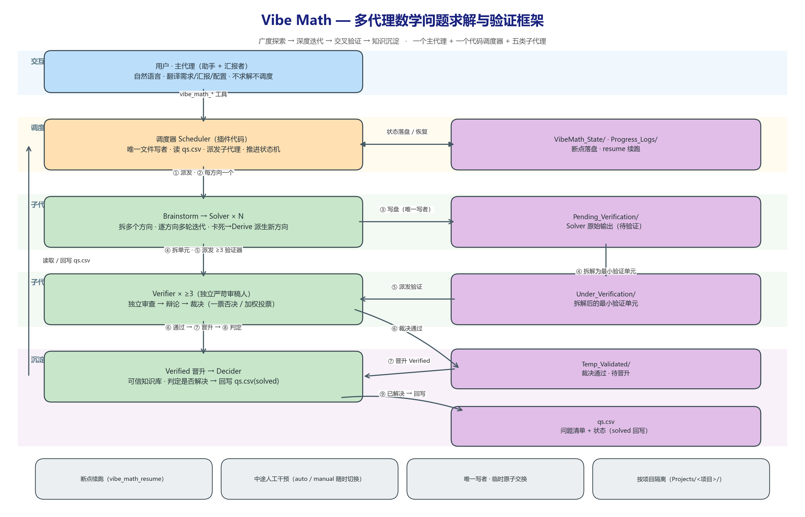
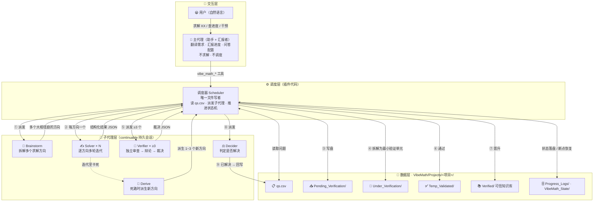

# Vibe Mathematics — 多代理数学问题求解与验证框架（双架构）

[](https://www.npmjs.com/package/dsh-vibe-math)
[](https://opensource.org/licenses/MIT)
[](https://github.com/ChongCyrus/Vibe-Mathematics)

> 运行在 **DeepSeek Harness** 内的一组 **agent preset**（`vibe-math-v1` / `vibe-math-v2`），
> 用多代理协作自动求解数学问题并对结论做多代理交叉验证。两个预设共享「**断点续跑**、
> **中途人工干预**、**进度汇报**、**自然语言驱动**」三大底座能力，但采用两套不同的求解架构：
>
> - **`vibe-math-v1`（经典流水线）**：「广度探索 → 深度迭代 → 交叉验证 → 知识沉淀」闭环；
> - **`vibe-math-v2`（新架构 · 概率驱动）**：`qs.json` 问题清单 + `Propos/` 命题库 + 概率驱动调度。

安装本插件包（或手动复制预设）后，DSH 的预设选择器里会出现**两个** agent preset。

---

## 🚀 安装

**方式 A：插件包一键安装（推荐）** —— 同时装出两个预设：

```sh
dsh plugin --profile <你的 profile> add dsh-vibe-math
# 或从 GitHub 直装：
dsh plugin --profile <你的 profile> add github:ChongCyrus/Vibe-Mathematics
```

安装时插件会自动把两个 preset 写入 `~/.dsh/.agent-presets/`：
`vibe-math-v1/` 与 `vibe-math-v2/`。之后新建会话，预设选择器里选择 **Vibe Math** 或 **Vibe Math V2** 即可。

**方式 B：手动复制**（任选其一）

```
C:\Users\<你>\.dsh\.agent-presets\vibe-math-v1\   ← 复制 vibe-math-v1/ 下的 agent.cordis.yml / preset.yml / vibe-math.js
C:\Users\<你>\.dsh\.agent-presets\vibe-math-v2\   ← 复制 vibe-math-v2/ 下的 agent.cordis.yml / preset.yml / vibe-math-v2.js
```

> 修改 preset 文件后需**重启 DSH 进程**再开新会话（standing mount 缓存到进程退出）。

---

## 🧭 两个预设怎么选

| | **vibe-math-v1（经典）** | **vibe-math-v2（新架构）** |
|---|---|---|
| 核心思想 | 流水线：拆方向 → 逐方向求解 → 拆最小单元 → 多验证器辩论 → 晋升 `Verified/` | 概率驱动：`qs.json` 问题 + `Propos/` 命题库，按「正确概率 / 价值」调度求解与验证 |
| 数据 | `qs/qs.csv` + `Progress_Logs/` | `qs/qs.json` + `Propos/<分类>_Propos.json` + `Reliable/` |
| 角色 | brainstorm / solver / derive / verifier / decider | explorer（拆方向）→ 逐方向 solver → verifier（独立审查→辩论→裁决） |
| 收口规则 | 验证通过晋升 `Verified/`，decider 判定解决 | 解法/证明达概率 `1` 即收口（问题 solved、命题 1/0），`never` 永不调度 |
| 特设能力 | 子问题分支（Aux_Hypothesis） | 命题「价值/关键性」自动晋升问题清单；`reportMode file/push/both`；`priorityAdjust` 三种优先级策略 |

两者都支持：断点续跑（`vibe_math_resume`）、人工/自动模式切换、`vibe_math_*` 工具集与 `/vibe` 命令、按项目隔离、子代理权限调控。

---

## 🧩 架构图（v1）

> Mermaid 原生渲染；可编辑图源见 [docs/架构图.md](docs/架构图.md)。





---

## 📚 规格文档

- **v1（经典）**：[`vibe-math-v1/实现方案-多代理数学问题求解与验证框架.md`](vibe-math-v1/实现方案-多代理数学问题求解与验证框架.md)
- **v2（新架构）**：[`vibe-math-v2/实现方案.md`](vibe-math-v2/实现方案.md)

---

## ⚠️ 已知边界

- 两个预设的 preset 文件互相独立、可共存；同一会话同时只能选一个预设。
- `vibe-math-v1` 的 `Pending_Verification` 按文件逐个拆解，未做跨文件去重。
- `vibe-math-v2` 的 `flat` 裁决在辩论不一致时直接判 `0.5`；`forced` 按历史准确率+置信度加权。
- 安装器只**补装缺失**的 preset 文件，不覆盖你已编辑的预设（删除对应目录即可重新安装）。

---

## 📄 License

MIT
