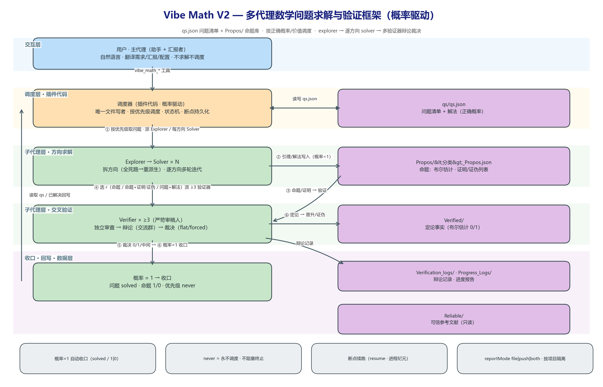
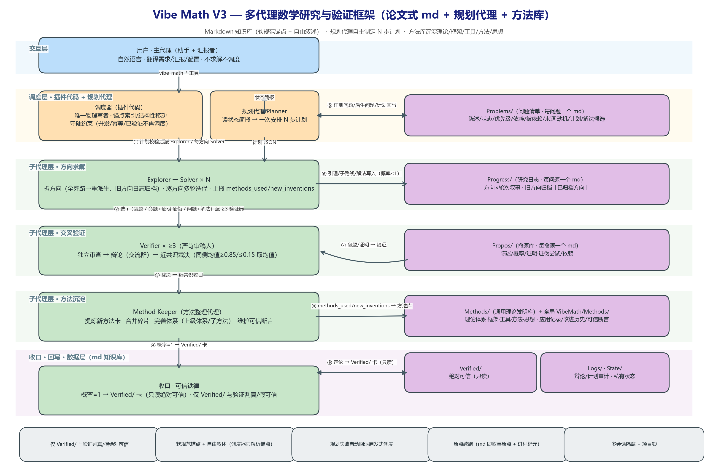
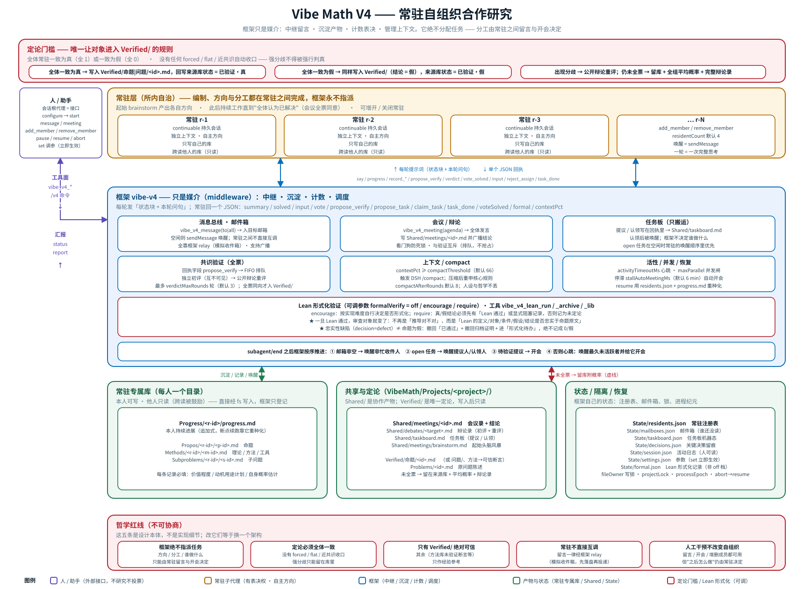
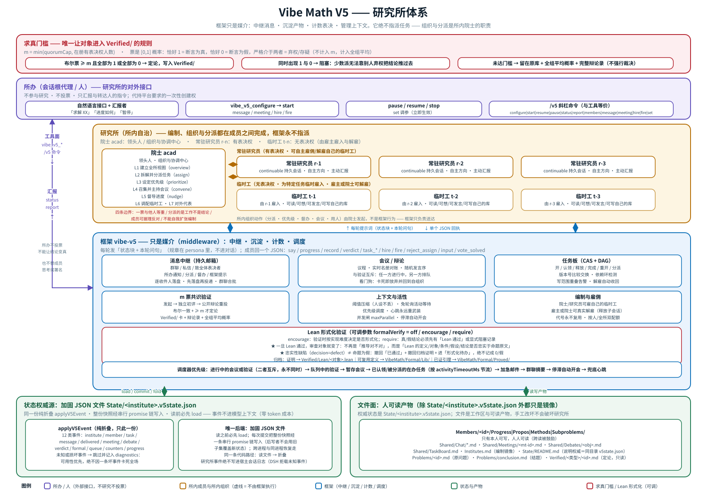
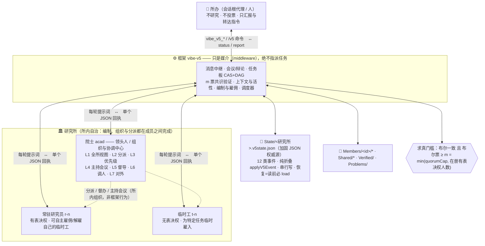

# Vibe Mathematics — 多代理数学问题求解与验证框架（四架构）

[English](README.en.md) | 中文

[](https://www.npmjs.com/package/dsh-vibe-math)
[](https://opensource.org/licenses/MIT)
[](https://github.com/ChongCyrus/Vibe-Mathematics)

> 运行在 **DeepSeek Harness** 内的一组 **agent preset**（`vibe-math-v2` / `vibe-math-v3` / `vibe-math-v4` / `vibe-math-v5`），
> 用多代理协作自动求解数学问题并对结论做多代理交叉验证。四个预设共享「**断点续跑**、
> **中途人工干预**、**进度汇报**、**自然语言驱动**」底座能力，但采用四代不同的求解架构：
> **💡 四个架构同级**——`vibe-math-v2` 与 `vibe-math-v3` 是**经典**架构（成熟可用、持续维护），`vibe-math-v4` 是「常驻自组织合作研究」架构、`vibe-math-v5` 是最新的「研究所体系」（两者均标注为实验性）；根据你的实际需求自行选择（详见下方「怎么选」）。
>
> - **`vibe-math-v2`（概率驱动 · JSON 数据层）· 经典**：`qs.json` 问题清单 + `Propos/` 命题库 + 概率驱动调度 + 代码启发式调度；
> - **`vibe-math-v3`（第三代 · 论文式 md + 规划代理 + 方法库）· 经典**：全部知识以 **Markdown 论文/研究报告式** 存储与续写（`Problems/` 问题清单+依赖+来源动机、`Progress/` 研究日志、`Propos/` 命题库、`Methods/` 通用理论发明库、`Verified/` 绝对可信）；调度前由**规划代理**自主制定接下来 N 步计划；解决过程中发明的理论/框架/工具/方法/思想由 **Method Keeper** 沉淀为可复用方法体系（如发明群论、泛函分析那样）。
> - **`vibe-math-v4`（第四代 · 常驻自组织合作研究）🧪 实验性**：一组**持久化常驻子代理**互相**留言 + 开会**，自主决定一切任务安排（无中央调度）；各自沉淀进度/命题/方法/子问题库并互相查阅；验证**仅当全体常驻一致（真 或 假）**才写入 `Verified/`，否则留库附概率；上下文达阈值自动 `/compact`；仅当全体一致认为原问题已解决才停止。
> - **`vibe-math-v5`（第五代 · 研究所体系）🧪 实验性 · 最新**：把常驻升级为一座**研究所**——**院士**（领头人 / 组织与协调中心，负责拆解与**分派**、定优先级、主持会议、督导进度）+ **常驻研究员**（有表决权，可自主雇佣/解雇自己的临时工）+ **临时工**（无表决权）；有**公共规章**、**群聊与会议**、**compare-and-set 任务板**、**真实解雇**；**≥ m 票布尔一致**才写入 `Verified/`（反向票阻塞、弃权不计票、未达门槛留库附平均概率）；状态存于研究所目录下的**加固 JSON** `State/<研究所>.v5state.json`（串行写、读前必 load），**不写入宿主会话日志**，零 token 成本。

安装本插件包（或手动复制预设）后，DSH 的预设选择器里会出现**四个** agent preset。

---

## 🧭 导航：我想要……→ 从这里开始

- **马上开始用（第一次跑）** → [5 分钟上手](#-5-分钟上手)
- **四个预设选哪个** → [四个预设怎么选](#-四个预设怎么选)
- **四套架构的定位、流程与分工** → [架构图](#-架构图v2--v3--v4--v5) · [架构与分工（四套并列）](#-架构与分工四套并列)
- **新功能：最终论文（收口时自动产出）** → [功能特色](#-功能特色) · [完整契约](docs/final-paper.md)
- **Lean 形式化验证** → [Lean 形式化验证](#-lean-形式化验证四个架构共用可调开关) · [完整契约](docs/formal-verification.md)
- **可观测面（`status()` / `report()` 字段与作用域）** → [完整字段表](docs/status-report-fields.md)
- **目录里都有什么** → [目录结构](#-目录结构)
- **调参数** → [参数速查表](#-参数速查表)
- **断点续跑 / 中途干预** → [断点续跑 & 人工干预](#-断点续跑--人工干预两大硬性需求)
- **已知边界（有意简化）** → [已知边界](#-已知边界有意简化)

---

## 🧩 架构图（v2 + v3 + v4 + v5）

> 静态架构图；完整流程说明见 [docs/架构图.md](docs/架构图.md)（v1 历史架构图；v2 起目录布局已变更）与
> [vibe-math-v5/架构图.md](vibe-math-v5/架构图.md)（v5 全套细节图）；
> 可编辑生成脚本：中文 v2/v3 海报由 matplotlib 脚本生成 [v2](docs/generate_framework_diagram_v2.py) / [v3](docs/generate_framework_diagram_v3.py)（matplotlib → PNG）；
> 英文版 v2/v3 由零依赖 Node 脚本生成 [v2-en](docs/generate_framework_diagram_v2_en.mjs) / [v3-en](docs/generate_framework_diagram_v3_en.mjs)（→ **SVG**）；
> [v4](docs/generate_framework_diagram_v4.mjs) / [v5](docs/generate_framework_diagram_v5.mjs)
> （零依赖 Node → **SVG**，`node docs/generate_framework_diagram_v4.mjs`，加 `--lang=en` 生成英文版 `示例图/框架图-v4-en.svg`）。
> v4 起改用 SVG：纯文本、diff 友好、任意缩放不糊；需要 PNG 时用无头浏览器截图（命令见生成脚本头部）。

### Vibe Math V2（概率驱动 · JSON 数据层）· 经典



**一句话流水线**：`qs.json` 按优先级取问题 → Explorer 拆方向（全死路则重派生）→ 每方向一个 Solver 多轮迭代（引理进 `Propos/`、解法回 `qs.json`，概率均 <1）→ 调度器选 r（命题 / 命题+证明·证伪 / 问题+解法）派 ≥3 验证器独立审查→辩论→裁决 → 概率=1 自动收口（问题 solved、命题 1/0，优先级置 `never`）；全程状态落盘，`resume` 断点续跑，`reportMode` 可 file/push/both 汇报。

### Vibe Math V3（论文式 md + 规划代理 + 方法库）· 经典



**一句话流水线**：全部知识以 **Markdown 论文/研究报告式**存储与续写（`Problems/` 问题清单含依赖/后生问题来源动机、`Progress/` 研究日志按方向按轮续写、`Propos/` 命题库、`Methods/` 通用理论发明库、`Verified/` 绝对可信）→ 调度前调度器构造状态简报并调用**规划代理**，规划代理一次性安排接下来 N 步（spawn solver/verifier/explorer/method-keeper、interrupt、promote、wait），代码校验后执行（超出并发的动作排队跨 tick 消费；规划失败自动回退 v2 式启发式）→ 验证器独立审查→辩论→**近共识裁决**（同侧且均值 ≥0.85/≤0.15 取均值，修复 v2 flat 误判）→ 概率=1 收口并生成 `Verified/` 卡 → 求解器的 `methods_used`/`new_inventions` 上报由 **Method Keeper** 沉淀/完善方法库（可组成体系层级、跨项目复用）。

### Vibe Math V4（常驻自组织合作研究）🧪 实验性



> 上面这张 SVG 由零依赖脚本生成：`node docs/generate_framework_diagram_v4.mjs`（纯 Node、无 Python/matplotlib 依赖；
> 生成时会估算文字宽度，任何一行溢出容器都会告警并以退出码 1 结束）。

**一句话流水线**：起始产生 N 个**常驻子代理**（continuable，持久上下文）先各自头脑风暴、产出初始见解/方向 → 此后**所有任务安排由它们互相留言 + 集体开会自主决定**（框架只做消息总线/会议/任务板/产物沉淀，**绝不分配任务**）；每个常驻把有价值的产物按**价值程度 / 动机用途计划 / 自身概率估计**沉淀到**自己**的 `Progress/<id>/`、`Propos/<id>/`、`Methods/<id>/`、`Subproblems/<id>/` 库，并**可互相阅读**；验证由它们**自行商议**发起，**仅当全体常驻一致（真或假）**才写入 `Verified/`，否则留库附概率；常驻上下文量达阈值（默认 66%）自动 `/compact`；**仅当全体一致认为原问题已解决**才停止；可随时人工干预/增开/关闭常驻，支持断点续跑。

> 说明：V4 去掉 v3 的中央规划器与确定性角色（explorer/solver/verifier/planner/method-keeper），把"研究者"本身作为主体。详见 `vibe-math-v4/实现方案.md`。
> 保活机制（分级保活 A+B + 死锁看门狗）：团伙空闲超 `activityTimeoutMs` 会收到**自驱动** CHECKPOINT（建议继续解决/发消息/提议任务，而非"是否要停止"），且**并行填充**——A 分支一次尽量填满 `maxParallel` 并发预算（同一时刻唤醒多个空闲常驻，而非"只唤醒 r1、结束后再 r2"的串行），邮箱投递也并行送达多个空闲收件人；唤醒失败会自动重新武装心跳；若团队空闲且**无新产物**超过 `stallAutoMeetingMs`（默认 6 分钟），框架会自动召集一次同步会议让常驻们自行决定下一步；若某次**会议/验证卡死**（超过 2×`activityTimeoutMs` 仍无新的发言/投票），框架会自动**放弃该会议/验证**并回到正常自组织，避免一个坏掉的会议永久卡住整个团队；**会议不抢占验证**——验证进行时会议请求会暂存，验证做完再补开（保持一致共识的"求真"环节不被协调讨论打断）——框架始终只促成、从不指派任务。

---

### Vibe Math V5（研究所体系）🧪 实验性 · 最新

**一句话定位**：把 v4 的"一群互相留言的常驻"升级为一座**研究所**——有**院士**（领头人）、**常驻研究员**、
**临时工**三类职员，有所内**公共规章**，有**群聊与会议**，有**自主雇佣/解雇**，并且
**任何结论都必须由至少 m 名有表决权者一致给出布尔概率 1 或 0 才能写入 `Verified/`**。



> 图源与全部细节图（成员生命周期、一轮时序、共识状态机、会议流程、调度优先级、状态折叠、
> 提示词构成、任务板、职权矩阵）：[`vibe-math-v5/架构图.md`](vibe-math-v5/架构图.md)。
> 上面这张 SVG 由零依赖脚本生成：`node docs/generate_framework_diagram_v5.mjs`。


```mermaid
flowchart TB
    OFF["👤 所办（会话根代理 / 人）<br/>不研究 · 不投票 · 只汇报与转达指令"]
    subgraph INST["🏛️ 研究所（所内自治：编制、组织与分派都在成员之间完成）"]
        ACAD["院士 acad —— 领头人 / 组织与协调中心<br/>L1 全所视图 · L2 分派 · L3 优先级<br/>L4 主持会议 · L5 督导 · L6 调人 · L7 对外"]
        RES["常驻研究员 r-n<br/>有表决权 · 可自主雇佣/解雇自己的临时工"]
        TMP["临时工 t-n<br/>无表决权 · 为特定任务临时雇入"]
    end
    subgraph FW["⚙️ 框架 vibe-v5 —— 只是媒介（middleware），绝不指派任务"]
        M["消息中继 · 会议/辩论 · 任务板 CAS+DAG<br/>m 票共识验证 · 上下文与活性 · 编制与雇佣 · 调度器"]
    end
    PROJ["💾 State/&lt;研究所&gt;.v5state.json（加固 JSON 权威源）<br/>12 类事件 · 纯折叠 applyV5Event · 串行写 · 恢复=读前必 load"]
    FS["📁 Members/&lt;id&gt;/* · Shared/* · Verified/ · Problems/"]
    RULE{{"求真门槛：布尔一致 且 布尔票 ≥ m = min(quorumCap, 在册有表决权人数)"}}
    OFF <-->|"vibe_v5_* / /v5 命令　↔　status / report"| M
    M <-->|"每轮提示词　↔　单个 JSON 回执"| ACAD
    M <-->|"每轮提示词　↔　单个 JSON 回执"| RES
    M <-->|"每轮提示词　↔　单个 JSON 回执"| TMP
    ACAD -.->|"分派 / 督办 / 主持会议（所内组织，非框架行为）"| RES
    ACAD -.-> TMP
    M <--> PROJ
    M <--> FS
    M --> RULE
```

**一句话流水线**：所办（会话根/人）`configure → start` 建所 → **院士**（academician，组织与协调中心）拆解原问题并**分派**任务、定优先级、主持会议、督导进度；**常驻研究员**各自研究并持有表决权，**临时工**可按需雇入（无表决权、可被真实解雇）。**框架只做媒介，绝不指派任务**；一切结论都要 **≥ m = min(`quorumCap`, 在册有表决权人数) 张布尔票且全部同向**才写入 `Verified/`（反向票阻塞、弃权不计票但计入平均概率，未达门槛留库附平均概率）；会议与验证**双向互斥**；状态写在研究所目录下的加固 JSON `State/<研究所>.v5state.json`（零 token 成本、串行写、读前必 load）；**仅当全体有表决权者都认为原问题已解决**才结题。

> 职位与职权、求真规则细节、运行机制、状态与持久化、提示词构成、研究所目录、工具面、与 v4 的差异：见 [`vibe-math-v5/架构图.md`](vibe-math-v5/架构图.md) §13「从 README 移入的 v5 说明」（原文保留）；参数见[参数速查表](#-参数速查表)，最终论文见 [`docs/final-paper.md`](docs/final-paper.md)。

---

## ✨ 功能特色

- **最终论文（四个预设默认开启）**：收口时自动撰写一篇**只整理已有证据**的完整论文，且论文阶段发生在 run 被标记完成**之前**；产物在 `Paper/<id>/{paper.md,paper.tex,paper.pdf,paper.meta.json,paper.log.md}`（v2/v3 另有 `paper.lock.json`）。参数 `finalPaper`（默认 `true`）/`paperFormat`（默认 `both`）/`paperLanguage`（默认 `zh`）/`paperCompilePdf`（默认 `true`）（v4/v5 另有 `paperEditor`），手动 `/vN paper [lang=] [format=] [editor=] [force]`；PDF 需要宿主上有 LaTeX 引擎（中文优先 `xelatex`），否则仍交付 tex+md。完整契约与用法见 [`docs/final-paper.md`](docs/final-paper.md)。
- **多代理自动求解**：主代理把问题交给调度器，调度器派发 explorer / solver / verifier（v2/v3）与 **planner（规划代理，v3）**、**method-keeper（方法整理代理，v3）** 等子代理协同求解，**你无需逐节点手操**。
- **多代理交叉验证**：每个结论交给 ≥3 个「严苛审稿人」**独立审查 → 辩论（交流群）→ 裁决**（v3 默认**近共识裁决**：同侧且均值 ≥0.85/≤0.15 取均值，避免"0.9 vs 1"被误判成 0.5）。
- **论文式 Markdown 知识库（v3）**：问题清单（含问题间依赖、后生问题产生原因与计划）、研究日志、命题、方法库全部以 md 论文/研究报告式书写与续写（方向重派生时旧方向的日志自动归档保留）；**只有 `Verified/` 与验证器判真/假的对象绝对可信**，其余 md（含方法库未验证断言）仅作经验参考。
- **通用理论发明库（v3）**：解决过程中发明的理论体系/框架/工具/方法/思想（含经验性总结）经 `methods_used`/`new_inventions` 上报，由 **Method Keeper** 沉淀为 `Methods/` 方法卡（可组成体系层级、跨项目复用），像"解决方程时发明群论"一样形成系统化方法理论体系。
- **规划代理调度（v3）**：调度前调用规划代理，根据实际情况（问题依赖/存活率/可验证对象/并发预算/上次计划结果）自主选择最优调度方案，**一次安排接下来 N 步**各代理任务；规划失败自动回退启发式。
- **知识沉淀**：验证通过的结论晋升进 `Verified/` 可信知识库（v2/v3 另有 `Propos/` 命题库），供后续方向复用。
- **断点续跑**：调度状态、任务栈、代理注册表、决策队列、验证器历史准确率等全部落盘；重启后 `resume` 即可恢复（v2/v3 用进程纪元区分"同进程暂停→恢复"与"跨进程重启"；v3 的 md 本身即叙事断点）。
- **中途人工干预（并继续）**：`auto / manual` 模式随时切换；manual 在关键节点挂起决策等你 approve/reject/override（v3 新增**计划审批门**与**方法晋升门**）；可对任意子代理发消息 / 中断。
- **按项目隔离**：每个数学问题一个独立项目文件夹，互不干扰，可随时切换。
- **多会话并行隔离**：DSH 的 agent preset 是 standing mount（同一 preset 的所有会话共享一个插件实例），插件内部按**根会话 id** 隔离全部运行状态——两个会话可以同时各跑一个项目，各自的子代理会正确挂在自己会话名下，调度器 / 参数 / 决策队列 / 当前项目互不干扰（v3 另有**项目锁**，同一项目同一时刻只被一个会话调度）。当前项目按会话分别持久化（`VibeMath/current.<会话id>.json`）。
- **子代理权限可调控**：可限制子代理允许/禁止的工具、每轮外部工具调用上限，并明确告知其可读 `Verified/`、`Propos/`、`Methods/`、`Reliable/` 与进度日志。
- **可配置**：`vibe_math_setting.json`（含注释）自定义默认参数；`/vibe setup` 交互式问答配置。
- **自然语言控制**：主代理充当「助手 + 汇报者」，你把需求说成人话，它自己调用工具、汇报进度、配置参数。

**v4 / v5 特有**：

- **常驻自组织（v4）**：起始产生 N 个**持久化常驻子代理**，此后**所有任务安排由它们互相留言 + 开会自行决定**（框架只做消息总线/会议/任务板，绝不分配任务）。
- **研究所体系（v5）**：在 v4 的自组织之上引入**现实研究所的组织形式**——**院士**（领头人）负责拆解、**分派**、定优先级、主持会议、督导进度；**常驻研究员**有表决权并可**自主雇佣/解雇自己的临时工**；**临时工**无表决权；全部组织动作都由**所内成员**完成，框架仍然只做媒介。详见上方 [Vibe Math V5](#vibe-math-v5研究所体系-实验性--最新) 一节。
- **可调的一致性门槛（v5）**：对象要进 `Verified/`，需要 **≥ m = min(`quorumCap`, 在册有表决权人数)** 名有表决权者投出**一致的布尔票**（全 `1` 或全 `0`）；**反向票阻塞**、**弃权不计票但计入平均概率**；未达门槛则**留库附平均概率与完整辩论录**，不强行裁决。
- **零 token 成本的状态持久化（v5）**：研究所状态写在**研究所目录下的加固 JSON** 里（`State/<研究所>.v5state.json`），不进模型上下文；跨进程与同进程恢复走同一条代码路径（读前必 load）。
- **真实可逆的编制（v5）**：雇佣会创建常驻子会话，解雇会取消在途回合、释放子会话、收回其任务并丢弃未投递邮件；代号永不复用。
- **人可读镜像（v4/v5）**：编制表、任务板、会议纪要、辩论录、结题记录都以 Markdown 落盘，人随时可读；但**权威状态不在这些文件里**（v5 在 `State/<研究所>.v5state.json`），所以手工改坏它们不会破坏研究所。

---

## 🧮 Lean 形式化验证（四个架构共用，可调开关）

**它改变的不是"更严格一点"，而是审查对象本身。** m 个代理一致认为"这是对的"仍然是**共识**——
排除不了共同误解；Lean 通过是**机器核对**。于是剩下的唯一不确定项缩小为一个人能有效审查的问题：
**Lean 代码里的定义 / 对象 / 条件 / 假设 / 结论，是否与命题原文完全一致（忠实性）？**

- **开关 `formalVerify`（四个架构同名，默认 `'off'`）**：`'off'` 是**真正的无操作**（提示词里不出现任何 Lean 内容、不写入任何形式化状态、验证流程与门禁完全不变；五个工具仍注册可用，persona 始终列出它们，否则这个开关不可发现、也无从打开）；`'encourage'` **鼓励但不强制**（验证时按实现难度自行决定是否形式化，一旦 Lean 通过，审查重心转为忠实性，**不设门禁**）；`'require'` **强制**——真/假结论必须满足「**Lean 已通过**」或「**显式记录了阻塞原因**」，否则本次裁定不生效（记为未定论、原因 `formal-required`、写入「形式化待办」）。相关参数：`leanCommand`（默认 `lean`）、`leanArgs`（配合 `lake env lean`）、`leanTimeoutMs`（默认 120s）。

- **⚠️ 忠实性缺陷 ≠ 命题为假（重要）**：Lean 通过只保证"这段代码过了内核"，**不保证它说的就是命题想说的**。表决者逐条核对后发现 Lean 代码与命题原文不一致（写窄 / 写宽 / 换了对象 / 漏了条件）时：**不得投 0**（投 0 的含义是"该命题为假"——那会把"形式化不合格"记成"命题被证伪"，v5 的全 0 一致规则下甚至写进 `Verified/` 标注**假**，用来求真的机制反而伪造出一个错误的否定结论）；正确做法是投一个严格介于 0 与 1 之间的值（记为弃权）+ 用回执 `formal:{decision:'defect', note:'<具体偏差>'}` 记录偏差，框架随即**撤回这条证明的「已通过」状态**（降级为 `attempted`、删除 `Verified/Lean/<id>.lean`、宿主删不掉时改写为"已撤回"说明、写入「形式化待办」），`require` 档下本次裁定不定论（`encourage` 档没有门禁，不得声称框架会强制搁置）；只有表决者**独立于这份 Lean 代码**也能确定命题为假（并能给出独立理由）时才投 0。
- **回执通道与三条硬要求**（不调用 Lean 工具的成员也能留下判断，`require` 档下必须留）：回执字段 `"formal": {"target":"<对象id>", "decision":"used|blocked|defect", "file":"Formal/<对象id>.lean", "note":"难度判断/阻塞原因/具体偏差"}`；`decision='blocked'`/`'defect'` 时 **`note` 必填**（缺则整条拒绝），`used` 只把对象记为 `attempted`，`off` 档下该通道**失效**（否则 `off` 就不是真正的无操作）。另外三条：注入文本里的工具名一律**全称**（`<prefix>_lean_archive` 不是 `lean_archive`——缩写不是注册名）；归档可复用定义/引理**前先跑通**，跑不通不许进库；**工具链缺失**（`LEAN_NOT_FOUND` 解析不到可执行文件 / `NO_SUBPROCESS` 宿主没有 subprocess 服务）时把代码写下来归档并在 `note` 写明"宿主无 Lean 工具链"——这算显式阻塞原因，门禁据此放行，不会因为装不了 Lean 而卡死。

- **归档位置**：`<VibeMath 根>/Formal/Lib|Proved/`（**跨项目**可复用定义与已证引理，各带 `Index.md` 索引，写新定义前先查这里）；项目内 `Formal/<对象id>.lean` 是对象的工作文件（旁边有 `Index.md` 与 `require` 档的 `TODO.md`），`Verified/Lean/<对象id>.lean` 是**归档证明**（v5 在 `Projects/<项目>/Institutes/<所>/` 下）。

- **五个工具（每个架构一套，前缀跟随各自命名）**：`<prefix>_lean_run` 在宿主 `subprocess` 服务上执行 Lean（`leanAsync=true` 时入队即返回 `{async:{jobId,state}}`，否则同步返回 `{ok, exitCode, ms, stdout, stderr}`），**绝不抛异常**（缺工具链 → `LEAN_NOT_FOUND`、超时 → `LEAN_TIMEOUT`、越界路径 → 拒绝）；`<prefix>_lean_archive`：`kind='def'/'lemma'` 归档到**跨项目** `Formal/Lib|Proved`（同内容去重），`kind='proof'` 写 `Formal/<target>.lean` 并**只在作业 `settled(ok)` 时**写 `Verified/Lean/<target>.lean` 标记该对象为 Lean 通过，`kind='blocked'` 记录显式难度判断/阻塞原因（**原因必填**）；`<prefix>_lean_lib` 重建并返回三处索引、逐对象状态与后台作业，**写新定义前先查重复用**；`<prefix>_lean_read` 取回归档原文（逐字复用，限 `Formal/Lib|Proved`、64KB）；`<prefix>_lean_job` 查看/等待后台编译作业（只读）。例如 v5 是 `vibe_v5_lean_*`，v2/v3 是 `vibe_math_lean_*`，v4 是 `vibe_v4_lean_*`（各有 run / archive / lib / read / job 五个）。
- **边界（有意为之）**：框架**不内置 Lean**（不装工具链、不下载依赖；工具链缺失时优雅降级并如实记录）；框架**不判断忠实性**（那是代理/人审查并投票的对象，框架只负责把审查焦点**换成**忠实性）；**Lean 通过 ≠ 命题为真**——它只表示"这段形式化代码通过了内核检查"。

完整契约（参数、路径、状态迁移、提示词语义、门禁位置、索引格式、测试要求）见 [`docs/formal-verification.md`](docs/formal-verification.md)。四个预设的 persona（主代理收到的提示词）都完整列出了这五个工具与八个参数，并且 `prefix` 与 `text` 两个块逐行一致（只允许第 0 行不同）；这一层由 [`audit-persona-surface.test.mjs`](tests/audit-persona-surface.test.mjs) 与 [`audit-persona-sensitivity.mjs`](tests/audit-persona-sensitivity.mjs) 守护——加入本特性时正是在四个预设里发现了"工具已注册、persona 从未列出"的缺陷（详见随包发布说明）。

---

## 🚀 安装

两种安装方式，任选其一（也可并存）：

### 方式 A：作为插件包一键安装（推荐，同时装出四个预设）

桌面版在「设置 → 插件」里安装 `dsh-vibe-math`；命令行 profile 用：

```sh
dsh plugin --profile <你的 profile> add dsh-vibe-math
# 或从 GitHub 直装：
dsh plugin --profile <你的 profile> add github:ChongCyrus/Vibe-Mathematics
```

之后新建会话，预设选择器里选择 **Vibe Math V2**（v2，经典）、**Vibe Math V3**（v3，经典）、**Vibe Math V4**（v4，常驻自组织）或 **Vibe Math V5**（v5，研究所体系）即可——四个架构同级，按实际需求自选（见「怎么选」）。
**两个 DSH 世代的落点不同，本包自动适配**：

- **DSH ≥ 0.1.7（当前）**：agent preset 由组合行声明。本包在 `cordis.patch.yml` 里声明四个 preset（每行把该 preset 的完整插件清单交给宿主的 `agentPresets` 服务注册），**不往 `~/.dsh/.agent-presets/` 写任何东西**——该目录自 0.1.7 起不再被读取。
- **DSH ≤ 0.1.6**：preset 仍是目录形式，安装器把四个 preset 写入 `~/.dsh/.agent-presets/`（`vibe-math-v2/` … `vibe-math-v5/`）；同一份 `cordis.patch.yml` 里的声明行在这些版本上什么都不注册，因此旧版启动**不会报错**。

**升级包版本后重启 DSH，受管内容会被整体替换成新版本的字节——包括你手动改过的文件。** 这是有意的：一个"一半旧版、一半新版"的 preset 会挂不上或行为诡异，而你在外面看不出来。**被替换掉的手改内容不会丢**：目录形式下原文会先备份到 `~/.dsh/.agent-presets/.vibe-math-backup/<旧版本>/<preset>/`，文件名会在日志里列出。
**要自定义 preset 就别改受管内容**——复制一份（预设选择器里的复制动作，或在自己的 bundle 里用新的 id 声明）。注意：在当前 DSH 里你若为**同名 id** 保存了自己的声明，本包会放弃注册并打印一行说明，以你的声明为准。

### 方式 B：手动声明（自定义 / 二次开发）

- **DSH ≥ 0.1.7**：把 `vibe-math-vN/agent.cordis.yml` 整段作为 `plugins` 放进一个声明行——既可以照抄本包 `cordis.patch.yml` 里的 `dsh-vibe-math/preset-declaration` 行，也可以用宿主自带的 `@deepseek-ai/dsh-agent-preset` 行；把这个 bundle 装进你的 profile 即可。完整规则见 DSH 自带技能 `editing-cordis-compositions`。
- **DSH ≤ 0.1.6**：把 `vibe-math-vN/` 下的 `agent.cordis.yml` / `preset.yml` / `vibe-math-vN.js` 复制到 `~/.dsh/.agent-presets/vibe-math-vN/`。

新建会话后在 preset 选择器里选 **「Vibe Math V2」** / **「Vibe Math V3」** / **「Vibe Math V4」** / **「Vibe Math V5」**；会话启动后即可使用：v2/v3 的工具是 `vibe_math_*`、v4 是 `vibe_v4_*`、v5 是 `vibe_v5_*`；输入框键入 `/vibe`、`/v4`、`/v5` 有自动补全。

> 改过 preset 定义后需**重启 DSH 进程**再开新会话（preset 的 standing mount 会缓存到进程退出）。

### DSH 版本适配与依赖

- **支持范围**：`0.1.2-alpha.4` … `0.2.0-rc.2`（11 个版本声明为 `compatible`，实测目标 `0.2.0-rc.2`；`engines.node` 为 `^22.19.0 || >=24.0.0`）——逐版本声明、`engines.dsh` 区间与 `peerDependencies` 见 `package.json`（`dsh.compatibility.dshReleases`）。
- **交付形态**：DSH ≥ 0.1.7 走**组合行声明**（`agentPresets` 服务），DSH ≤ 0.1.6 走 `~/.dsh/.agent-presets/<id>/` 目录 + preset picker——一份 bundle 同时兼容两条线。
- **硬约束**：v5 研究所状态**只**写 `State/<研究所>.v5state.json`，**绝不**写宿主会话日志——DSH 遇到日志里不认识的事件类型会**拒绝加载整个会话**，会话下次恢复将打不开。
- **其余细节**（宿主插件行与必需服务、启动自检与能力门槛、常驻数量上限、2026 的三处修复、`dsh.bundle.patch` 约束、升级路径与 `peerDependencies`）：见 `docs/COMPAT-AUDIT-ROUND2.md`；升级本包用 `dsh plugin --profile <你的 profile> add dsh-vibe-math@latest`（用 `add` 而非 `update`）。

---

## 🧭 四个预设怎么选

> **💡 四个架构同级，按你的实际需求自行选择：**
>
> - **选 `vibe-math-v2`（概率驱动 · JSON 数据层）**，如果你：
>   - 偏好**结构化 JSON 数据**（`qs.json` / `Propos/<分类>_Propos.json` / `Verified/` 卡），方便程序化检索与二次加工；
>   - 想要**成熟稳定的代码启发式调度**（优先级 + 概率，行为可预期、不依赖规划代理的"临场发挥"）；
>   - 不需要方法库沉淀 / 论文式叙述，数据以字段为主即可。
> - **选 `vibe-math-v3`（论文式 md + 规划代理 + 方法库）**，如果你：
>   - 偏好**论文/研究报告式的自然语言知识库**（问题清单含依赖与后生问题来源动机、研究日志按方向按轮续写，人类可读、可自由续写）；
>   - 希望调度由**规划代理**根据实际情况自主制定 N 步计划（更灵活，失败自动回退启发式）；
>   - 希望**通用理论发明库**——求解中发明的理论/框架/工具/方法/思想经 Method Keeper 沉淀为可复用、可体系化、跨项目扩充的方法论（像"解决方程时发明群论"）；
>   - 接受"只有 `Verified/` 绝对可信，其余 md 为经验参考"的可信分层。
>
> 两者都成熟可用、持续维护，且都支持断点续跑、人工/自动干预、进度汇报、多会话隔离、命题晋升、近共识/加权裁决等核心能力；切换成本低（同一套 `vibe_math_*` 工具与 `/vibe` 命令、同一套参数体系）。
>
> - **选 `vibe-math-v4`（常驻自组织）**，如果你想要一组**持久化常驻子代理**互相留言开会、**完全自组织**（无领头人、无中央调度），并且能接受"全体一致才定论"这种严格门槛。
> - **选 `vibe-math-v5`（研究所体系）**，如果你想要：
>   - **有组织的自组织**——现实研究所那样有**领头人（院士）**负责拆解、分派、定优先级、主持会议、督导进度，但**判断仍归每个人自己**；
>   - **可增减的编制**——常驻研究员 + 可**自主雇佣/解雇**的临时工（临时工无表决权，适合处理核对、试算、资料整理等杂活）；
>   - **可调的一致性门槛**——`m = min(quorumCap, 有表决权人数)` 票布尔一致即定论（因为反向票阻塞，实际门槛仍是"全部布尔票同向"；只有投出布尔票的人少于 `m` 时才不同）；
>   - **零 token 成本的状态持久化**——研究所状态写在研究所目录下的加固 JSON 里，不占成员上下文预算。
>
> **⚠️ `vibe-math-v2` 与 `vibe-math-v3` 是经典架构；`vibe-math-v4`、`vibe-math-v5` 是实验性架构，** 四者同级、均可选择；老 `vibe-math-v1` 已被移除（本包仅含 v2/v3/v4/v5）。

| | **v2（概率驱动 · 经典）** | **v3（论文式 md · 经典）** | **v4（常驻自组织 · 实验）** | **v5（研究所体系 · 实验）** |
|---|---|---|---|---|
| 定位 | **经典**（JSON 数据层） | **经典**（第三代） | **实验性**（第四代） | **实验性**（第五代） |
| 核心思想 | 概率驱动：`qs.json` 问题 + `Propos/` 命题库，按「正确概率 / 价值」调度 | **论文式 md 知识库 + 规划代理调度 + 通用理论发明库** | **持久化常驻子代理自组织**：互相留言 + 开会决定一切任务，无中央调度 | **研究所**：院士做组织与分派，成员各自研究；**≥ m 票布尔一致**才定论；临时工可按需雇入 |
| 数据 | `qs/qs.json` + `Propos/<分类>_Propos.json` + `Reliable/` | `Problems/` + `Progress/` + `Propos/` + `Methods/`（全部 md，软规范锚点 + 自由叙述）+ `Verified/` | `Problems/` + **按常驻 id 归属**的 `Progress|Propos|Methods|Subproblems/<id>/` + `Shared/`（会议/任务板/辩论）+ `Verified/` | 同 v4 的按成员归属布局，另加 `Institutes.md`（编制镜像）；**权威状态在 `State/<研究所>.v5state.json`**，其余文件只是镜像与工作区 |
| 角色 | explorer → 逐方向 solver → verifier | **planner（规划代理）** → explorer → 逐方向 solver → verifier → **method-keeper（方法整理代理）** | **N 个常驻研究者**（continuable），无固定角色 | **院士 acad**（领头人）+ **常驻研究员 r-n**（有表决权）+ **临时工 t-n**（无表决权，可雇可解雇）+ 所办（不研究不投票） |
| 调度方式 | 代码启发式（优先级 + 概率） | **规划代理产出 N 步计划**（校验后执行，失败回退启发式） | **无中央调度**：任务由常驻互相留言/开会（框架只做媒介，不指派） | **框架仍不指派**；由**院士**拆解/分派/定优先级/督导，成员可据理反对；框架只做中继、任务板、会议与计数 |
| 收口规则 | 解法/证明达概率 `1` 即收口，`never` 永不调度 | 同 v2（近共识裁决修复 flat 误判） | **仅当全体常驻一致（真 或 假）**才写入 `Verified/`，否则留库附概率 | **布尔票 ≥ m = min(`quorumCap`, 有表决权人数) 且全为 1 或全为 0** 才写入 `Verified/`；反向票阻塞；弃权不计票但计入平均；（可切回 v4 口径） |
| 停止 | 全解或卡死 | 全解/无候选 | **仅当全体常驻一致认为原问题已解决**才停止 | 同 v4：**全体有表决权者一致认为原问题已解决**才结题 |
| 上下文 | 无 | 无 | **常驻上下文达阈值自动 `/compact`**（可调） | 同 v4（阈值/轮数可调，压缩后规章仍在 persona 里生效） |
| 特设能力 | 命题「价值/关键性」自动晋升问题清单；`reportMode file/push/both`；`priorityAdjust` | **方法库沉淀循环**（`methods_used`/`new_inventions` → Method Keeper）；**计划审批门/方法晋升门**；**项目锁**；后生问题「来源与动机」一等公民 | **常驻各自沉淀 + 互相阅读**；**全体一致验证**；**随时增开/关闭常驻、留言干预**；**断点续跑** | v4 的全部能力，另加：**真实雇佣/解雇**（释放子会话、收回任务）；**compare-and-set 任务板 + 依赖 DAG**；**会议与验证严格互斥**；**编制镜像与结题记录**；**状态零 token 成本** |

四者都支持：断点续跑（`vibe_math_resume` / `vibe_v4_resume` / `vibe_v5_resume`）、人工干预与暂停恢复、
按项目隔离、子代理权限调控、自然语言驱动。**四个架构同级**——偏好结构化 JSON 数据与确定性调度选 v2，
偏好论文式 md、规划代理与理论发明库选 v3；v4 是完全自组织的常驻合作研究，v5 是"有领头人 + 可增减编制 + 可调门槛"的研究所体系。

---

## 🧠 架构与分工（四套并列）

### V2（概率驱动 · 经典）

框架 = **主代理 + 代码调度器 + explorer / solver / verifier 三类子代理**。调度器是唯一主控与唯一文件写者（子代理只返回结构化 JSON，从不写文件），按「正确概率 + 价值/关键性 + 优先级」由**代码启发式**决定下一步；每个验证对象交给 ≥3 个独立「严苛审稿人」审查 → 辩论 → 裁决（解法/证明达概率 `1` 即收口，`never` 永不调度）。**选它**：偏好结构化 JSON（`qs.json` / `Propos/`）与可预期、不依赖规划代理的确定性调度。

> 一句话分工：**主代理负责"和人对话"，调度器负责"执行与守界"，子代理负责"动脑"。**

### V3（论文式 md + 规划代理 + 方法库）· 经典

框架 = **主代理 + 代码调度器 + 规划代理 + explorer / solver / verifier / method-keeper 四类子代理**。每次准备派发时，**规划代理**读取状态简报（问题依赖、存活率、可验证对象、并发预算、上次计划结果）**自主制定接下来 N 步计划**，由调度器校验后执行（失败自动回退启发式）；求解中发明的理论/框架/工具/方法/思想经 `methods_used`/`new_inventions` 上报，由 **Method Keeper** 提炼新方法卡并沉淀进 `Methods/` 通用理论发明库。**选它**：偏好论文式 md 知识库、希望调度更灵活、并想要可体系化、跨项目复用的方法库。

> 一句话分工：**主代理负责"和人对话"，规划代理负责"定计划"，调度器负责"执行与守界"，子代理负责"动脑"，Method Keeper 负责"把发明沉淀成理论"。**

### V4（常驻自组织 · 实验）

主体是 **N 个持久化常驻子代理**（continuable）：**没有中央调度，也没有领头人**——任务安排靠它们互相**留言 + 开会**自行涌现（框架只做消息总线/会议/任务板，绝不指派）；各自沉淀并**按常驻 id 归属**自己的 `Progress/Propos/Methods/Subproblems` 库，可互相阅读；验证**仅当全体常驻一致（真 或 假）**才写入 `Verified/`，否则留库附概率；上下文达阈值自动 `/compact`；**仅当全体一致认为原问题已解决**才停止（`vibe_v4_resume` 可断点续跑）。**选它**：想要完全自组织、能接受"全体一致才定论"的严格门槛。

### V5（研究所体系 · 实验 · 最新）

把 v4 的常驻升级为一座**研究所**：**院士**（领头人 / 组织与协调中心：拆解、**分派**、定优先级、主持会议、督导进度）+ **常驻研究员**（有表决权，可自主雇佣/解雇自己的临时工）+ **临时工**（无表决权）；**框架仍然只做中继、任务板、会议与计数，绝不指派任务**。定论门槛为 **≥ m = min(`quorumCap`, 在册有表决权人数) 票布尔一致**（反向票阻塞、弃权不计票但计入平均概率、未达门槛留库附平均概率）；状态写在 `State/<研究所>.v5state.json`（零 token 成本）；会议与验证严格互斥。**选它**：想要"有组织的自组织"、可增减的编制与可调门槛。

v5 的完整架构（成员生命周期、一轮时序、共识状态机、会议流程、调度优先级、状态折叠、提示词构成、任务板、职权矩阵）见 [`vibe-math-v5/架构图.md`](vibe-math-v5/架构图.md)；文字规格见 [`vibe-math-v5/实现方案.md`](vibe-math-v5/实现方案.md)。

---


## 📁 目录结构

> 只列**顶层与高价值路径**；每个文件的完整语义见各预设的 `实现方案.md`（[v2](vibe-math-v2/实现方案.md) · [v3](vibe-math-v3/实现方案.md) · [v4](vibe-math-v4/实现方案.md) · [v5](vibe-math-v5/实现方案.md)）与 [`vibe-math-v5/架构图.md`](vibe-math-v5/架构图.md)。

### v2（概率驱动 · 经典）

```
<VibeMath>/Projects/<项目>/
├─ qs/qs.json                   # 问题清单（概述/已解决/解法+正确概率/优先级）
├─ Propos/<分类>_Propos.json     # 命题库（布尔估计/证明·证伪/价值·关键性）
├─ Verified/                    # 定论事实索引
├─ Reliable/                    # 可信参考文献（只读，用户放入）
└─ VibeMath_State/              # 调度器私有持久状态（断点恢复用）
```

### v3（论文式 md + 规划代理 + 方法库）· 经典

```
<VibeMath>/
├─ Methods/                     # 【全局】跨项目通用理论发明库（晋升自项目级）
├─ Formal/{Lib,Proved}/         # 跨项目可复用定义 / 已证引理（Lean）
└─ Projects/<项目>/
   ├─ Problems/ Progress/ Propos/ Methods/     # 论文式 md 知识库（软规范锚点 + 自由叙述）
   ├─ Verified/{命题,问题}/                      # 绝对可信（只读）
   ├─ Logs/{Verification,Plans}/  Logs/报告.md   # 辩论录 / 调度计划 / 论文式进度报告
   └─ State/                                     # 索引、项目锁、进程纪元
```

### v4 / v5（常驻自组织 / 研究所体系 · 实验）

```
<VibeMath>/Projects/<项目>/
├─ Progress|Propos|Methods|Subproblems/<常驻id>/   # v4：按常驻 id 归属
└─ Institutes/<研究所>/                             # v5
   ├─ Members/<代号>/{Progress,Propos,Methods,Subproblems}/
   ├─ Shared/{Chat,Meetings,Debates}/  Shared/TaskBoard.md  Institutes.md
   ├─ Verified/<类型>/<id>.md                      # 定论（只读）
   └─ State/<研究所>.v5state.json                  # ★ 权威状态（加固 JSON、串行写、读前必 load）
```

**铁律（四套）**：v2/v3 的调度器是**唯一文件写者**（v3 另支持代理直接写 md，靠 `vibe_math_claim_write`/`vibe_math_release_write` 写锁保证同一文件同一时刻只有一个写者）；只有 `Verified/` 与标注"已验证·真/假"的卡片**绝对可信**，其余 md（含 `Methods/` 里未验证的断言）只是经验参考；v5 的权威状态只写在 `State/<研究所>.v5state.json`，上面其余文件都只是**镜像/工作区**（手工改坏不会破坏研究所），成员**只写自己的库**、入库必须写明**价值程度 / 动机用途计划 / 自己的概率估计**。启用 Lean 时另有本所 `Formal/`（工作文件 + 索引 + 形式化待办）与 `Verified/Lean/`（归档证明），以及**跨项目**的 `<VibeMath根>/Formal/{Lib,Proved}/`——详见上方「Lean 形式化验证」一节。

---

## ⚡ 5 分钟上手

> 一条主线：**说人话启动 → 随时问进度 →（可选）调参 / 干预 → 收尾**。收口时四个预设会**默认自动产出一篇最终论文**（`Paper/<id>/`，见上「功能特色」与 [`docs/final-paper.md`](docs/final-paper.md)）。下面三种用法任选，不必都读。

### 方式 A：直接对话（推荐，最省事）

因为主代理内置了使用说明，你**直接说人话即可**：

```
帮我用 Vibe Math 证明 √2 是无理数。
```

主代理会自动：`vibe_math_add_problem` 加题 → `vibe_math_start` 启动 → 之后你随时问它进度。

```
现在进展怎么样了？
```

主代理会自动调用 `vibe_math_status` / `vibe_math_report` 并把结果用人话汇报给你。

### 方式 B：命令 / 工具（精确控制）

在对话里直接调用工具（参数为 JSON）：

| 工具 | 作用 |
|---|---|
| `vibe_math_add_problem` | 加题（id/description/priority/dependencies?；v3 生成 `Problems/<id>.md`） |
| `vibe_math_add_proposition` / `vibe_math_list_propositions`（v2/v3） | 添加 / 列出命题库（id/概述/布尔估计/细类型/价值·关键性；v3 生成 `Propos/<分类>/<id>.md`；**add 只新建**：id 已存在会被拒绝并返回 `PROPOSITION_ID_EXISTS`，绝不覆盖已有卡） |
| `vibe_math_start` / `vibe_math_resume` | 启动 / 断点恢复调度器 |
| `vibe_math_pause` / `vibe_math_abort` | 暂停 / 终止（中断所有子代理） |
| `vibe_math_status` / `vibe_math_report` | 查看状态 / 完整进度报告 |
| `vibe_math_set_mode` | 切换 `auto` / `manual` |
| `vibe_math_set_params` | 运行时调参 |
| `vibe_math_setup` | 返回参数 schema（交互式配置用） |
| `vibe_math_save_settings` | 把当前参数存成新默认 |
| `vibe_math_template` | 生成默认参数模板文件 |
| `vibe_math_new_project` / `vibe_math_set_project` / `vibe_math_list_projects` | 项目管理 |
| `vibe_math_list_decisions` / `decide` | 查看 / 裁决人工决策（v3：`node=plan` 计划审批 / `node=method-promote` 方法晋升） |
| `vibe_math_list_agents` / `vibe_math_message_agent` / `vibe_math_interrupt_agent` | 查看 / 发消息 / 中断子代理 |
| `vibe_math_plan`（v3） | 查看待执行计划 / 上次计划，或 `force:true` 强制触发一次规划 |
| `vibe_math_index`（v3） | 从 md 知识库重建机器索引（`State/index.json`） |
| `vibe_math_method_add` / `vibe_math_method_list`（v3） | 手动添加 / 列出方法卡（项目 + 全局） |
| `vibe_math_lock_status`（v3） | 查看项目锁占用 |
| `vibe_math_claim_write` / `vibe_math_release_write`（v3） | 申请 / 释放某个 md 文件的**写锁**（代理直接写文件前调用；同一文件同一时刻只允许一个代理写，防并发冲突） |
| `vibe_math_sync_meta`（v3） | 代理把内容写进 md 后上报**轻量元数据**（方向状态/存活率/引理 id/方法卡 id/新发明），让调度器同步索引——内容留在 md，不进 JSON |

斜杠命令（与工具等价）：`/vibe start|resume|pause|abort|status|report|mode <auto|manual>|setup|save|template [global|project]|add <id> <desc>|add-proposition <id> <概述>|list-propositions|project [list|new <name>|<name>]|decisions|agents`（v3 另有 `methods|index|plan|lock`）

### 🎓 让主代理替你干活（不用记命令）

#### 1. 自然语言驱动（不用记命令）

主代理的作用就是当你的「翻译官」。你只需描述**目标**，它会自己选择并调用工具：

| 你说的话 | 主代理做的事 |
|---|---|
| “求解 / 证明 XXX” | `add_problem` + `start`，之后汇报 |
| “现在进度怎么样 / 有哪些代理在跑” | `status` / `report` / `list_agents` 并总结 |
| “暂停 / 终止求解” | `pause` / `abort` |
| “切到人工模式，我要逐步把关” | `set_mode manual`，之后有决策就 `list_decisions` 提醒你 |
| “给 q1 的某个求解方向换个思路（比如改成构造性证明）” | `list_agents` 找到 childId → `message_agent` 注入新指令 |
| “中断某个卡住的子代理” | `interrupt_agent` |

#### 2. 问答式参数配置（/vibe setup）

你甚至不用记参数名。说：

```
帮我配置一下参数。
```

主代理会调用 `vibe_math_setup` 拿到完整参数 schema（每项含**说明 / 选项 / 建议 / 当前值**），
然后用 `ask_user_question` **逐项问你**（选项自带解释与建议），你选完它用 `vibe_math_set_params`
应用，最后问你是否 `vibe_math_save_settings` 存为默认。

也可以直接跑命令：`/vibe setup`（看 schema）→ 跟主代理说你要改哪些 → `/vibe save`（存默认）。

#### 3. 配置文件（vibe_math_setting.json）

- **生成模板**：`/vibe template`（生成到工作区）或 `/vibe template project`（生成到当前项目）——
  会产出一份**带 `//` 注释、逐项中文说明**的 JSON 模板，你手改后重启/resume 即生效。
- **保存当前值**：`/vibe save` 把当前生效参数写回该文件。
- **唯一持久化来源**：该文件是参数的**唯一持久化层**（项目级优先 → 缺失时回退全局 `<工作区>/VibeMath/vibe_math_setting.json` → 内置默认）。
  `vibe_math_set_params` / `set_mode` 会**立即写回**项目级文件并持久化，无需再手动 save。

### 🌱 完整示例：证明 √2 是无理数

**Step 1 — 用一句话启动**

```
帮我用 Vibe Math 证明：√2 是无理数。
```

主代理执行 `vibe_math_add_problem {"id":"q1","description":"证明：√2 是无理数。","priority":0}`
再执行 `vibe_math_start`，然后告诉你“已启动”。

**Step 2 — 询问进度**

```
进展如何？
```

主代理执行 `vibe_math_status` 并用人话汇报：当前活跃子代理数、正在验证的单元、是否有待决策等。

**Step 3 — 问答式调参（可选）**

```
我想让它用强制裁决模式（forced）跑，并发数设成 6。
```

主代理 `vibe_math_set_params {"verdictMode":"forced","maxParallelThreshold":6}`，
并问你是否 `vibe_math_save_settings` 保存。（`verdictMode` 只接受 `flat|forced`；写其它值**不报错**，会被静默回退成该架构的默认值——v2 是 `flat`、v3 是 `forced`。）

**Step 4 — 中途干预（可选）**

```
切到人工模式，我要在每个关键节点把关。
```

主代理 `vibe_math_set_mode {"mode":"manual"}`。之后每到一个关键节点它会 `vibe_math_list_decisions`
拿到决策，向你说明，等你 `vibe_math_decide {"id":"...","action":"approve"}`（或 `reject` / `override`）。

**Step 5 — 收尾**

```
结束了吗？结论是什么？
```

主代理 `vibe_math_status`：`qs/qs.json` 里 `q1` 已回写 `已解决 = true`，其解法 `正确概率 = 1`；定论事实进入
`Verified/<分类>_Verified.json`。

> v2 不写 CSV：已解决问题就在 `qs/qs.json` 里，`Verified/<分类>_Verified.json` 是定论事实索引（解法 `正确概率 = 1` → 问题收口；证明/证伪 `正确概率 = 1` → 命题布尔估计 = 1/0）。

**Step 6 — 收口时自动产出最终论文（默认开启）**

四个预设默认 `finalPaper=true`：论文阶段在各个收口信号命中后、**run 被标记完成之前**启动（v2/v3 由专职「论文撰写」子代理整理已有证据，v4/v5 由团队合写 → 交叉互审 → 定稿代表定稿并取得一致认同）。产物在 `Paper/<id>/{paper.md,paper.tex,paper.pdf,paper.meta.json,paper.log.md}`（v2/v3 另有 `paper.lock.json`）：`paper.tex` / `paper.pdf` 只在 `paperFormat` 含 tex 且宿主检测到 LaTeX 引擎时产出（中文优先 `xelatex`；没有引擎就只交 md/tex，不阻塞收尾）。手动触发用 `/vibe paper`（v2/v3）、`/v4 paper`、`/v5 paper`，可带 `lang=` / `format=` / `editor=` / `force`；完整契约见 [`docs/final-paper.md`](docs/final-paper.md)。

### 🖼️ 实际使用示例（长截图）

> 截图很长，这里默认**折叠**：点击下方「展开」才加载整张长图，避免它占满页面、遮挡前后文字。

<details>
<summary>📸 展开查看实际使用示例长截图</summary>


</details>

---

## ⚙️ 参数速查表

### 共用参数（被 ≥2 个预设接受）

> 每个预设的**完整参数集 = 本表「适用」列含该预设的每一行 ∪ 该预设的专属参数表**（v2 没有专属参数）。
> 参数细节与门禁位置另见 [`docs/formal-verification.md`](docs/formal-verification.md) 与 [`docs/final-paper.md`](docs/final-paper.md)。

| 参数 | 默认 | 适用 | 说明（含各预设差异） |
|---|---|---|---|
| `mode` | `auto` | v2·v3 | `auto` / `manual`（manual 在关键节点挂起决策等你 approve/reject/override） |
| `maxParallelThreshold` | 4 | v2·v3 | 全局最大并发子代理轮数（新派发前须 active < 阈值） |
| `solverMaxRounds` | 3 | v2·v3 | 每个求解方向最大迭代轮数（agent_self_iteration 上限） |
| `directionsPerSolver` | 1 | v2·v3 | 每个 solver 提示词可见的方向总数（1 = 只看自己方向、互不干扰；N>1 = 自己 + 最多 N-1 个其他活跃方向摘要） |
| `verifierCount` | 3 | v2·v3 | 每个验证对象的独立验证器数量 |
| `debateMaxRounds` | 5 | v2·v3 | 验证辩论（交流群）最大轮数 |
| `verdictMode` | v2 `flat`；v3 `forced` | v2·v3 | **默认按预设不同。** v2 `flat` = 取各验证者报告概率的**等权平均**（不一致时不再一律判 0.5）；v2 `forced` = 强制裁决（按历史准确率+严谨性加权；准确率按模型追踪，且只在对象此后获得布尔裁决时计分）。v3 `forced` = 先做**近共识判定**（全部结果同侧且均值 ≥0.85/≤0.15 取均值——先于模式生效，所以 0.9 vs 1 在两种模式下都得到 ≈0.95），否则取各验证者概率的**等权平均**（不再按准确率加权；严格的 1/0 仍以绝对票生效），`flat` 则判 `0.5`（不一致即不确定） |
| `reportMode` | `file` | v2·v3 | `file` = 写报告文件 / `push` = 推送主代理汇报 / `both` |
| `promoteValueThreshold` | 0.7 | v2·v3 | Propos 中「价值/关键性」≥ 该值且未决(0,1) 的命题自动加入 qs.json |
| `priorityAdjust` | `none` | v2·v3 | `none` / `deadend-deprioritize`（全死路降优先级）/ `survival-map`（按存活率重算） |
| `proposPriorityAdjust` | `none` | v2·v3 | 命题优先级动态调整：`none` / `progress-graded`（按定论接近度+证明/证伪材料量重算，越接近定论越优先验证） |
| `provider` / `model` | 空 | 四套 | 模型路由（空 = 继承根代理）。**各预设语义**：v2/v3 = 子代理模型（v3 的规划代理另见专属表 `plannerProvider`/`plannerModel`）；v4 = **常驻 LLM 路由**（此前声明未用，v1.4.1 真正接入）；v5 = 成员 LLM 路由（空 = 继承所办/主代理路由） |
| `solverPersona` / `verifierPersona` / `explorerPersona` | 空 | v2·v3 | 注入求解器/验证器/explorer 提示词开头的人格/要求 |
| `knowledgeContext` | 空 | v2·v3 | 共享知识/数据模型说明（空 = 内置完整版：对象/属性定义、概率语义、文件夹用途、输出完整性要求；非空 = 覆盖并注入所有子代理提示词） |
| `solverToolAllow` / `solverToolDeny` | `[]` | v2·v3 | 求解器允许/禁止的工具 |
| `verifierToolAllow` / `verifierToolDeny` | `[]` | v2·v3 | 验证器允许/禁止的工具 |
| `solverAllowNetwork` / `verifierAllowNetwork` | 空 | v2·v3 | 网络工具开关（web_search/web/fetch）：空=继承全部；`true`=在已有 allow 列表时补入；`false`=禁止 |
| `solverAllowScripts` / `verifierAllowScripts` | 空 | v2·v3 | 脚本工具开关（bash/pwsh）：同上 |
| `solverMaxToolCalls` / `verifierMaxToolCalls` | 0 | v2·v3 | 每轮外部工具调用上限（0=不限） |
| `reportIntervalMs` | 0 | v2·v3 | 0 = 仅事件驱动（有状态更新才写/推）；>0 = 定时自动汇报（毫秒） |
| `mathComputation` | `auto` | 四套 | 数学计算工具档位：`off`（真 no-op，不探测/不执行/不进提示词）/ `auto`（探测到引擎才工作）/ `on`。详见 [`docs/math-computation.md`](docs/math-computation.md) |
| `mathMode` | `typed+shell` | 四套 | **提示词策略**（插件无法强制）：`typed+shell` 允许工具不可用时用宿主 shell 兜底，但结论必须标注"未经工具归档"、只有工具路径算可复核支撑材料；`typed` 不提 shell 且禁用 `engine:'cli'` |
| `mathEngines` | `[python, r, octave, julia, matlab, maple, wolfram, cli]` | 四套 | 允许的引擎及探测顺序。商业三家（matlab/maple/wolfram）只探测与许可检查、**永不安装**；去掉 `cli` 即关闭通用逃生口 |
| `mathTimeoutMs` | `60000` | 四套 | 单次计算上限（毫秒，最小 1000）；超时后主动终止进程 |
| `mathPackages` | `[]` | 四套 | 默认要求存在的包/工具箱；缺包只报告并给安装计划，**不自动安装** |
| `mathInstallScope` | `user` | 四套 | 安装作用域；`system` 必须**每次显式指定且不被记住**（多数包管理器没有 system 模板，此时会被拒绝） |
| `tickIntervalMs` | 2000 | v2·v3 | 调度器心跳间隔（毫秒） |
| `activityLogCap` | 100 | v2·v3 | 活动日志保留条数（report 最多显示 30 条） |
| `maxExplorerRetries` | 3 | v2·v3 | explorer 拆方向失败的重派生上限 |
| `maxParallel` | 3 | v4·v5 | 同时唤醒的常驻（v4）/成员（v5）上限（框架侧并发闸，非指派） |
| `activityTimeoutMs` | 120000 | v4·v5 | v4：空闲心跳间隔（超时才触发**自驱动** CHECKPOINT 唤醒，推动常驻继续推进；唤醒失败会自动重新武装心跳，保证小组永不永久停死）；v5：空闲兜底心跳间隔（主驱动是一次性活动等待，不轮询；任务板的"推一把"也按它节流） |
| `stallAutoMeetingMs` | 360000 | v4·v5 | **停滞自动同步会议阈值**（分级保活 B）：团队空闲且无新产物超过该时长时，框架自动召集一次同步会议，让成员自行决定下一步路线/分工（框架只促成，不指派） |
| `verdictMaxRounds` | 3 | v4·v5 | 验证在独立初评后进入辩论（v4）/公开辩论（v5）的最大轮数 |
| `compactThreshold` | 66 | v4·v5 | 上下文占比（0–100）达此值触发软压缩：v4 = 常驻上下文占比达此值触发软压缩（自述指令）；v5 = 成员达此值触发压缩（把工作状态浓缩进 `Progress/`） |
| `compactAfterRounds` | 8 | v4·v5 | 每累计 N 轮（未压缩）触发一次软压缩 |
| `meetingKeepEvery` | 5 | v4·v5 | 每积累 N 个新产物自动触发一次同步会议 |
| `toolAllow` / `toolDeny` | `[]` | v4·v5 | **常驻/常驻员工工具权限**（经 `startContinuable` 的 `toolFilter` 做作用域 `tools.restrict()`；空 = 继承全部工具；⚠️ 空 `allow:[]` 会拒绝一切工具）；v5 的临时工另有专属 `tempToolAllow`/`tempToolDeny` |
| `formalVerify` | `'off'` | 四套 | **Lean 形式化验证开关**：`'off'` 不额外要求（默认）｜`'encourage'` 鼓励（验证时按实现难度自行决定是否形式化）｜`'require'` 强制（真/假结论必须先有「Lean 通过」或显式阻塞记录，否则记为未定论并进入形式化待办）。非法值一律回退 `'off'` |
| `leanCommand` | `'lean'` | 四套 | 要执行的 Lean 可执行文件（例：`'lake'`） |
| `leanArgs` | `[]` | 四套 | 插在文件名之前的附加参数（例：`['env','lean']` 配合 `leanCommand='lake'`） |
| `leanTimeoutMs` | `120000` | 四套 | 单次 Lean 运行的上限（毫秒）（异步作业同样用它作单次预算） |
| `leanAsync` | `true` | 四套 | Lean 编译模式：`true`（默认）= 后台队列，`lean_run` / `lean_archive{run:true}` 入队即返回 `async.jobId`，成员不阻塞；`false` = 同步 await（旧语义逐字保留） |
| `leanJobsMaxParallel` | `1` | 四套 | 后台编译并发上限（默认 1 = 串行；调大即并行） |
| `leanInitiative` | `'normal'` | 四套 | **日常形式化主动性**：`off` / `normal`（默认，顺手形式化）/ `eager`（更主动）。与 `formalVerify`（验证时的要求强度）**是两件事** |
| `leanSearchPaths` | `[]` | 四套 | 额外 Lean 搜索根（先注入它们、再注入自动的 `<VibeMath 根>`；`leanArgs` 里已有 `--search-path`/`-R`/`--root` 时不注入） |
| `finalPaper` | `true` | 四套 | **最终论文**：收口时自动撰写（`false` 只关自动触发，手动命令仍可用）。完整契约见 `docs/final-paper.md` |
| `paperFormat` | `both` | 四套 | 论文产出格式：`both`（md+tex）/ `md`（跳过编译，且不报"缺 tex"）/ `tex` |
| `paperLanguage` | `zh` | 四套 | 论文语言：`zh`（ctexart，引擎优先 xelatex）/ `en`（article，pdflatex 优先） |
| `paperCompilePdf` | `true` | 四套 | 检测到 LaTeX 时编译 `paper.pdf`；无引擎或编译失败则保留 tex+md 并记日志告警 |
| `paperLatexCommand` | `''` | 四套 | 指定 LaTeX 引擎可执行文件（空 = 按语言自动探测 xelatex→latexmk→pdflatex→lualatex→tectonic） |
| `paperEditor` | v4 `office`；v5 `academician` | v4·v5 | 定稿代表。v4：`office`（会话根/人类侧，默认）或 `resident:<id>`（该 resident 已离职则降级 office 并在 meta/log 记明）；v5：`academician`（默认，无人值守也能完成）或 `office`（仅手动 `/v5 paper editor=office`，须先与全所交流 + 开会） |

> **归档即证据**：每次计算写 `Computation/<id>/`（回执含 `scriptPath`+`scriptHash`）；脚本改后必须用 `mode:'file'` 重跑取新回执（`scriptChanged`/`scriptChangedDuringRun` 会告警，旧回执不代表改后代码）；归档只追加不覆盖。详见 [`docs/math-computation.md`](docs/math-computation.md) §4.1。

> **替代必须声明**：替代改变精确性或结论强度时必须写明，不得读作原结果；拿不到精确结果就直说（规则行 `MATH_SUBSTITUTION_RULE_LINE`）。

- **安装与版本**：`op:'install'` 分派 conda/mamba、uv 或 pip 回退；R/Octave/Julia 默认只做用户级（`system` ⇒ `MATH_REFUSED`）；版本求解交给包管理器——只按 base name 查存在，`pkg==1.2` 原样透传，危险/未知写法 ⇒ `unsupported-version-syntax`；引擎发现与 `engine:'cli'` 细节见 [`docs/math-computation.md`](docs/math-computation.md) §5.1–5.4。
- **Lean 异步**：`leanAsync=true`（默认）编译走后台队列，`lean_run`/`lean_archive{run:true}` 立即返回；**只有** `settled` 且 exit 0、编译期间内容哈希与构建上下文未变的作业才置 `passed` 并写 `Verified/Lean/<id>.lean`，其余停在 `attempted`。

### v2（概率驱动 · 经典）专属参数

v2 **没有专属参数**：它的完整参数集就是上表「适用」列含 v2 的每一行。运行时用 `vibe_math_set_params`（或 `/vibe set`）调整，持久化在项目级 `vibe_math_setting.json`（缺失时回退全局 `<工作区>/VibeMath/vibe_math_setting.json` → 内置默认）。

#### 最终论文（final paper）

四个预设都**默认开启**：收口判定命中后、**在 run 被标记完成之前**进入 paper 阶段。v2 由一名专职「论文撰写」子代理把已定论证据整理成 `Paper/<id>/{paper.md,paper.tex,paper.meta.json,paper.log.md,paper.lock.json}`（检测到引擎时才有 `paper.pdf`）。手动：`/vibe paper [lang=zh|en] [format=both|md|tex] [force]`。PDF 需要宿主上有 LaTeX 引擎（中文优先 `xelatex`）；没有引擎或编译失败时 tex+md 照常交付，只记日志告警——不阻塞定稿、不覆盖已有 pdf。完整契约见 `docs/final-paper.md`。

### v3（论文式 md + 规划代理 + 方法库）专属参数

v3 接受 v2 的**全部**参数（见上表「适用」列含 v3 的行），并新增：

| 参数 | 默认 | 说明 |
|---|---|---|
| `planningHorizon` | 3 | 规划代理一次计划的最多动作数（"接下来 n 次"） |
| `plannerEnabled` | true | false = 完全走内置启发式调度（规划代理禁用） |
| `plannerProvider` / `plannerModel` | 空 | 规划代理模型路由（空 = 继承根代理） |
| `plannerPersona` | 空 | 注入规划代理提示词开头的人格/要求 |
| `planMinIntervalMs` | 30000 | 两次规划调用的最小间隔（毫秒）；对**每一次**规划调用都生效（含空计划、含"空闲但仍有工作"，不再有空闲绕过） |
| `plannerMaxFails` | 3 | 规划代理连续失败达此值 → 自动降级启发式 |
| `methodKeepIntervalMs` | 0 | Method Keeper 定时整理间隔（0 = 事件驱动） |
| `methodKeepEvery` | 5 | 每积累 N 个待沉淀发明/新命题触发一次整理 |
| `methodAutoPromote` | false | 项目级方法自动晋升全局库（false = 人工门） |
| `indexAutoRebuild` | true | 每次写盘后自动重建 `State/index.json`（false = 手动 `vibe_math_index`） |
| `projectLockTimeoutMs` | 60000 | 项目锁等待超时（同项目同一时刻只允许一个会话调度） |
| `methodKeeperPersona` | 空 | 注入方法整理代理提示词开头的人格/要求 |

#### 最终论文（final paper）

v3 与 v2 同一开关、同一时序（严格收口；**在调度器停止之前**派遣撰写者）：专职「论文撰写」子代理产出 `Paper/<id>/{paper.md,paper.tex,paper.meta.json,paper.log.md,paper.lock.json}`（检测到引擎时才有 `paper.pdf`）。手动：`/vibe paper [lang=zh|en] [format=both|md|tex] [force]`。无引擎或编译失败仍交付 tex+md、记警告、不阻塞定稿。完整契约见 `docs/final-paper.md`。

### v4（常驻自组织 · 实验）专属参数

`vibe_v4_set` 可调（持久化到 `State/settings.json`）；共用参数见上表，v4 另有：

| 参数 | 默认 | 说明 |
|---|---|---|
| `residentCount` | 4 | 常驻数（可 `vibe_v4_add_member` 增减） |
| `residentPersona` | 空 | 注入每个常驻提示词开头的人格/要求 |

#### 最终论文（final paper）

默认开启；v4 在一致性会议投出「一致停止」票后、**标记完成之前**进入 paper 阶段。团队流程：各 resident 写自己库里的部分 → 合并（去重、统一术语与记号）→ 至少一轮**交叉互审** → 定稿代表按 `paperEditor`（默认 `office`，或 `resident:<id>`）梳理成最终稿 → **全体明确"可交付"**才定稿（有反对则继续迭代，超轮次上限记警告并把分歧写进附录）。手动：`/v4 paper [lang=] [format=] [editor=office|resident:<id>] [force]`。产物 `Paper/<run id>/{paper.md,paper.tex,paper.meta.json,paper.log.md}`（引擎可用时另有 `paper.pdf`）。**注意：v4 不写 `paper.lock.json`** —— 论文目录的复写串行化在本进程内完成；**共享文件写锁并未实现**，`vibe_v4_claim_write` 会返回 `{ok:true}` 但不保留任何东西（见 `vibe-math-v4.js` 的工具说明）。完整契约见 `docs/final-paper.md`。

**v4 专属工具 `vibe_v4_formal_report`（文档补记，round-3）**：把"哪些命题/方法已经得到形式化支撑、支撑强度如何"汇报给常驻团队，是 v4 **团队自治**流程的一部分——居民之间要靠这条汇报对齐"谁能引用哪条已定论结论"，因此它**只存在于 v4**（v2/v3 是专职求解/验证子代理架构，其形式化状态由 `vibe_math_lean_*` 与验证日志承载；v5 由院士评审路径 `vibe_v5_propose_verify`/`vibe_v5_verdict` 与 `vibe_v5_status` 承载）。v4 的两处 persona 文本块都要求成员使用它；v4 的 `status`/`report` 也会汇总其输出。

> **状态面不对称（文档补记，round-3）**：v2/v3 的 `vibe_math_status` 返回**参数块**（含 `math*`/`lean*` 现值），而 v4 的 `vibe_v4_status` 与 v5 的 `vibe_v5_status` 返回**各自的状态/成员/研究所视图但不含参数块**（参数请用 `vibe_v4_set`/`vibe_v5_set` 的 schema 或对应 `status` 里的既有字段）。这是既定设计（v4/v5 的参数面在 `*_set` 的闭合 schema 上），本轮选择**在文档里声明**而不是给 v4/v5 加参数块。

### v5（研究所体系 · 实验）专属参数

`vibe_v5_set` 可调（持久化在研究所状态文件 `State/<研究所>.v5state.json` 里）；共用参数见上表，v5 另有：

| 参数 | 默认 | 说明 |
|---|---|---|
| `academician` | `true` | 是否设院士（1 名） |
| `academicianLeads` | `true` | 是否启用院士的组织/分派职权（关掉则退化为 v4 式纯自组织，只有所办能协调） |
| `memberMayRejectAssign` | `true` | 成员可否**据理反对**院士的分派（反对不阻塞执行，但理由会广播给院士与全所） |
| `researcherCount` | 3 | 常驻研究员数（建所时） |
| `quorumCap` | 3 | m 的上限；实际 **m = min(quorumCap, 在册有表决权人数)** |
| `quorumMode` | `'m-unanimous'` | v5 口径；切 `'all-unanimous'` 回到 v4 的"全体一致" |
| `maxTempPerMember` | 3 | 每位院士/研究员**同时**在册的临时工上限（按在册计，非累计——所以换人不受限） |
| `maxTempTotal` | 12 | 全所同时在册临时工上限 |
| `chatDigestMs` / `chatDigestMax` | 45000 / 12 | 群聊摘要合批的时间窗与条数上限（私信/会议/表决不合批） |
| `tempToolAllow` / `tempToolDeny` | `[]` | 临时工的工具权限（比常驻更窄） |
| `staffPersona` | 空 | 追加到每个成员章程前的人格/要求 |

#### 最终论文（final paper）

默认开启；v5 在 `checkSolved` 判定「已解决」后、**标记完成之前**进入 paper 阶段。常驻研究员与院士各自写、合并、交叉互审，定稿代表由 `paperEditor` 决定：**自动流程固定用 `academician`**（所办是根会话，没有唤醒路径）；`office` 只能通过手动 `/v5 paper editor=office` 选择，此时**所办必须先与全所交流、商讨、优化、审查**（≥1 条 `vibe_v5_message` + ≥1 次 `vibe_v5_meeting`），把结论写进定稿说明，再调用 `vibe_v5_finalize_paper`；缺一即被拒（`V5_PAPER_CONSULT_REQUIRED`）。工具入口：`vibe_v5_paper`、`vibe_v5_finalize_paper`。产物 `Paper/<研究所 id>/{paper.md,paper.tex,paper.meta.json,paper.log.md}`（引擎可用时另有 `paper.pdf`）。完整契约见 `docs/final-paper.md`。

常用控制：`vibe_v5_configure`（先配置）→ `vibe_v5_start`（开工）→ `vibe_v5_report` / `vibe_v5_status`；`vibe_v5_message` / `vibe_v5_meeting` / `vibe_v5_members` / `vibe_v5_hire` / `vibe_v5_fire`（临时工）/ `vibe_v5_add_researcher` / `vibe_v5_remove_researcher`（增删常驻，仅所办）/ `vibe_v5_pause` / `vibe_v5_resume` / `vibe_v5_stop`；斜杠命令 `/v5`。

---

## 📝 断点续跑 & 人工干预（两大硬性需求）

- **断点续跑**：所有状态落盘（v2：`VibeMath_State/*.json`；v3：`State/*.json`；**v5：研究所目录下的加固 JSON `State/<研究所>.v5state.json`**），每个子代理都是 DSH 的 **continuable 持久会话**（对话由 DSH 自动保存）。重启后新开会话 → `vibe_math_resume` / `vibe_v4_resume` / `vibe_v5_resume` 即可续跑。v2/v3 额外用**进程纪元**区分"同进程暂停→恢复"（保留存活子代理继续）与"跨进程重启"（清理陈旧任务）。**v3 的 md 知识库本身就是叙事断点**——代理 resume 时从研究日志/问题卡/命题卡尾部续写；**v5 由状态文件承担**——恢复就是"读之前先 load"，跨进程与同进程走同一条代码路径，成员会话重建时会以"读回你自己的 Progress/"重新种化（而不是让它们从头再来）。
- **中途人工干预**：`manual` 模式在关键节点挂起决策（v2：explorer/solver 派发、验证裁决；v3：**计划审批门**（规划代理产出计划后等你 approve/reject）、验证裁决门、**方法晋升门**（项目方法 → 全局库））；可随时 `set_mode auto` 切回自动（自动放行所有挂起决策）；可对任意子代理 `message_agent` / `interrupt_agent`。**v4/v5 天然可干预**：随时给成员留言（`vibe_v5_message`）、召集会议、暂停全所、增删编制——成员下一轮就会看到。
- **进度汇报**：默认**事件驱动** —— 只有代理状态更新等事件发生时才会写报告（v2：`Progress_Logs/report.json`；v3：`Progress_Logs/report.json` + `Logs/报告.md` 论文式人读摘要；`reportMode` 可 `file`/`push`/`both`，`push` 通过 `subagents.sendMessage(根代理, 常驻子代理, …)` 唤醒常驻主动汇报——`followup` **不是** `subagents` 服务的方法，它只是 `Agent` 对象方法）；只有把 `reportIntervalMs` 设为 >0 才启动定时自动汇报（间隔毫秒）。**v4/v5 的工作汇报是"所内自述"**：成员把进展写进自己的 `Progress/`、把关键结论说进群聊（v5 另有人读镜像 `Institutes.md` / `Shared/TaskBoard.md` / 会议纪要 / 辩论录 / `Problems/conclusion.md`）。

---

## 📚 规格文档

- **v2（概率驱动）**：[`vibe-math-v2/实现方案.md`](vibe-math-v2/实现方案.md)
- **v3（论文式 md + 规划代理 + 方法库）**：[`vibe-math-v3/实现方案.md`](vibe-math-v3/实现方案.md)
- **v4（常驻自组织）**：[`vibe-math-v4/实现方案.md`](vibe-math-v4/实现方案.md)
- **v5（研究所体系）**：[`vibe-math-v5/实现方案.md`](vibe-math-v5/实现方案.md)（文字规格）· [`vibe-math-v5/架构图.md`](vibe-math-v5/架构图.md)（全套架构图）
- **v5 提示词与交互语料**：[`prompt-corpus-v5/prompt-corpus-v5.md`](prompt-corpus-v5/prompt-corpus-v5.md)（框架真正发出的每一条提示词原文，可直接人工复核身份/编制/交互署名是否正确）
- **四套 Lean 提示词语料**：[`prompt-corpus-v2/formal-verify-v2.md`](prompt-corpus-v2/formal-verify-v2.md) · [`prompt-corpus-v3/formal-verify-v3.md`](prompt-corpus-v3/formal-verify-v3.md) · [`prompt-corpus-v4/formal-verify-v4.md`](prompt-corpus-v4/formal-verify-v4.md)（各自覆盖 off / encourage / **require** / 忠实性分支 / 工作轮 / 回执契约；工作区归一化为 `<WS>`、VibeMath 根为 `<VIBEMATH>`）
- **四个预设的 persona 原文**：[`prompt-corpus-persona/persona-corpus.md`](prompt-corpus-persona/persona-corpus.md)（主代理实际收到的提示词：有哪些工具、哪些参数、哪些斜杠子命令；由 `audit-persona-surface.test.mjs` 生成，随包发布）
- **Lean 形式化验证（四架构共用契约）**：[`docs/formal-verification.md`](docs/formal-verification.md)
- **最终论文（四架构共用契约）**：[`docs/final-paper.md`](docs/final-paper.md)（五个参数与 v4/v5 的 `paperEditor`、收口顺序"先论文后完成"、`Paper/<id>/` 产物与 9 节骨架、LaTeX 检测顺序与"先修复后降级"、v4/v5 团队合写流程与 v5 所办咨询规则）
- **测试耗时基线与并行跑法**：[`docs/test-timing.md`](docs/test-timing.md)（`node tests/run-tests.mjs` 并行跑**全部套件 + 全部探针**：`TOTAL 90`（44 套件 + 46 探针/变体，**作业计数**（job count），不是文件计数）；**这些数字必须派生**：`node tests/run-tests.mjs --counts` 是权威来源（**作业计数**，不是文件计数），并由 [`tests/audit-readme-counts.mjs`](tests/audit-readme-counts.mjs) 校验本页与另两份文档；随包发布的是 `files[]` 里的 57 个 `tests/*.mjs`（17 个套件 + 40 个探针/脚本）（文件计数），其余仅开发检出可见，清单见该文档 §1.1；每个 runner 都会打印耗时/加速比供下次选策略）
- **静态提示词面一致性（persona ↔ 工具注册表 ↔ 斜杠命令 hint/usage）**：[`audit-persona-surface.test.mjs`](tests/audit-persona-surface.test.mjs)（260 条断言，并生成 [`prompt-corpus-persona/persona-corpus.md`](prompt-corpus-persona/persona-corpus.md) 供人工复核）+ [`audit-persona-sensitivity.mjs`](tests/audit-persona-sensitivity.mjs)（16 条灵敏度探针）——守"注册的工具必须在 persona 里出现 / persona 里的名字必须真的注册 / `prefix` 与 `text` 两块逐行一致 / hint、usage、实际分支三处必须一致"
- **全面检查必查清单**：[`AUDIT-CHECKLIST.md`](docs/AUDIT-CHECKLIST.md)（本仓库的强制审计流程；§1.9 专门查"工具参数 schema 收不收得下"）
- **提示词/交互不变式（四套一起，可一键复核）**：[`audit-prompt-invariants.mjs`](tests/audit-prompt-invariants.mjs)（157 条断言）——把"历史上真实发生过的提示词/工具面缺陷类别"逐条编码成静态不变式（缩写工具名、把忠实性缺陷投成 0、`defect` 只写在提示词里没实现、回执契约缺 `defect`、无 note 放行、字段名错、`off` 档回执仍能写状态、语料不确定、探针缺失、**工具的封闭 schema 收不下它自己文档里的参数**、**schema 声明了参数层却静默丢弃的键**）。加 `--self-probe` 会在内存里注入这些缺陷形状，要求对应不变式**变红**、未变异的对照跑**仍为绿**（5/5）；脚本自身另带 X5–X8b 六条自检（注释扫描器必须认正则字面量——包括 `return /…/ ` 这种**关键字后面**的正则——字符串里的 `//` 必须保留、抹注释不改变行结构，以及"四套源码抹掉注释后仍必须能被 `node --check` 解析"这条解析级判据）
- **规格 ↔ 代码可追溯（四套一起）**：[`audit-spec-traceability.mjs`](tests/audit-spec-traceability.mjs)（94 条断言）——`实现方案.md`/README 里承诺的工具必须真的注册；四个 Lean 参数必须同时被文档与代码接受
- **v5 静态完整性**：[`audit-v5-integrity.mjs`](tests/audit-v5-integrity.mjs)（≈0.5 s）——调用了但未定义的函数、未声明的 `params.*` 读取、会话 API 上不存在的方法、文档化但从未抛出的错误码、遗留开发标记，外加**扫描器解析级自检**（它先把注释/字符串/正则抹掉再扫描，自检保证"抹除后的源码仍能被 `node --check` 解析"——2.3.5 修掉的正是这个扫描器读错 30 行的盲区）；配套 [`audit-v5-sensitivity.mjs`](tests/audit-v5-sensitivity.mjs)（39 条探针，全红才算通过）

---

## ⚠️ 已知边界（有意简化）

**v2**：
- **（DSH ≤ 0.1.6 的目录形式）** 安装器带**版本化自动更新**：每次 DSH 启动时对比包版本与 `<presetRoot>/.vibe-math-installed.json` 记录——**版本一变（或无记录的老安装首次运行）就整体替换受管文件，不看它是否被改过**；被替换的手改原文先备份到 `<presetRoot>/.vibe-math-backup/<旧版本>/<preset>/` 并在日志里列出。同一个版本内**不重写任何文件**（重启 DSH 不会改写 preset、也不会扰动它按 mtime 记的生成代际），缺失文件随时补回。想强制全量重装：删除那四个 preset 目录后重启 DSH。
  在 DSH ≥ 0.1.7 上安装器**不写这些目录**（预设由上文「安装」里的组合行提供），启动时只会提示旧副本可安全删除。
- **在 DSH ≤ 0.1.6 上，这四个目录由安装器负责**：删掉其中任一文件或整个目录，只会在下次启动 DSH 时被补回（这正是上面"强制全量重装"可行的原因）。在 DSH ≥ 0.1.7 上它们不再被读取、也不再被写入，直接删掉即可；想彻底不要本包的预设，就卸载本包（`dsh plugin --profile <你的 profile> remove dsh-vibe-math`）。
- `flat` 裁决在辩论不一致时取各验证者概率的**等权平均**（不再直接判 `0.5`；早期把高置信分歧 0.9 vs 1 误判为 0.5 的问题已在 v2/v3 修复）；`forced` 按历史准确率+严谨性加权，且准确率只在对象此后获得布尔裁决时计分。
- `never` 优先级的问题/命题**永不调度**，且不阻塞严格终止（视为主动弃权）。
- 四个 preset 文件互相独立、可共存；同一会话同时只能选一个预设。

**v3**：
- **软规范而非零规范**：md 知识库只强制对象头部的 4~7 行锚点（`- ID/类型/状态/概率/优先级/依赖/...`）与条目标题行（`### 解法/证明/证伪 N｜标题｜概率X｜状态Y`），供调度器可靠索引；正文完全自由论文式叙述，调度器从不解析正文。手工编辑锚点可能导致索引漂移（调度器会保留上次有效索引并告警）。
- **规划代理是增强而非必需**：`plannerEnabled=false` 或规划代理连续失败（`plannerMaxFails`）时自动回退 v2 式启发式调度；`planMinIntervalMs` 冷却对**每一次**规划调用生效——包括空计划和"空闲但仍有工作"的情形（空闲不再绕过冷却，那正是规划代理每 tick 空转的放大器）。
- **方法库可信分层**：方法卡的 `可信断言` 只允许链接已进 `Verified/` 的 ID；方法条目的其余内容（含未验证的策略/直觉/启发式）一律视为**经验参考**，不得当定理引用。
- **项目锁**：同一项目同一时刻只允许一个会话调度（第二个会话启动会提示"被会话 X 占用"）；锁在暂停/终止/全部解决时自动释放。
- **近共识裁决**：全部验证器结果同侧且均值 ≥0.85/≤0.15 时取均值（如 0.9 vs 1 → 0.95），否则 `forced` 取各票的**等权平均**、`flat` 判 `0.5`——修复了 v2 中"数学上正确但形式有瑕疵"的结论被误判为不确定的问题。

**v5**：
- **框架绝不指派任务**：这是设计上的硬边界，不是尚未实现的功能。任务的产生与分配属于**所内自治**
  （院士拆解分派、成员自行认领），框架只提供任务板、消息与会议这些**协调工具**。
- **`≥ m` 一致 ≠ 数学上已证明**：门槛只保证"所内达成了一致判断"，不保证结论真的正确。
  求真的纵深靠成员自己的推导与辩论录留痕；未达门槛的对象会**留库附平均概率**，不会被强行判真判假。
- **一致性门槛不是"少数服从多数"**：任何一张反向布尔票都阻塞定论，弃权既不帮真也不帮假。
  因此在本口径下（`m = min(quorumCap, 有表决权人数)`）**只要有人投布尔票，门槛就等于"全部布尔票同向"**：
  调低 `quorumCap` 只是把"至少几张布尔票"降到 `m`，**不会让收敛更容易**；要更严格可切 `quorumMode: "all-unanimous"`（它连弃权都不允许）。
- **一个回合永不结束的成员不会被强行释放**（与 v4 同一边界）：心跳每次都会重新武装，
  所以调度器不会永久冻结；需要人工介入时用 `vibe_v5_fire`（临时工）或所办增删编制。
- **会议与验证严格互斥**：一方进行中，另一方排队/暂存。因此"在会议上当场定论一个对象"会先排队，
  等会议收口后再走完整的表决流程。
- **`resume` 后轮次计数从 1 重新计**（内存态，仅用于节流与压缩提示）；权威进度在成员自己的 `Progress/`。
- **成员章程是入职快照**：升级本包不会改写已在跑的研究所里成员的章程（它们仍用入职时冻结的版本）。
  需要新章程就在新会话里重开一个研究所；状态文件与文件树无需迁移。
- **安装器行为同 v2**（在 DSH ≤ 0.1.6 的目录形式上：版本一变即整体替换受管文件并先备份原文，`vibe-math-v5` 目录同样受管；
  DSH ≥ 0.1.7 上安装器不写预设目录，预设由组合行提供）。
- **Lean 形式化需要宿主上有 Lean 工具链**：框架不内置、不下载；没有工具链时三个 Lean 工具会如实返回
  `LEAN_NOT_FOUND`，形式化代码仍可写下来归档，但无法执行验证。
- **`require` 模式的门禁是「搁置」而不是「卡死」**：缺形式化的真/假结论会被记为未定论 + 进入形式化待办，
  研究所继续推进（与「未达门槛留库附平均概率」同一取舍），不会被一个对象永久卡住。

---

## 📄 License

MIT
