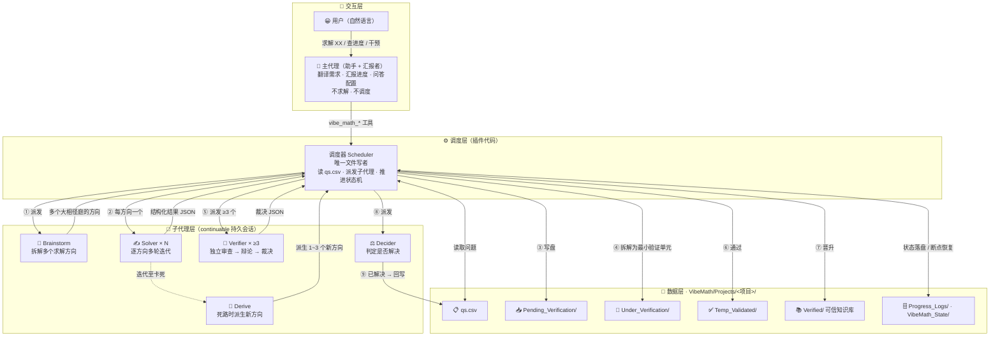

# Vibe Math 架构图

> 框架 = **一个主代理（助手）+ 一个代码调度器 + 五类子代理** + 一套按项目隔离的持久化数据布局。
> 下方的 Mermaid 代码块在 GitHub 上会**原生渲染**成流程图；本文件即图源，改完重新提交即可自动更新。

## 主流程（编号对应上图）

- **①** 主代理把用户需求翻译成 `vibe_math_add_problem` + `vibe_math_start`，调度器从 `qs.csv` 选问题并派发 **Brainstorm** 子代理；
- **②** Brainstorm 返回多个「大相径庭」的求解方向，调度器为**每个方向**起一个专属 **Solver**（同一会话内多轮迭代，产出引理/子路线/存活概率/完整解法，以结构化 JSON 返回）；
- **③** 调度器作为**唯一文件写者**，把 Solver 输出落盘到 `Pending_Verification/`；
- **④** 调度器把待验证输出**拆解为最小验证单元**（`Under_Verification/`）；
- **⑤** 每个单元派 **≥3 个 Verifier** 独立审查 → 辩论 → 裁决（一票否决 / 加权投票）；
- **⑥** 裁决通过 → `Temp_Validated/` → **⑦ 晋升**进 `Verified/` 可信知识库；
- **⑧** 派 **Decider** 判断新结论是否解决某未解决问题：**⑨** 是则回写 `qs.csv` 为 `solved` 并命名解法文件，否则留作后续方向复用的已知结论；
- **卡死兜底**：所有方向都走进死路时，派 **Derive** 基于历史痛点派生 1~3 个全新方向，回到 ②。

## 关键特性在图中对应

| 特性 | 图中的对应 |
|---|---|
| **断点续跑** | `调度器 ⇄ VibeMath_State/` 双向边：任务栈、代理注册表、决策队列、依赖图、验证器历史准确率全部落盘，重启后 `vibe_math_resume` 恢复 |
| **中途人工干预** | `manual` 模式下，调度器在 ① 派发 / ⑥ 裁决 / ⑦ 晋升 三个节点挂起决策，等主代理用 `vibe_math_list_decisions` / `vibe_math_decide` 处理，随时可切回 `auto` |
| **唯一写者铁律** | 所有指向数据层的实线都从「调度器」出发；子代理只返回 JSON，从不写文件，跨目录移动走临时原子交换 |
| **按项目隔离** | 整个数据层位于 `VibeMath/Projects/<项目>/` 下，互不干扰、可随时切换 |
| **子代理权限调控** | 调度器派发时注入 toolFilter（允许/禁止）与每轮外部工具调用上限 |
| **可配置** | 默认参数来自 `vibe_math_setting.json`（JSONC 含注释），`/vibe setup` 交互式配置 |
