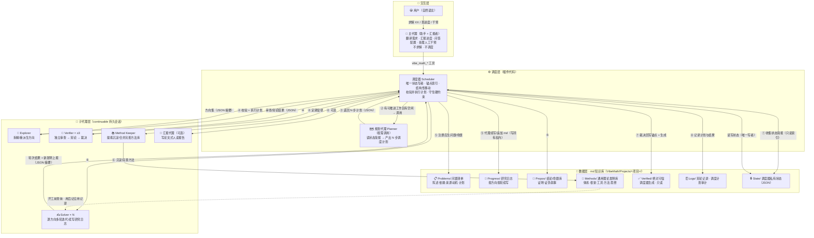

# Vibe Math V3 —— 论文式多代理数学研究与验证框架（md 知识库 + 代理自组织调度 + 通用理论发明库）

> **一句话定位**：把项目知识从 JSON 字段解放为**论文/研究报告式的 md 叙述**，让代理像数学家一样"写论文、续写论文、沉淀理论"；调度从代码启发式升级为**由规划代理自主制定 N 步计划**；并新增**通用理论发明库**，把解决过程中发明的/经验性的一切有价值理论、框架、工具、方法、思想沉淀为可跨问题复用、持续扩充的方法体系。
>
> **可信铁律**：只有 `Verified/` 中的 md 与经验证器判为真/假的对象绝对可信；其余一切 md（含方法库中未验证的断言、研究日志、未定论命题）仅作为经验性记录与参考。

---

## 1. 定位与总览

V3 是在 v1（经典流水线）、v2（概率驱动 + JSON 数据层）基础上的第三代架构，三项核心变化：

| # | 需求 | 一句话说明 |
|---|---|---|
| 1 | **md 数据层** | 结论/命题、progress、问题清单（含问题间依赖、后生问题的产生原因与计划）等全部以 **.md** 存储，代理以自然语言叙述、书写、**续写**，按类型存放于不同项目路径下；不设严格格式规范，代理自组织 |
| 2 | **通用理论发明库** | 新增 `Methods/`：代理在解决过程中**发明的或经验性总结出的**一切有价值的东西——理论体系、框架、工具、方法、思想、范式、技巧——都可整理入库，不断应用、完善、扩充，形成**系统化的方法理论体系与工具框架**（类比：解决方程时发明了群论，解决变分问题时发明了泛函分析） |
| 3 | **调度规划代理** | 调度时调用一个代理，根据实际情况自主选择最优调度方案，可**一次性安排接下来 n 次**所调用的各代理的任务；代码只负责校验与执行 |

同时完整继承 v1/v2 的既有核心能力：**断点续跑、中途人工干预、进度汇报、多会话并行隔离、参数化调控、验证器多代理独立审查→辩论→裁决**。

---

## 2. 设计总览（与 v1/v2 的差异）

| 维度 | v1（经典流水线） | v2（概率驱动） | v3（论文式自组织） |
|---|---|---|---|
| 知识媒介 | JSON（csv/字段） | JSON（qs.json / Propos / Verified 卡） | **md（代理是主要写者，调度器只做锚点索引/结构性移动/状态簿记）** |
| 书写风格 | 结构化字段 | 结构化字段 | **论文/研究报告式叙述，自组织** |
| 问题来源记录 | 无 | progress 字段零散记录 | **问题卡"来源与动机"章节 + 依赖图（后生问题自带产生原因与计划）** |
| 方法论沉淀 | 无 | 无 | **Methods/ 通用理论发明库 + Method Keeper 沉淀循环** |
| 调度决策 | 流水线状态机 | 代码启发式（processVerify→processSolve 等固定序） | **规划代理产出 N 步计划，代码只校验执行（失败回退启发式）** |
| 可信分层 | 隐含 | 概率语义隐含 | **锚点状态 + Verified/ 副本 + 提示词三层显式化** |

### 2.1 三条铁律（机器永远守住，代理与规划器都不可逾越）

1. **唯一绝对可信**：`Verified/`（验证器判 1/0 后由调度器生成的只读副本）。`Propos/` 中"已验证·真/假"条目可信，但以 Verified 副本为准；其余（Progress、Methods 中未验证断言、Notes、未定论条目）一律**经验参考**，不得作为已知事实注入推理。
2. **机器守住调度硬边界**：并发上限、幂等（不重复 spawn）、已验证对象永不再次调度、未验证对象绝不作为事实、工具过滤器/权限、文件写所有权，全部由代码强制。
3. **状态与知识分离**：调度器私有状态（任务栈、代理注册表、计划队列、索引、进程纪元）仍为 JSON，存放于 `State/`；md 只承载知识，不承载调度簿记。

---

## 3. 架构图



**主流程（编号对应上图）**：
- **①** 调度器 tick 时只读 `State/index.json` 收集状态快照（未解决问题+依赖+优先级、可验证对象、活跃代理、资源预算、最近事件、可用方法体系、上次计划执行结果）；
- **②** 若有可推进工作且并发有空闲 → 构建**规划简报**，调用**规划代理**一次；
- **③** 规划代理返回**计划**（最多 `planningHorizon` 步动作的 JSON）；manual 模式下先挂**计划审批门**；
- **④** 调度器逐条**校验**（硬约束）并**执行**：派发/续轮/中断 Explorer、Solver、Verifier，定期安排 Method Keeper 与汇报代理；超出当前并发的动作进入待执行队列跨 tick 消费；
- **⑤** 子代理以 JSON 返回结构化摘要（方向集、轮次结果、审查报告、新发明上报），调度器在**写所有权**内把内容写入/追加到对应 md；子代理按提示词要求直接续写自己被分配的研究日志/问题卡/命题卡；
- **⑥** Method Keeper 提炼近期工作，沉淀新方法条目、合并碎片、完善体系结构；
- **⑦** 验证裁决由调度器回写锚点（状态/概率）、生成 `Verified/` 副本、更新索引；
- **⑧** 计划 + 逐条执行结果写入 `Logs/Plans/`，作为下一次规划的"上次计划经验"（规划学习闭环）。

---

## 4. 目录结构（需求 1：按类型分路径）

```
VibeMath/                                   # 工作区级
├─ Methods/                                 # 【全局】跨项目理论发明库（可选层级，见 §16 假设）
├─ current.<sessionId>.json                 # 每会话当前项目（多会话并行互不覆盖）
└─ Projects/<项目>/
   ├─ Problems/                             # 问题清单：每问题一个 md（可建领域子目录）
   │   └─ q-xxxx.md                         #   陈述/状态/优先级/依赖/被依赖/来源/计划/解法候选
   ├─ Progress/                             # 研究日志：每问题一个 md，代理按方向按轮续写
   │   └─ q-xxxx.md
   ├─ Propos/                               # 结论/命题库：每命题一个 md（按分类子目录可选）
   │   ├─ 数论/p-xxxx.md                    #   陈述/概率/证明·证伪叙事/依赖/进度
   │   └─ 分析/p-yyyy.md
   ├─ Methods/                              # 【新】项目级通用理论发明库（见 §7）
   │   └─ m-xxxx.md
   ├─ Verified/                             # 绝对可信：调度器生成、只读
   │   ├─ 命题/p-xxxx.md                    #   已验证真/假的完整可信版本
   │   └─ 问题/q-xxxx.md                    #   已解决的完整可信解法
   ├─ Reliable/                             # 用户放置的可信参考文献（只读）
   ├─ Notes/                                # 自由笔记（不参与调度，纯记录）
   ├─ Logs/
   │   ├─ Verification/                     # 验证辩论记录（审计）
   │   ├─ Plans/                            # 每次调度计划 + 执行结果（规划学习闭环）
   │   └─ 报告.md                           # （可选）汇报代理产出的人读论文式摘要
   └─ State/                                # 调度器私有状态（JSON，仅调度器读写）
       ├─ scheduler_state.json              # 运行状态/活跃计数/纪元
       ├─ agents.json                       # 子代理注册表（角色/目标/轮次/所属会话）
       ├─ tasks.json                        # 验证任务等
       ├─ plans.json                        # 当前待执行计划队列
       ├─ index.json                        # 锚点扫描重建的机器索引（调度唯一读取面）
       ├─ verifier_accuracy.json            # 验证器历史准确率
       ├─ method_log.json                   # 方法库操作日志（上报/沉淀/晋升）
       ├─ process_epoch.json                # 进程纪元（断点续跑判据）
       └─ project.lock                      # 会话级项目锁（防并发写冲突）
```

**路径职责**：`Problems/` 问题清单类、`Progress/` progress 类、`Propos/` 结论/命题类、`Methods/` 理论发明类、`Verified/` 绝对可信类、`Reliable/` 可信参考、`Notes/` 自由记录、`Logs/` 审计、`State/` 机器状态——**不同类型，不同路径**（需求 1）。

---

## 5. 软规范与数据模型（"不设严格格式"的落地方式）

### 5.1 软规范概念

> 需求注明"可以不设置较高、严格 md 书写格式规范，让代理自行根据实际情况自组织"。v3 的落地方式是**最小强制 + 最大自由**：
>
> - **强制部分（唯一）**：每个对象 md 头部有 **4~7 行锚点**（`- 键: 值`），供调度器可靠索引；
> - **自由部分（其余全部）**：正文完全由代理按论文/研究报告风格自组织——陈述、推导、反例、教训、随笔皆可，调度器**从不解析正文**。

锚点行由调度器用正则提取（`^- (ID|类型|状态|概率|优先级|依赖|被依赖|来源|计划|上级体系|子方法|相关|可信断言):`），重建 `State/index.json`。**状态/概率行由调度器在验证回写时改写；正文只追加，不覆盖。**

### 5.2 问题卡 Problems/q-xxxx.md

```
# 问题｜<标题>
- ID: q-xxxx
- 类型: 问题
- 状态: 求解中            # 原始 | 求解中 | 等待依赖 | 已解决 | 死路
- 优先级: 0
- 依赖: []                # 解决本问题前需先定论的对象 ID
- 被依赖: []              # 依赖本问题结果的对象 ID
- 来源: 原始              # 原始 | 后生
- 计划: 一句话说明下一轮安排

## 陈述
（完整问题陈述；涉及的所有记号/对象/环境/背景给出完整定义，不断章取义）

## 来源与动机        （仅后生问题，需求 1 的重点）
（在求解哪个问题的哪个方向第几轮、由哪个代理产生；
 产生动机 = 想利用这个问题的结果来解决原问题/某个问题或实现什么目的；
 拟如何回填主线：解决后把结果用在哪里、如何更新依赖它的对象）

## 解法候选
### 解法 1：<标题>（正确概率 x.x，状态：未定论/已验证）
（叙述式完整解法，含每个记号的完整定义）
```

### 5.3 研究日志 Progress/q-xxxx.md（progress 类）

```
# 研究日志｜q-xxxx

## 方向 d1｜<标题>（存活率 0.6，状态 进行中）
### 第 1 轮（代理 solver:q-xxxx:d1，时间）
（叙事：本轮尝试了什么、得到什么中间结论、遇到什么阻碍、
 明确的可行性信号（如"遇到不可消除的奇点""与某已知定理冲突"）、教训）

### 第 2 轮
（继承上轮继续续写……）
```

### 5.4 命题卡 Propos/<分类>/p-xxxx.md（结论/命题类）

```
# 命题｜<标题>
- ID: p-xxxx
- 类型: 命题
- 状态: 未定论            # 未定论 | 已验证·真 | 已验证·假
- 概率: 0.85              # 布尔估计（未定论时；已验证后由调度器改写为 1/0）
- 优先级: 2               # 整数（越小越优先调度）或 never
- 依赖: []                # 引用/依赖的其他对象 ID

## 陈述
（完整陈述，所有记号定义完整）

## 证明尝试
### 证明 A：<标题>（正确概率 x.x）
（叙述式完整证明……）

## 证伪尝试
### 证伪 A：<标题>（正确概率 x.x）
（叙述式完整证伪，含反例……）

## 经验与教训
（自由叙述）
```

### 5.5 方法卡 Methods/m-xxxx.md（见 §7）

### 5.6 Verified/ 卡（绝对可信）

调度器在对象定论（判定为真或假）时生成：完整可信陈述 + 全部"正确概率=1"的证明/证伪/解法全文 + 结论（真/假）+ 时间 + 来源。其他代理**只准引用这里的事实**。

### 5.7 依赖语义与后生问题

- 状态 = `等待依赖` 的问题不派求解（除非计划显式注册"临时假设"并走 q_sub 流程）；
- q_sub 流程沿用 v2 点 5 的严格化：产生子问题时注册**三个对象**——临时问题 q_sub（问题类，入 Problems/）、判断问题「判断下述命题是否成立：p_{q-tmp}」（问题类，入 Problems/）、临时假设 p_{q-tmp}（命题类，入 Propos/，布尔估计 0.5，标注"临时假设 · 依赖 q_sub"）；三者概述与定义必须完整（不断章取义）；
- 依赖该假设的后续结论必须显式写「若 <p_{q-tmp} 的完整陈述> 成立，则：…」；
- 后生问题在问题卡"来源与动机"中记录产生原因与计划（§5.2），这是 v3 相对 v2 的一等公民化改进。

---

## 6. 调度架构（需求 3：调度规划代理）

### 6.1 角色总览

| 角色 | 说明 | 触发方 |
|---|---|---|
| **Planner（规划代理）** 🆕 | 读状态简报，自主制定接下来最多 n 步的调度计划 | 调度器按需调用（有空闲+有工作） |
| Explorer | 拆解/重派生问题方向 | 计划动作 |
| Solver ×N | 逐方向多轮迭代，续写研究日志 | 计划动作 |
| Verifier ×≥3 | 独立审查→辩论→裁决 | 计划动作 |
| **Method Keeper（方法整理代理）** 🆕 | 提炼/合并/完善方法库 | 计划动作（按 interval/事件） |
| 汇报代理（可选） | 写论文式人读报告 | 计划动作 |

### 6.2 调度循环（每次 tick）

```
1. 收集状态快照（只读 State/index.json + 各清单锚点）
2. 若有容量（active < maxParallelThreshold）且存在可推进工作：
   a. 构建「规划简报」（见下）
   b. 调用规划代理一次
   c. manual 模式 → 挂计划审批门，等用户 decide
   d. 代码逐条校验计划动作（硬约束）→ 按序执行
   e. 超出当前并发的动作进入待执行队列（plans.json），跨 tick 消费
3. 计划 + 逐条执行结果 → 写入 Logs/Plans/（规划学习闭环）
4. 无工作 / 无容量 → 跳过规划，直接进入汇报与终止判定
```

**规划简报内容**（压缩但信息完整）：未解决问题（ID/状态/优先级/依赖是否满足/各方向存活率）、可验证对象（命题/证明/证伪/解法 + 概率 + 优先级）、活跃代理与已占用槽位、资源预算（剩余并发、工具/网络限制）、最近事件（新增命题/解法/子问题、最近裁决）、可用方法体系（Methods/ 索引）、**上次计划的执行结果**（哪些成功、哪些失败、原因）。

**计划 JSON（机器接口，唯一允许结构化输出的地方）**：

```json
{
  "summary": "一句话说明本计划思路",
  "plan": [
    { "action": "spawn", "role": "solver", "target": "q-xxxx", "direction": "d1", "round": 2,
      "reason": "d1 存活率最高且依赖已齐" },
    { "action": "spawn", "role": "verifier", "target": "p-yyyy", "kind": "prop-proof", "reason": "…" },
    { "action": "continue", "childId": "…", "reason": "…" },
    { "action": "interrupt", "childId": "…", "reason": "方向已死路" },
    { "action": "promote", "target": "p-zzzz", "reason": "价值/关键性超过阈值" },
    { "action": "method-keep", "target": "m-wwww", "reason": "近期 3 轮应用效果稳定，需要整理体系" },
    { "action": "wait", "target": "q-vvvv", "reason": "依赖未满足，等待验证完成" }
  ]
}
```

动作类型（可扩展）：`spawn`（新派发）、`continue`（续轮）、`interrupt`（中断）、`promote`（命题晋升问题）、`verify`（验证）、`method-keep`（方法整理）、`wait`（标记等待依赖）、`report`（汇报）、`stop`（终止判定）等。

### 6.3 硬约束（代码强制执行，规划器无权违反）

1. `active < maxParallelThreshold` 才可派发新代理；
2. 同一对象/方向不重复 spawn（幂等检查，含 agentRegistry 与待执行队列双重去重）；
3. **已验证对象永不再次调度**；未验证对象绝不作为事实注入提示词；
4. 依赖未满足的问题不派解（除非计划显式注册临时假设）；
5. 工具过滤器、网络/脚本开关、每轮工具调用上限由代码注入，规划器不可绕过；
6. 每个文件同一时刻仅一个写者（写所有权，见 §13）；
7. 终止判定仍由代码执行（问题全解决 / 方向耗尽 stall），规划器只建议不裁定。

### 6.4 失败回退

- 规划代理无输出 / 超时 / JSON 非法 → 同 tick 内回退 **v2 式内置启发式调度器**（按优先级 processVerify → processSolve 的默认逻辑兜底），并记录原因；
- 连续失败 ≥ `plannerMaxFails`（新增参数）→ 自动降级为纯启发式模式（可在设置中重新启用）。

### 6.5 规划学习闭环

每次计划连同逐条执行结果（成功/失败/子代理产出摘要）写入 `Logs/Plans/<时间戳>.json`。下一次规划简报携带最近若干条结果，使规划代理能"从上次计划中学习"：识别无效策略（如某方向反复失败）、利用有效策略（如某方法体系在高存活方向上的复用）、避免重复踩坑。

---

## 7. 方法库（需求 2）—— 通用理论发明库（核心新机制）

### 7.1 定位

> 不限于"解题技巧"。**凡是代理在解决任意问题的过程中发明的、或经验性总结出的、具有复用价值的理论体系、框架、工具、方法、思想、范式、技巧，都可整理入库。** 它模仿人类数学研究的"理论发明 → 沉淀 → 体系化"路径——**就像在解决某个方程时发明了群论、研究变分问题时发明了泛函分析一样**：代理在工作中形成的任何"新东西"都应在 `Methods/` 中沉淀，供后续不断应用、完善、扩充，最终形成**系统化的方法理论体系与工具框架**。
>
> 例如：解决"π² 无理"过程中发明的"连分数收敛分析机器"、"Niven 型证明范式"、"被证伪卡片中有效子断言的独立重建技术"，都可以沉淀为方法条目，并可能随应用扩展为覆盖一整类问题的**方法体系**。

### 7.2 方法卡 Methods/m-xxxx.md

```
# 方法｜<名称>
- ID: m-xxxx
- 类型: 理论体系|框架|工具|方法|思想|范式|技巧   # 可多选
- 状态: 经验            # 经验（默认）| 应用验证 | 含已验证断言
- 可信断言: [p-ids]     # 方法内被验证器定为真/假的数学断言（必须已进 Verified/）
- 上级体系: []          # 所属体系 ID（体系化层级）
- 子方法: []            # 体系下挂的子条目（定义/引理/工具/技巧）
- 相关: []              # 相关方法/命题/问题 ID
- 适用场景: …

## 核心内容
（叙述：这个方法/理论/工具是什么、为什么有效、怎么用、注意事项；
 若发明了新的记号/形式化对象，在此给出完整定义，不断章取义）

## 定义与记号      （可选）
（方法自带的形式化对象/记号体系，定义完整）

## 应用记录        （每次应用追加）
### 应用 1（时间，问题 q-xxxx 方向 d1）
（用在哪、效果如何、发现的问题、改进建议）

## 改进历史
### v1（初始版）：……
### v2（改进）：……（含改动动机）
```

### 7.3 体系化组织

- `上级体系` / `子方法` 字段形成**层级树**：一个体系 = 一份可生长的"理论"，如 `m-连分数分析体系` 下挂：定义条目、引理条目、工具条目、技巧条目；
- 规划器与求解器**沿树检索**（开工前先查方法库，命中体系则优先采用体系内工具）；
- 体系跨问题、跨项目持续扩充——这正是"形成系统化方法理论体系、工具框架"的机制。

### 7.4 经验性条目（明确允许）

尚未形式化、未经数学验证但实践中有效的**策略/直觉/启发式/经验法则**都可入库，锚点 `状态: 经验`。提示词与调度器都**不得将其当作定理**使用；若其中某断言后来被验证器定为真/假，则将其 ID 加入 `可信断言`（并链接 Verified/）——**只有该断言可信，条目其余部分仍为经验**。

### 7.5 发明上报闭环（关键机制）

1. **开工前查询**：每个 Explorer/Solver 提示词要求"先查 `Methods/`（含全局层），判断有无可复用方法/体系；用则引用其 ID"；
2. **轮次上报**：Solver/Explorer 返回 JSON 新增两个字段：
   - `methods_used: [{id, 效果, 建议}]` —— 调度器自动追加到对应方法卡的应用记录；
   - `new_inventions: [{类型, 标题, 内容描述, 是否已入库}]` —— 本次新发明/经验性总结的东西；未入库的由 Method Keeper 兜底提取；
3. **定期提炼**：`Method Keeper` 由规划器按 `methodKeepIntervalMs` / 事件（每 M 个新命题或 N 轮 solver 完成）安排，输入近期 Progress/Propos/Logs/新发明上报摘要，输出：
   - 新方法条目草稿（写入 Methods/，状态=经验，等待应用验证）；
   - 合并重复/碎片条目；
   - 完善体系结构（上级体系/子方法 调整）；
   - 维护 `可信断言`（把新验证通过的断言链接进相关方法卡）；
4. **晋升**：项目级方法 → 全局 `VibeMath/Methods/`（跨项目可复用）走人工门（`methodAutoPromote` 参数控制自动/人工）。

### 7.6 可信度红线

- 方法卡的 `可信断言` 只允许链接已进 `Verified/` 的 ID；
- 其余内容一律标注 经验/参考；
- 验证器/求解器不得把未验证方法当定理引用（引用规则见 §12）。

---

## 8. 验证机制与可信分层（"注意"落地）

### 8.1 流程（延续 v2）

- **目标对象**：单个命题 / 命题+证明或证伪 / 问题+解法，从 md 读取（锚点 + 正文全文）；
- **独立审查**：≥3 个验证器各自独立输出 `{Result ∈ [0,1], Reason}`（判定 1 需完整证明，判定 0 需严谨证伪，否则取中间值）；独立前互不通气；
- **辩论（交流群）**：轮流发言，回应他人、可改变立场（须说明理由）；上限 `debateMaxRounds`；全部一致（全 1 或全 0）即终止；
- **裁决**：`verdictMode` —— `flat`（均衡）/ `forced`（按历史准确率+严谨性加权）/ `manual`（人工）；中间结果回写证明/证伪列表与对应概率。

### 8.2 v3 默认修复 v2 审计发现的缺陷

1. **flat 高置信分歧误判 0.5**（实测：0.9 vs 1 → 0.5，把数学上正确的经典定理打成"不确定"）：v3 默认改为 `forced`，或采用"**近共识**"规则——全部结果同侧且均值 ≥0.85/≤0.15 时取均值，否则才 0.5；
2. **引用被证伪卡片**（实测：验证器引用整体概率 0 卡片中仍有效的子断言）：提示词明确"引用必须指向 `Verified/`；引用未定论/被证伪对象需先独立重建或注册子命题"。

### 8.3 裁决回写（调度器执行）

改锚点（状态/概率）→ 生成 `Verified/` 副本 → 更新 `State/index.json` → 写 `Logs/Verification/` 辩论记录 → 更新 `verifier_accuracy.json`。

---

## 9. 断点续跑 / 中途人工干预 / 多会话并行隔离 / 进度汇报

### 9.1 断点续跑

- **叙事断点 = md 本身**：代理 resume 时从自己的研究日志/问题卡/命题卡**尾部续写**，md 即"论文的续写位置"；
- **机器断点 = State/*.json**：任务栈、代理注册表、计划队列、索引、决策队列、验证器准确率、方法日志全部落盘；
- **进程纪元**（process_epoch，沿用 v2 语义）：同进程 pause→resume 保留存活子代理（纪元相等）；跨进程重启清空 registry/tasks（纪元不等），未写出的部分丢弃——md 尾部即最后一致状态；
- `vibe_math_resume` 恢复：重新读设置 → 读状态 → 根据纪元判定 → 启动调度循环（子代理被中断但方向仍 active，不误标死路）。

### 9.2 中途人工干预

| 干预点 | 说明 |
|---|---|
| 计划审批门（新） | manual 模式下，规划代理产出计划后挂起，用户 `vibe_math_decide` approve/reject（可 override 具体动作），或整体拒绝后回退启发式 |
| 裁决门 | 辩论结束后挂起，用户可 override 最终裁决（同 v2） |
| 方法晋升门（新） | 项目级方法 → 全局库 时挂起（`methodAutoPromote=false` 时） |
| 随时控制 | pause / abort / message（给指定子代理发消息）/ interrupt（同 v2） |
| 模式切换 | `mode` 切回 auto 时自动放行所有挂起决策（同 v2） |

### 9.3 多会话并行隔离（standing mount）

- 沿用 v2 工厂模式：per-session `Session`（rootAgent / 当前项目 / 调度器 / 注册表 / 决策队列 / 参数 / 任务栈全部按根会话隔离），`childOwner` 路由 subagent/end，每会话 `current.<sessionId>.json`；
- **新增项目锁**：`State/project.lock`（含持有会话 ID + 时间戳）——同一项目同一时刻只被一个会话调度；第二个会话尝试调度该项目时提示"项目被会话 X 占用"或等待至 `projectLockTimeoutMs`（md 追加写比 JSON 更易并发冲突，需要此防线）；
- `processEpoch` 仍为进程级（apply 层共享），避免同进程两个会话互判"过期进程"而中断对方子代理。

### 9.4 进度汇报

- 事件驱动（有代理状态更新/新裁决/新计划时）+ 定时（`reportIntervalMs`）；
- `reportMode: file | push | both`（同 v2）；
- **新增**（可选）：汇报代理把近期进展写成 `Logs/报告.md`——论文式人读摘要（问题状态表、关键新命题、方法库新增、下一步计划），比 JSON 报告更适合人类阅读。

---

## 10. 参数与设置

沿用 v2 全部参数（mode、maxParallelThreshold、solverMaxRounds、directionsPerSolver、verifierCount、debateMaxRounds、verdictMode、provider/model、各 persona、knowledgeContext、工具开关/上限、reportIntervalMs、reportMode、promoteValueThreshold、priorityAdjust、proposPriorityAdjust、tickIntervalMs、activityLogCap、maxExplorerRetries），并新增：

| 参数 | 默认 | 含义 |
|---|---|---|
| `planningHorizon` | 3 | 规划代理一次计划的最多动作数（"接下来 n 次"） |
| `plannerProvider` / `plannerModel` | 空=继承 | 规划代理的模型路由 |
| `plannerPersona` | 空 | 注入规划代理提示词开头的人格/要求 |
| `planMinIntervalMs` | 30000 | 规划冷却：两次调用规划代理的最小间隔（省资源） |
| `plannerMaxFails` | 3 | 规划代理连续失败次数达此值 → 自动降级启发式 |
| `methodKeepIntervalMs` | 0（事件驱动） | Method Keeper 定时整理间隔；0 = 按事件触发 |
| `methodKeepEvery` | 5 | 每积累 N 个新命题或每 M 轮 solver 完成后安排一次整理 |
| `methodAutoPromote` | false | 项目级方法自动晋升全局库（false = 人工门） |
| `indexAutoRebuild` | true | 每次写盘后自动重建索引（false = 手动 `vibe_math_index`） |
| `projectLockTimeoutMs` | 60000 | 项目锁等待超时 |

设置文件仍为 `vibe_math_setting.json`（JSONC 含注释，项目级，回退全局），是参数的唯一持久化来源。

---

## 11. 工具与命令清单

沿用 v2 全部 `vibe_math_*` 工具（start/resume/pause/abort/status/report/set_mode/set_params/setup/save_settings/template/add_problem/add_proposition/list_propositions/new_project/set_project/list_projects/list_decisions/decide/list_agents/message_agent/interrupt_agent）与 `/vibe` 命令，新增/变更：

| 工具 | 说明 |
|---|---|
| `vibe_math_plan` | 查看当前待执行计划队列 / 手动触发一次规划 |
| `vibe_math_index` | 手动重建 `State/index.json`（锚点扫描） |
| `vibe_math_method_add` | 手动添加方法条目（用户/主代理直接入库） |
| `vibe_math_method_list` | 列出方法库（ID/名称/类型/状态/体系归属） |
| `vibe_math_lock_status` | 查看项目锁占用情况 |
| `vibe_math_decide` | 扩展支持 `node: 'plan'`（计划审批）与 `node: 'method-promote'` |

---

## 12. 提示词与知识上下文（关键）

每个子代理提示词注入"知识上下文"，v3 版在 v2 基础上新增以下要点：

1. **可信分层表**（最高优先级规则）：
   - `Verified/` 中的内容 = **绝对可信**，可直接引用；
   - `Propos/` 中 `状态: 已验证·真/假` = 可信（以 Verified 副本为准）；
   - 其余一切（未定论命题、`Progress/` 研究日志、`Methods/` 中未验证断言、`Notes/`）= **经验性记录、参考**，绝不能当作已成立事实；
2. **软规范说明**：锚点行格式 + "正文自由叙述，像写论文一样"；每类卡片的完整含义（对照 §5）；
3. **引用规则**：引用任何已有对象必须给出「文件路径 + ID + 锚点/节」；事实只引 `Verified/`；新结论自带完整定义（不断章取义）；依赖临时假设的结论必须写「若 … 成立，则…」；
4. **写规则**：只写自己被分配的文件；以追加/续写为主；不修改他人锚点；发现的格式问题反馈给主代理而不是擅自改动；
5. **方法库使用规则**：开工前先查 `Methods/`（含全局层），有可复用方法/体系则引用；用后必须上报 `methods_used`；**本轮新发明/经验性总结必须上报 `new_inventions`**；
6. **后生问题规则**：产生 q_sub 时，问题卡"来源与动机"必须写全（在哪个流程、为了什么目的、如何回填主线）+ 完整陈述（不断章取义）。

---

## 13. 并发一致性 / 失败模式 / 容错

- **写所有权**：规划器动作携带目标文件；调度器在 `agents.json` 登记"文件 → 当前写者"，同文件同一时刻仅一个写者；追加为主；结构性移动（生成 Verified 副本、晋升）仅调度器执行；
- **索引容错**：锚点丢失/损坏 → 保留上次有效索引 + 警告日志，不崩溃；正文乱码不影响调度（调度只读索引）；
- **规划器故障** → 回退启发式（§6.4）；
- **验证器无输出** → 沿用 v2 abort 语义（中断时丢弃、resume 重建）；
- **文件过大** → 研究日志轮转（每 N 条或按大小归档为 `*.1.md`，头部保留"续写位置"指针）；
- **项目锁超时** → 提示"项目被会话 X 占用"，不阻塞其他会话。

---

## 14. 实现计划（分阶段，每阶段含 E2E 验收）

| 阶段 | 内容 | E2E 验收点 |
|---|---|---|
| 1. 数据层 | 目录结构、软规范、锚点扫描索引、读写所有权、项目锁 | 读写+索引重建正确；并发写被锁拦截；锚点损坏不崩溃 |
| 2. 调度循环 | 状态快照 → 规划简报 → 规划代理（计划 JSON/校验/待执行队列）→ 失败回退 | 计划被逐条执行；N 步跨 tick 消费；注入垃圾计划 → 回退启发式 |
| 3. 验证与 Verified | md 对象验证、裁决回写锚点、Verified 生成、flat 缺陷修复 | 裁决正确回写；Verified 只含 1/0 卡；近共识规则生效 |
| 4. 方法库 | 方法卡+体系层级、应用记录自动追加、`new_inventions` 上报、Method Keeper 提炼、经验条目可信约束、项目→全局晋升 | 上报→沉淀→体系化链路通；经验条目不被当定理；晋升走门 |
| 5. 控制面 | 参数/工具/命令、人工干预门（计划审批/裁决/方法晋升）、汇报、提示词全量 | manual 门挂起与 decide 放行；push 汇报触发 |
| 6. 多会话 | per-session 隔离 + 项目锁 + 进程纪元 | 双会话并行各跑各的项目；resume 0 误中断 |
| 7. 文档与迁移 | README（v3 为主推）、可选 v2→v3 迁移工具（JSON 项目 → md 骨架） | 迁移后项目可被 v3 调度器索引与续跑 |

---

## 15. 需求对照表

| 需求 | 落点 |
|---|---|
| md 论文式存储/书写/续写；结论/命题、progress、问题清单按类型分路径 | §4 目录结构、§5 软规范、§9.1 叙事断点 |
| 问题清单含问题间依赖关系、后生问题产生原因及其计划 | §5.2 问题卡（依赖/被依赖/来源与动机/计划）、§5.7 依赖语义 |
| 方法库：理论体系/框架/工具/方法/思想（含经验性）可沉淀、应用、完善、扩充，形成系统方法论 | §7 通用理论发明库（体系化层级、发明上报闭环、Method Keeper、全局/项目两级） |
| 调度前调用代理自主选择最优调度方案（一次安排 n 次） | §6 调度规划代理（简报/计划 JSON/校验/待执行队列/学习闭环/失败回退） |
| 不设严格 md 格式规范，代理自组织 | §5.1 软规范（仅锚点行强制，正文自由） |
| 仅 Verified 类 md / 验证为真/假的对象绝对可信，其余为经验参考 | §2.1 铁律 1、§7.6 可信度红线、§8 验证、§12 提示词 |

---

## 16. 明确假设与待确认项

1. **v3 目录名** `vibe-math-v3/`（与 v1/v2 并列，沿用惯例）。
2. **方法库作用域**：项目级 `Methods/` + 工作区全局 `VibeMath/Methods/` 两级（跨项目复用最大化，理论发明体系化后值得全局沉淀）；项目→全局晋升走人工门。备选：仅项目级。
3. **Verified 采用"调度器生成副本"**（Propos 保留历史，Verified 为定论只读版本），而非原位删除/移动。
4. **规划代理输出 JSON**（机器接口），知识才用 md——调度器需要可校验的动作流，JSON 是最低成本的机器契约；md 的自由叙述留给知识对象。
5. **软规范取折中**（锚点行强制 + 正文自由），而非完全零规范——否则调度器无法可靠索引；锚点仅 4~7 行，符合"不设较高严格规范"。
6. **v3 作为新 preset id** `vibe-math-v3` 并入现有 npm 包 `dsh-vibe-math`（与 v1/v2 同包多预设），版本发布策略沿用（README 标注 v3 为新主推、v2 次推、v1 弃用）。
7. **v2 审计发现的两个缺陷**（flat 高置信分歧误判 0.5、引用被证伪卡片）在 v3 默认修复（§8.2）。
8. **方法库收录范围**：不限解题技巧——任何过程中发明的/经验性总结出的有价值理论体系、框架、工具、方法、思想、范式、技巧均可沉淀（§7.1）；允许经验性条目（§7.4）；条目可组成体系层级并跨项目持续扩充（§7.3）。

---

*本文档为 v3 架构与实现方案设计稿（仅设计，不含代码实现）。实现时以本文档为蓝本，按 §14 分阶段推进。*
