# Vibe Math V5 架构图

> 本文件是 v5 的图源（GitHub 上 Mermaid 会**原生渲染**）。总览大图另有一张生成好的
> **SVG**：[`../示例图/框架图-v5.svg`](../示例图/框架图-v5.svg)，由
> [`../docs/generate_framework_diagram_v5.mjs`](../docs/generate_framework_diagram_v5.mjs) 生成
> （零依赖，`node docs/generate_framework_diagram_v5.mjs`）。
> 文字规格见 [`实现方案.md`](实现方案.md)。

**一句话**：v5 = **一个所办**（对外接口，不研究不投票）+ **一所研究所**（院士 / 常驻研究员 / 临时工）
+ **一个只做媒介的框架**（中继 · 沉淀 · 计数 · 调度）。

---

## 1. 总览：三层 + 两个面

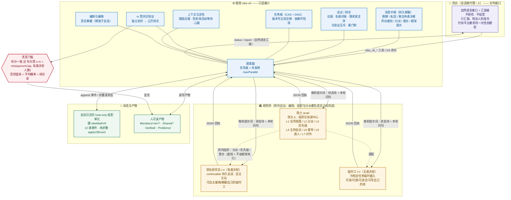

---

## 2. 成员生命周期

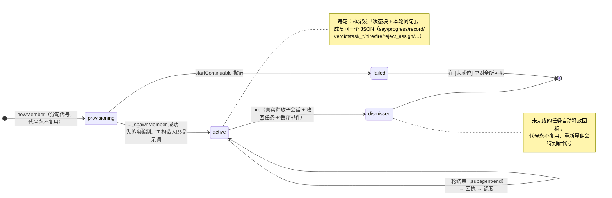

---

## 3. 一轮唤醒的时序（唯一的推进驱动）

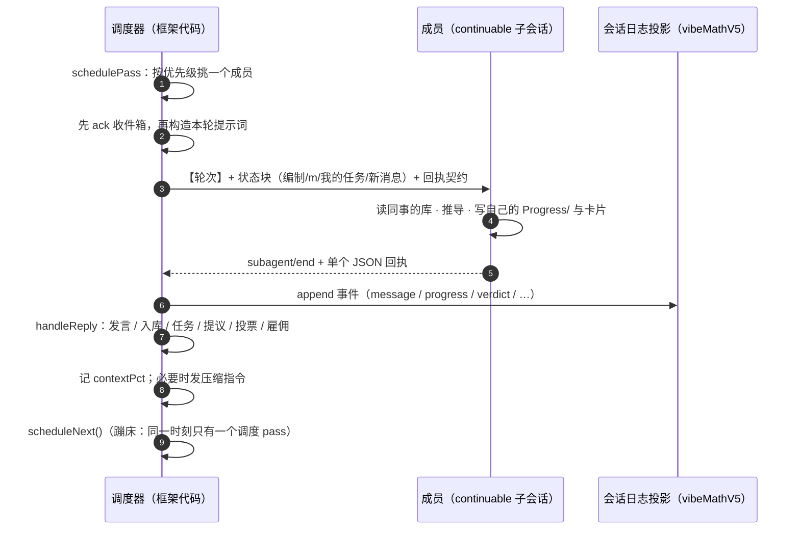

> 关键点：**成员的一轮结束是唯一的推进驱动**。没有轮询；`vibe_v5_wait` 是一次性活动等待，
> 心跳只是最后的兜底，且每次唤醒后**永远重新武装**，所以调度器不会永久冻结。

---

## 4. 共识验证状态机（m 票布尔一致）

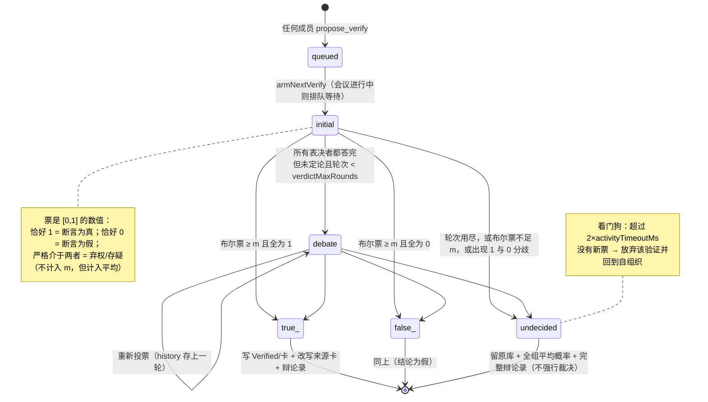

**判定规则（`judgeVerdict`）**：任何一张反向布尔票都**阻塞**定论 —— 少数派无法靠别人弃权
把结论推过去。`quorumMode: "all-unanimous"` 可切回 v4 的"全体有表决权者一致"口径。

### 4.1 Lean 形式化验证（可调参数 `formalVerify`）

完整契约见 [`../docs/formal-verification.md`](../docs/formal-verification.md)。**它改变的不是"更严格一点"，
而是审查对象本身**：m 票一致是**共识**（排除不了共同误解），Lean 通过是**机器核对**，
于是剩下的唯一不确定项缩小为"Lean 代码是否忠实于命题原文"。

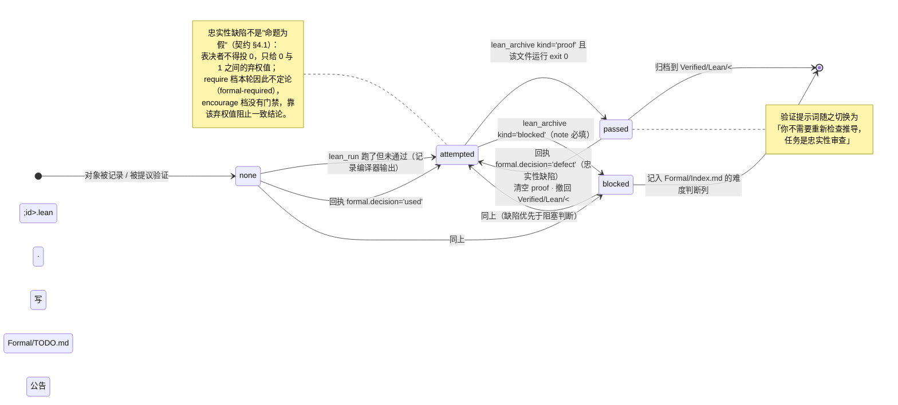

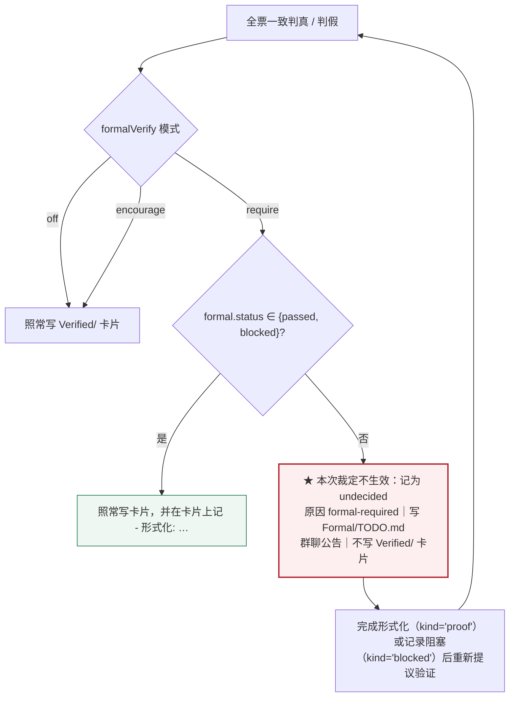

**三档**：`off`（默认，**真正的无操作**：不注入任何 Lean 文本、不设门禁、不改验证流程）｜
`encourage`（按实现难度自行决定，不设门禁）｜
`require`（真/假结论必须先有 Lean 通过或**显式、可审计**的阻塞记录）。

> `off` 的"无操作"约束的是**框架主动做的事**（提示词、门禁、验证流程、回执里的 formal 通道）。
> 三个 Lean 工具仍然无条件注册、任何档位下都可被代理或人**主动**调用，并且会照实执行与记录
> ——"调用是一个明确的动作，不会被静默忽略"。

**"根据实现难度决定不做"是被允许的，但必须说出来**：`blocked` 记录要求 `note` 非空 ——
决定权在代理，静默跳过不行。

**路径**：工作文件 `Formal/<对象id>.lean`｜**归档证明 `Verified/Lean/<对象id>.lean`**（与定论卡片同处
`Verified/`）｜可复用定义 `<VibeMath根>/Formal/Lib/`｜已证引理 `<VibeMath根>/Formal/Proved/`。
跨项目复用是这套设计的核心收益，因此 Lean 路径守卫的边界是 **VibeMath 根**而不是研究所根
（爬出研究所但仍在 VibeMath 内是合法的，那正是全局库所在）。

---

## 5. 会议流程（与验证互斥）

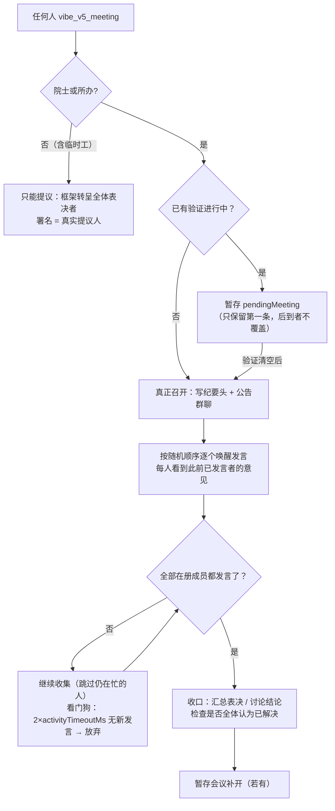

**互斥的双向保证**（v2.2.2 起对称）：
- `startMeeting`：验证进行中 → **会议暂存**；
- `armNextVerify`：会议进行中 → **验证排队**（此前只做了前一半，成员在会上提议验证会真的
  并发启动第二个共识过程，进而饿死会议的看门狗时钟）。

---

## 6. 调度优先级（`schedulePass`）

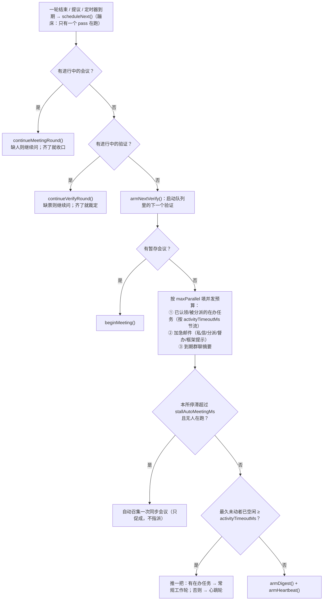

---

## 7. 状态：纯折叠 + 双后端

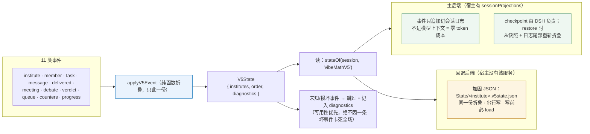

**为什么用投影**：v4 的 `State/*.json` 直写带来"损坏静默覆盖 / 并发丢写 / 跨进程陈旧快照"一整类问题。
v5 的副作用只是往会话日志追加事件，跨进程与同进程恢复**走同一条代码路径**。

---

## 8. 提示词是怎么构成的（成员读到的文字 = 产品）

```mermaid
flowchart LR
    subgraph P["人设 persona（入职时冻结，随会话持久化，压缩后依然有效）"]
        CH["公共规章（十节）<br/>编制与同事 · 通用规章 · 资料库与 progress<br/>组织与协调 · 表决规则 · 每轮节奏<br/>雇佣解雇 · 任务板 · 上下文纪律 · 停止条件"]
    end
    subgraph R["每轮提示词（临时，短）"]
        ST["状态块<br/>&#91;状态&#93; 你是 &lt;代号&gt;（职位）｜轮次｜m｜表决者数<br/>&#91;在册&#93; …　&#91;未就位&#93; …<br/>&#91;任务板&#93; …　&#91;新到的消息/通知&#93; …"]
        ASK["本轮问句（常规 / 心跳 / 会议 / 表决）<br/>+ 收件箱（先 ack 再构造，绝不重复投递）"]
        SPEC["回执契约（按职位裁剪）<br/>say / progress / record / propose_verify / verdict<br/>propose_meeting / task_* / reject_assign / input<br/>hire / fire / vote_solved / solved / contextPct / compacted"]
    end
    P --> MEM["成员（子会话）"]
    R --> MEM
    MEM --> OUT["单个 JSON 回执"]

    style CH fill:#fdf5e2,stroke:#b26a00
    style ST fill:#eaf3fd,stroke:#0b6fb8
    style ASK fill:#eaf3fd,stroke:#0b6fb8
    style SPEC fill:#eaf3fd,stroke:#0b6fb8
```

**身份不变式（有测试与语料保证）**：

- 提示词里的身份 = 这条提示词**实际发给的成员**；题头、`[状态]`、人设资料库路径三者必须一致；
- 成员**先落盘进编制、再构造**它的入职提示词（否则会漏掉自己、并按加入前的编制算 m）；
- 章程快照**冻结在入职时**（它写着"你入职时的在册编制"），重建会话时原样复用；
- 会话重建框为 `【会话重建】`，**不**自称"刚入职"；
- 领袖叙事跟随真实编制：没有院士时，章程不得声称存在院士或承诺其派活；
- 框头按**真实来源**标注（所办分派 ≠ 院士分派；督办 ≠ 分派；致全体表决者 ≠ 私信）；
- 框架反馈有独立发送者（`【框架提示】`），且**一次提示词只投递一条消息**。

---

## 9. 任务板（compare-and-set + DAG）

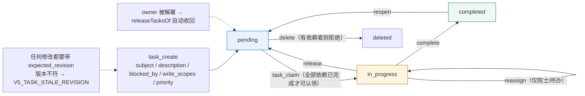

---

## 10. 职权矩阵

| 动作 | 院士 | 常驻研究员 | 临时工 | 所办 |
|---|---|---|---|---|
| 发言 / 私信 / 致全体表决者 | ✅ | ✅ | ✅ | ✅（所办通知） |
| 写自己的成果库 / 认领任务 | ✅ | ✅ | ✅ | ❌（不是成员） |
| **表决**（进 `Verified/`） | ✅ 一票 | ✅ 一票 | ❌ | ❌ |
| 提议验证 / 提议开会 | ✅ | ✅ | ✅ | ✅（可直接召开） |
| **直接召开会议** | ✅ | ❌（只能提议） | ❌ | ✅ |
| **分派任务**（`vibe_v5_assign`） | ✅ | ❌ | ❌ | ✅ |
| 设定优先级（`vibe_v5_prioritize`） | ✅ | ❌ | ❌ | ✅ |
| 督导（`vibe_v5_nudge`） | ✅ | ❌ | ❌ | ✅ |
| **雇佣临时工** | ✅ | ✅（自己的） | ❌ | ✅ |
| **解雇临时工** | ✅（任何） | ✅（自己雇的） | ❌ | ✅ |
| 增聘 / 解聘**常驻研究员** | ❌（建议） | ❌（建议） | ❌ | ✅ |
| 暂停 / 恢复 / 停止 / 调参 | ❌ | ❌ | ❌ | ✅ |

> **分派不改变真假**：院士能分派工作、定优先级，但不能让任何断言因此变正确 ——
> 对象进 `Verified/` 仍然只能靠 m 票布尔一致。

---

## 11. 目录结构与制品

```text
<会话工作区>/VibeMath/Projects/<项目>/Institutes/<研究所>/
├─ Institutes.md                 # 编制镜像（人读快照，勿手改）
├─ Problems/<id>.md              # 原问题
├─ Problems/conclusion.md        # 结题记录（全体有表决权者一致认为已解决时生成）
├─ Members/<代号>/
│   ├─ Progress/progress.md      # 研究日志（叙述体，可追加；压缩后恢复状态的主要依据）
│   ├─ Propos/<id>.md            # 命题
│   ├─ Methods/<id>.md           # 方法 / 理论 / 工具
│   └─ Subproblems/<id>.md       # 子问题
├─ Shared/
│   ├─ Chat/<日期>.md            # 群聊记录
│   ├─ Meetings/<mt-id>.md       # 会议纪要（含表决小节）
│   ├─ Debates/<对象>.md         # 辩论录（各轮票与理由 + 平均概率）
│   ├─ TaskBoard.md              # 任务板镜像
│   └─ State-of-institute.md     # 各成员对"是否已解决"的判断快照
├─ Verified/<类型>/<id>.md       # 定论（只读；只有它能被当作已确立）
└─ State/
    ├─ README.md                 # 说明"权威状态在会话日志投影里，不是这里"
    └─ <研究所>.v5state.json      # 仅当宿主缺 sessionProjections 时的回退权威源
```

**可信分层**：只有 `Verified/` 与标注"已验证·真/假"的卡片**绝对可信**；
`Progress/`、`Methods/`、未定论命题、他人推测都只是**经验参考**，引用时必须注明"未验证"。

---

## 12. 不变式速查（这些都有测试守着）

| 不变式 | 由谁保证 |
|---|---|
| 提示词身份 = 收件人；题头/状态块/人设三者一致 | `prompt-v5-integrity.test.mjs`（逐条断言 + 语料） |
| 成员先落盘进编制、再构造入职提示词 | 同上 |
| 章程冻结在入职时；重建会话自称"重建" | 同上 |
| 无院士时不出现任何院士叙事 | 同上 |
| 框头署名 = 真实来源 | 同上 |
| 一次提示词不重复投递同一条消息 | 同上 |
| 回执契约涵盖框架真正处理的每个字段 | 同上 |
| 只有 ≥ m 张一致的布尔票才能定论 | `selfdrive-v5.mjs` / `e2e-v5-round2.test.mjs` |
| 反向布尔票阻塞结论 | 同上 |
| 临时工无表决权、不能雇佣 | 同上 |
| 只有院士/所办能分派、定优先级、督办 | 同上 |
| 会议与验证互斥（双向） | `prompt-v5-integrity.test.mjs` |
| `formalVerify` 默认 `off` 是**真正的无操作**；非法值只回退到 `off` | `formal-verify-v5.test.mjs` |
| Lean 通过后，审查对象切换为**忠实性**（"你不需要重新检查推导"） | `formal-verify-v5.test.mjs` |
| `require` 模式：无形式化记录的真/假结论被记为未定论 + 形式化待办，不写 `Verified/` | `formal-verify-v5.test.mjs` |
| 「因难度决定不做形式化」必须显式记录原因（`note` 非空） | `formal-verify-v5.test.mjs` |
| 忠实性缺陷**不得**记成"命题为假"：撤回 `passed`、删除 `Verified/Lean/<id>.lean`、写待办，`require` 档不定论 | `formal-verify-v5.test.mjs` |
| 命题的证明归档到 `Verified/Lean/<id>.lean`；可复用定义归档到**跨项目** `Formal/Lib/` | `formal-verify-v5.test.mjs` |
| Lean 路径守卫按词法归一 `..`（字符串前缀检查会被穿越绕过） | `formal-verify-v5.test.mjs` |
| 解雇是真实的（释放子会话、收回任务） | `selfdrive-v5.mjs` |
| 跨进程恢复不丢研究所 | `e2e-v5-round2.test.mjs` |
| 每条不变式都有能让套件变红的探针 | `audit-v5-sensitivity.mjs` + [`../docs/AUDIT-CHECKLIST.md`](../docs/AUDIT-CHECKLIST.md) |
